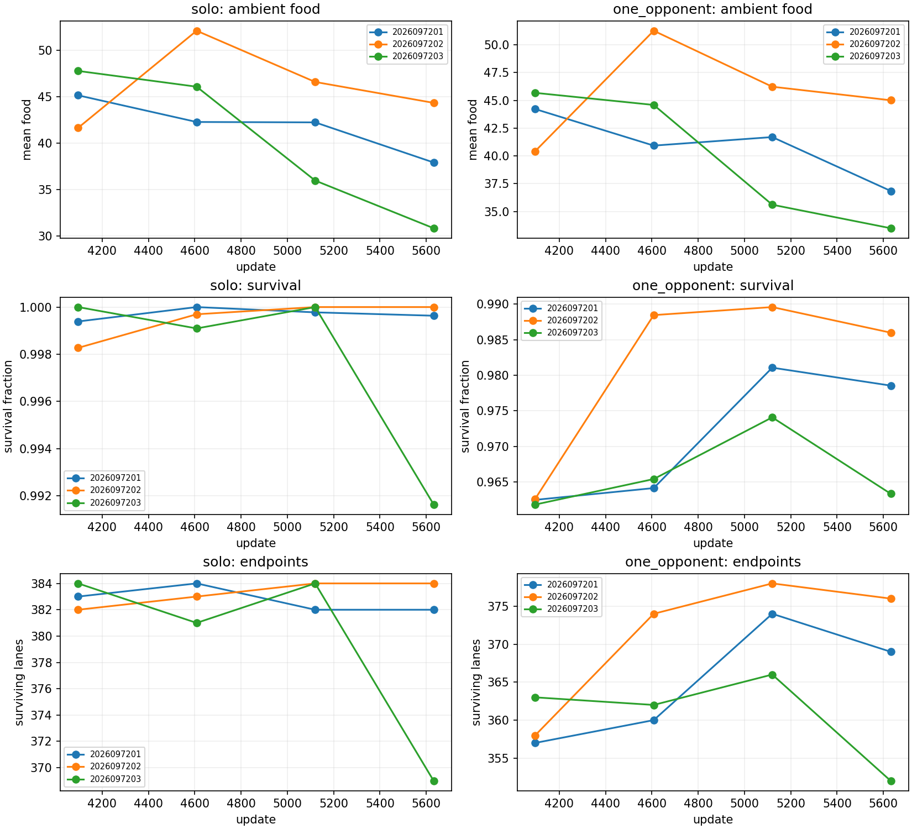
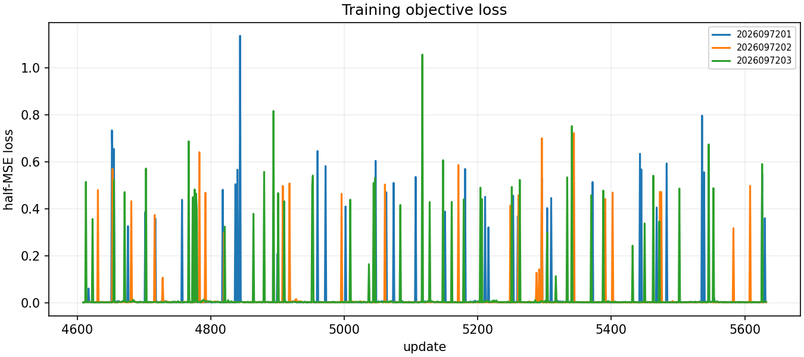
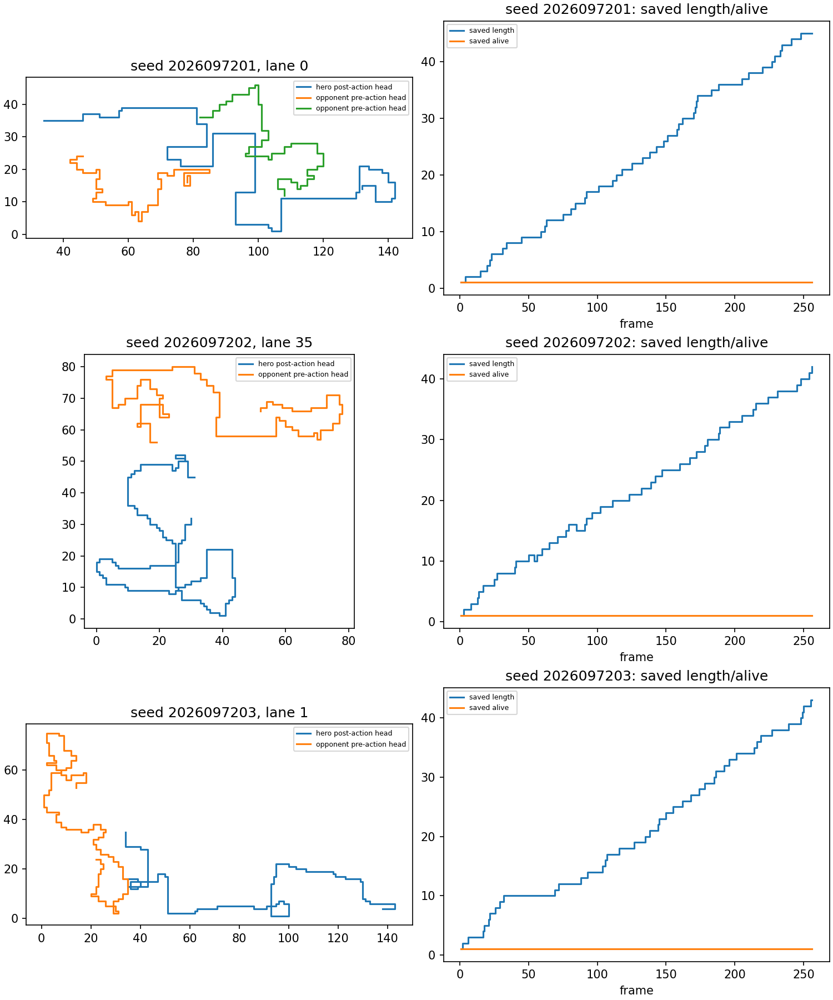

# Enemy-visible PQN longer-dose experiment

This record closes the 21 September 2026 continuation of the completed CZ
enemy-visible PQN lineages. It asks a narrow question: after the existing visible
models reached update 4,608, do another 1,024 unchanged native updates improve
fixed-GreedyFood opponent survival while retaining food behavior? This was an
outcome-informed continuation, not a new causal test of enemy visibility. It is
diagnostic only and is not promotion-eligible. Ape-X remains the operational
incumbent; these results make no architecture-superiority claim.

The audited closeout is
`3ab5cb40a7b66c9fc6267ec5f0ae18bde396294e84899496c7d159b011434b77`.
It records 35 physical jobs, 2,426.002 seconds of guarded elapsed time under the
6,240-second envelope. All three CZ parents were retained: parent lineages
6101/6102/6103 were resumed as 7201/7202/7203 with fresh worlds and RNG streams,
but restored model, Adam, and counters. The recipe remained native E16, rollout
16, minibatch 256, one exact-coverage epoch, epsilon 0.1, Q(lambda), half-MSE,
and fixed GreedyFood S2 play. Training produced 3,072 optimizer updates and
785,728 new valid hero transitions. Guards were 16 GiB RSS, 24 GiB MPS driver,
and a 9.6 GiB host reserve; observed peaks were 1,356,054,528 B RSS,
1,224,196,096 B MPS driver allocation, and 28,677,259,264 B minimum available
memory. Training loss is diagnostic telemetry, not
evidence of greedy gameplay quality.

The new evaluation bank held 32 fresh worlds, four headings, and three reachable
food placements per world: 384 lanes per condition at H256, with H64/H128
prefixes. Every lineage was evaluated at historical 4096, resumed 4608, midpoint
5120, and final 5632 in solo and fixed-GreedyFood conditions. Teacher and
random-safe anchors were evaluated in both conditions. The outer recursive
evaluation closure was actually frozen and checked before evaluation at 14:39:41
UTC, rechecked after evaluation began, and rehashed by the final analyzer and
closeout; it covered 2,023 files. The earlier qualification smoke predates that
addendum and is preserved as such. The first qualification attempt failed before
updates, then the repaired training and evaluation qualifications passed. The
unexecuted original analyzer repair is also retained in the audit trail; this
closeout uses the repaired saved-artifact analyzer.

## Result

None of the all-three-seed packages passed: cumulative capability versus 4096 was
**1/3**, retention versus 4608 was **0/3**, and incremental S2 learning versus
4608 was **0/3**. The final S2 endpoint mean and paired 95% CI in fraction-of-lane
units (multiply by 384 for lanes) were:

| Resumed seed | Final S2 food | Final S2 endpoints | Final minus 4608 endpoint mean [95% CI] | Cumulative | Retention | Incremental |
| --- | ---: | ---: | ---: | --- | --- | --- |
| 7201 | 36.85 | 369 | +0.0234 [-0.0010, +0.0479] | no | no | no |
| 7202 | 45.01 | 376 | +0.0052 [-0.0163, +0.0267] | yes | no | no |
| 7203 | 33.49 | 352 | -0.0260 [-0.0638, +0.0117] | no | no | no |

At marks 4608/5120/5632, respectively, solo food/endpoints were 42.29/384,
42.24/382, 37.92/382 for 7201; 52.12/383, 46.60/384, 44.35/384 for 7202; and
46.09/381, 35.97/384, 30.84/369 for 7203. S2 food/endpoints were 40.93/360,
41.70/374, 36.85/369; 51.26/374, 46.23/378, 45.01/376; and 44.59/362,
35.61/366, 33.49/352. The midpoint is descriptive only; it was never selected
as a best checkpoint.

The final absolute checks were largely retained: 97/102 primary absolute checks
and all 216/216 heading/action family cells passed. That does not satisfy the
separate paired learning and retention packages. The initial S2 encounter
admission was present for each lineage; final S2 close-range exposure was observed
on the fresh bank. These observations establish encounter opportunity, not a
learned-opponent-handling claim.

The three packages answer different questions and should not be collapsed into a
single score. Cumulative capability compares final 5632 to the historical visible
4096 checkpoint on the same new bank. It requires the inherited per-prefix
absolute protections in both S1 and S2, initial S2 encounter admission, S2 paired
learning, and S1 food/survival/endpoints retention. The 4608 retention package
checks both conditions against the actual resumed starting checkpoint. Incremental
S2 learning requires its own S2 food/time protections, at least
eight additional S2 endpoint survivors, and a positive paired 95% lower bound
versus 4608. It is independent of the separate both-condition retention package.
The table reports every seed because the 7202 cumulative pass does not establish
an all-lineage effect.

The final-minus-4608 endpoint fractions and confidence intervals are paired across
the 32 worlds, rather than pooled across seeds. They describe this bank and this fixed scripted opponent.
They do not establish a promotion result, general self-play strength, or a change
to the incumbent. Loss curves similarly record the native half-MSE objective and
can help diagnose an interrupted or unstable learner, but they are not a gameplay
metric. The representative figure is a saved-array illustration with fixed,
predeclared lanes; it is not a cherry-picked proof of policy quality.

## Decision and next work

Do not extend this unchanged recipe again. The bounded conclusion is that this
extra dose did not provide reliable incremental survival benefit across the three
lineages while retaining food behavior. The next controlled encounter calibration
is currently running serially. It is a separate experiment and has no result in
this document. Its purpose is to audit targeted encounter learnability and
experience while preserving food retention; it does not revise this study's
thresholds, bank, lineage, or decision.
