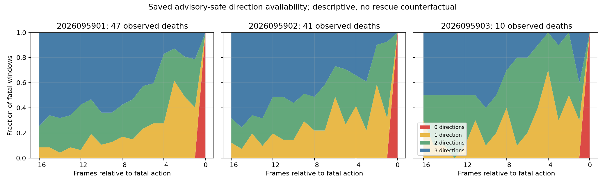

# CU: saved fatal advisory-onset census

**Status: complete and independently audited.** CU is a saved-window reduction
of CT's 98 replayed fatal events. It creates no game, model inference, optimizer
update, checkpoint choice, or policy result. The audit independently recomputed
all 98 windows and verified nine hashes.

## Observed onset pattern

Across every saved fatal window, the advisory-safe set first becomes empty only
at fatal offset 0. All 16 earlier saved states have at least one safe choice.
Every fatal window has at least one state within its final six preceding
states with at least two advisory-safe *directions*. This identifies the observed timing of advisory-set exhaustion in
these fatal windows; it does not establish that a different action would have
avoided death.

| CS seed | Fatal windows | First empty offset | Offset-1 windows with multiple directions |
| --- | ---: | --- | ---: |
| 2026095901 | 47 | 0 for all 47 | 28/47 |
| 2026095902 | 41 | 0 for all 41 | 28/41 |
| 2026095903 | 10 | 0 for all 10 | 7/10 |
| **All saved windows** | **98** | **0 for all 98** | **63/98** |

The per-seed histograms retain the distribution of the last pre-fatal state with
multiple directions and the safe-direction count at every offset. No earlier
empty-then-recovery sequence appears in the saved windows. Each sequence is
left-edge censored at the earliest retained state, so CU cannot identify how much
earlier the relevant constraint began.

## Boundary of the finding

CU has no matched nonfatal controls, alternative-action replay, or counterfactual
rescue. It cannot estimate the prevalence of the same timing pattern among
nonfatal play, prove that the advisory mask is the causal mechanism, or determine
whether any action was sufficient. It is a descriptive diagnostic, not a new
policy result or promotion gate.

CS behavior and CR learning curves remain historical evidence from their own
studies; CU only reduces CT's saved fatal records. The earlier CO, CP, CR, and CS
negative results remain unchanged. Apex remains the operational incumbent; its
larger historical training dose remains a confound rather than evidence of
inherent superiority.

## Qualification, audit, and next question

Qualification passed six tests in 0.2102062919875607 seconds. The saved reduction
completed in 0.625117749965284 seconds; both stayed within their 30-second caps.
The independent audit at `/tmp/cu-independent-audit-attempt2.json` passed after
recomputing all 98 windows. It verified nine input hashes, recorded 246,841,344
bytes peak RSS and 36,762,877,952 bytes minimum available memory, and reported no
MPS measurement. Both passing auditor versions are retained; the second adds an explicit
six-test log check. Neither reran or changed the scientific reduction.

The selected next question is CV, a paired experiment exposing the existing linear and log length inputs. It is drafted only and has not begun.

- [CU intent](/Users/josenunez/Projects/ml/snake-dqn-artifacts/ongoing-research-20260913/solo-food-pqn-fatal-onset/intent.json)
- [CU saved reduction](/Users/josenunez/Projects/ml/snake-dqn-artifacts/ongoing-research-20260913/solo-food-pqn-fatal-onset/report.json)
- [CT saved terminal diagnostic](../solo_food_pqn_h512_terminal_diagnostic_2026-09-21/README.md)
- [CS audited H512 behavior](../solo_food_pqn_h512_control_confirmation_2026-09-21/README.md)
- [CR historical training curves](../solo_food_pqn_h384_training_2026-09-20/training-curves.png)
