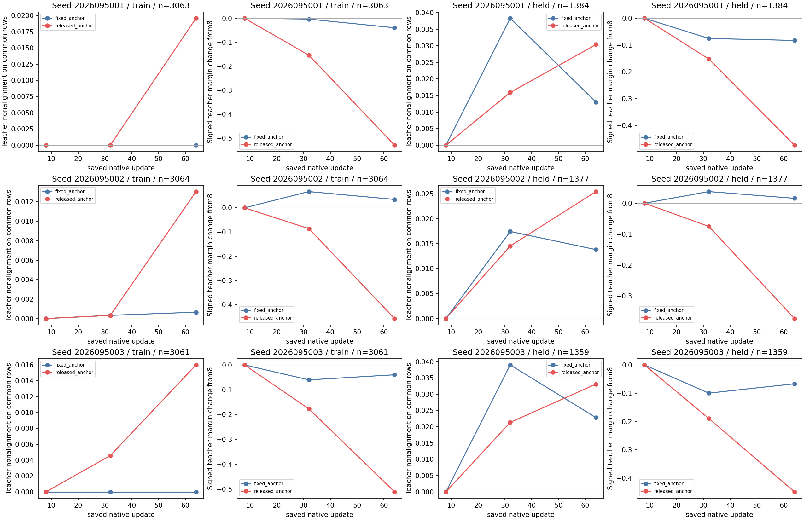

# BZ: teacher-alignment and margin drift on fixed BY rows

**Status: COMPLETE AND AUDITED.** On the same saved mark-8 rows, the released-anchor arm loses
teacher alignment more often and reduces its teacher margin more than the fixed-anchor
control in every held seed. The predeclared three-seed directional screen is positive.
This is a descriptive localization of saved Q outputs; it is not a significance test,
proof that teacher labels are optimal, a gameplay regression claim, or a learned-policy
result.

## Scope and comparison

BZ reads saved Q-output archives from the completed BY evaluations. It loads no model, performs no
inference, optimizer update, simulation, or gameplay. The two BY arms share an exact
mark-8 prefix. Fixed keeps the teacher anchor through update 64; released anneals it
after update 8 and has no teacher anchor from update 33 onward. BZ compares the
common eligible rows at marks 8 and 64, then describes marks 8→32 and 32→64 locally.

For each row, teacher alignment means the masked greedy action equals the archived
teacher label. A nonalignment is a change from aligned at the common mark-8 baseline
to nonaligned later. The teacher margin is Q(teacher action) minus the best legal
alternative; reported deltas are mark 64 minus mark 8. Teacher labels are a frozen
supervision reference, not an optimal-action or safety ground truth.

The retained BY train rows and the reused 1,526-row conditional-live held archive are
reported separately. Each common denominator contains precisely the rows that were
teacher-aligned at mark 8 and had at least two legal actions. That same denominator
is used in both arms at every mark. The held archive was inspected in earlier studies
and is a shared diagnostic, not a fresh confirmation set.

## Held fixed-row result

Each row gives `denominator; nonaligned/rate; mean teacher-margin delta` at mark 64
relative to the common mark-8 baseline. All released-minus-fixed margin differences
are negative, and released has more held nonalignments in every seed. That satisfies
the declared directional screen in 3/3 seeds, descriptively.

| Seed | Fixed held | Released held | Released − fixed margin delta |
|---|---|---|---:|
| 5001 | 1,384; 18 / 1.301%; -0.082702 | 1,384; 42 / 3.035%; -0.473373 | -0.390671 |
| 5002 | 1,377; 19 / 1.380%; 0.015881 | 1,377; 35 / 2.542%; -0.373714 | -0.389595 |
| 5003 | 1,359; 31 / 2.281%; -0.066622 | 1,359; 45 / 3.311%; -0.448339 | -0.381717 |

These are within-seed fixed-row summaries. They do not supply a confidence interval,
causal estimate, or a claim that released training worsened gameplay.

## Train fixed-row result

The same contrast appears in train rows, where the fixed control remains almost
entirely teacher-aligned. These values are descriptive and do not replace held or
gameplay evidence.

| Seed | Fixed train | Released train | Released − fixed margin delta |
|---|---|---|---:|
| 5001 | 3,063; 0 / 0.000%; -0.039701 | 3,063; 60 / 1.959%; -0.529330 | -0.489629 |
| 5002 | 3,064; 2 / 0.065%; 0.034659 | 3,064; 40 / 1.305%; -0.457275 | -0.491934 |
| 5003 | 3,061; 0 / 0.000%; -0.039714 | 3,061; 49 / 1.601%; -0.511514 | -0.471800 |

## Low-margin rows are a descriptive concentration

At mark 64, held teacher nonalignments concentrate in the lowest mark-8 margin
quartile: released seeds 5001 and 5003 have 42/42 and 45/45 there; seed 5002 has
32/35 there and three in quartile 2. Training nonalignments also concentrate there
but extend to other quartiles. The held low-margin quartile has 346,
345, and 340 rows for seeds 5001–5003 respectively. Its fixed/released nonalignment
rates are 5.202% / 12.139%, 5.507% / 9.275%, and 9.118% / 13.235%.

This concentration helps localize the saved-row drift, but does not prove that small
margins cause later action changes or that an intervention targeting them would help.

## Retained BY behavior

BZ does not rerun or revise BY gameplay. BY retained both arms 3/3, while released
anchor passed its relative-benefit food gate in 0 of 3 seeds and passed the
paired-world food-improvement confidence-interval gate versus its initial state in
only seed 5001. The all-seed strong result remained false. The previous
behavior table, fixed-gameplay examples, and failure gates are preserved here for
context rather than treated as BZ output.

| Seed | Initial food | Fixed final food / survivors | Released final food / survivors |
|---|---:|---:|---:|
| 5001 | 11.188 | 11.688 / 94 of 96 | 11.781 / 96 of 96 |
| 5002 | 11.344 | 11.865 / 95 of 96 | 11.635 / 95 of 96 |
| 5003 | 11.406 | 11.583 / 94 of 96 | 11.417 / 95 of 96 |

The teacher collected 12.656 food on average; random-safe collected 1.260. All nine
retention checks passed for both arms in every seed. The released-minus-fixed food
CI failed in all three seeds, and released-minus-initial food CI failed in seeds
5002 and 5003. No diagnostic fit score changes those behavioral conclusions.

- [BY completed report](../solo_food_pqn_anchor_release_2026-09-20/README.md)
- [Retained BY behavior comparison](by-behavior-comparison.png)
- [Retained BY fixed gameplay evidence](by-fixed-gameplay-evidence.png)

## Execution and limits

The saved-array analysis completed in 2.725526834 / 20 CPU science seconds, with peak
RSS 461,455,360 bytes and minimum available memory 36,433,903,616 bytes. There were
zero model loads, optimizer updates, inference calls, simulations, or gameplay runs.
Qualification preserves the original NumPy-index fixture failure after four passing
tests (1.410 seconds) and the R1 correction with five passing tests (1.323 seconds),
for 2.733 / 60 seconds.

The next bounded question uses the BY released-64 parent for 128 new updates with
fresh three-seed runtime, comparing no CE against re-anchoring. It is not an exact
simulation continuation and has no result here.

Apex remains the operational incumbent until the shared tournament gate supports a
replacement. Its larger historical training budget is a confound, not architectural-
superiority evidence.

## Primary records

- [BZ analysis](/Users/josenunez/Projects/ml/snake-dqn-artifacts/ongoing-research-20260913/solo-food-pqn-fixed-row-drift-r1/analysis/analysis.json) — frozen source revision `56e0e92434ae510a84ebaf6f58cf41c3e4421b04`
- [BZ intent](/Users/josenunez/Projects/ml/snake-dqn-artifacts/ongoing-research-20260913/solo-food-pqn-fixed-row-drift-r1/intent.json)
- [BZ qualification](/Users/josenunez/Projects/ml/snake-dqn-artifacts/ongoing-research-20260913/solo-food-pqn-fixed-row-drift-r1/qualification-complete.json)
- [BZ science receipt](/Users/josenunez/Projects/ml/snake-dqn-artifacts/ongoing-research-20260913/solo-food-pqn-fixed-row-drift-r1/supervisor-runs/analysis/receipt.json)
- [BY source analysis](/Users/josenunez/Projects/ml/snake-dqn-artifacts/ongoing-research-20260913/solo-food-pqn-anchor-release/analysis/analysis.json)

The root review and independent saved-JSON and receipt/hash audits passed. The
[closeout](/Users/josenunez/Projects/ml/snake-dqn-artifacts/ongoing-research-20260913/solo-food-pqn-fixed-row-drift-r1/closeout.json)
binds those audits and the preserved qualification failure. The receipt audit rehashed
1,466 input files and authenticated all 15 evaluation reports and 30 Q archives.
