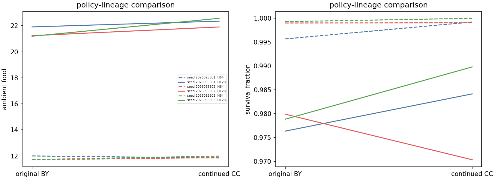
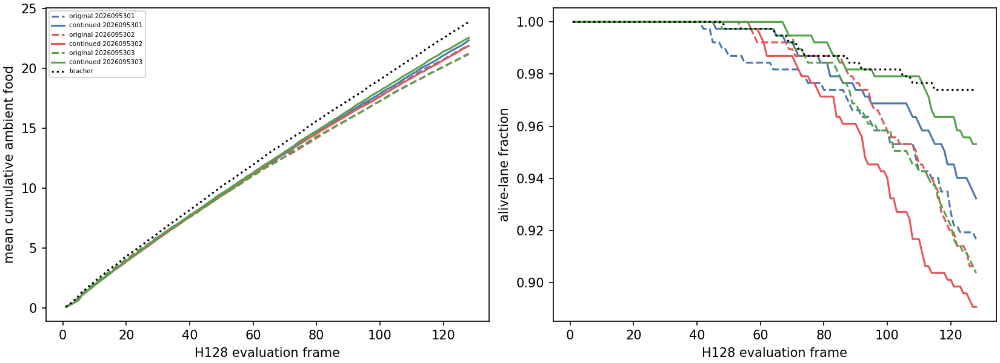
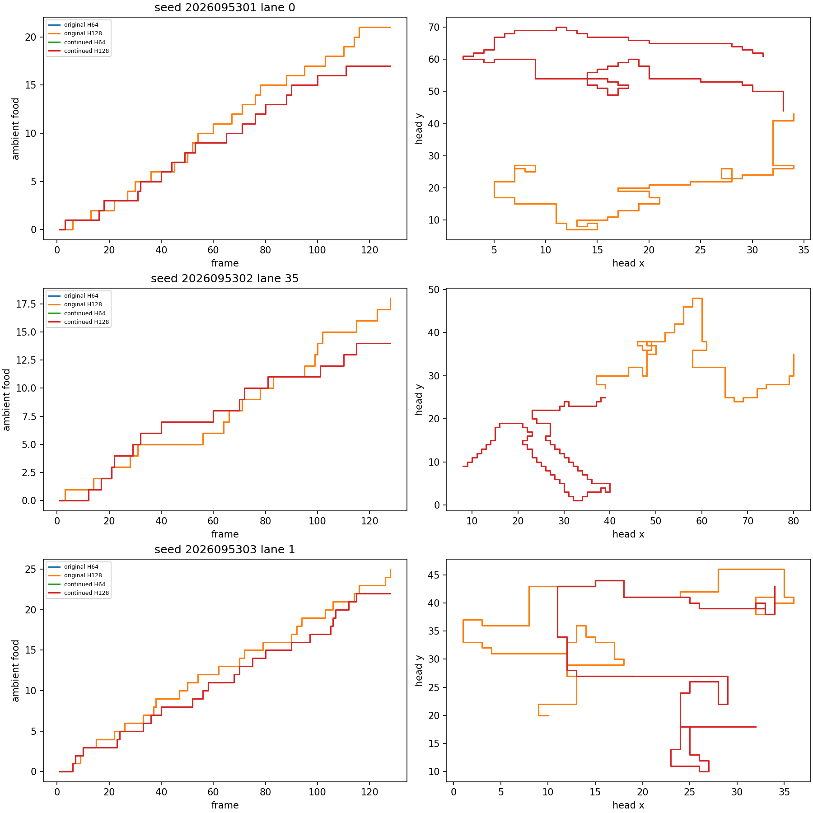

# CF: 32-world H128 replication of fixed mark-1024 policies

**Status: COMPLETE_AND_AUDITED.** CF confirms the earlier H128 limitation on a larger,
independent 32-world bank. All three fixed CC mark-1024 policies pass every H64
condition and retain H128 food, time, relative endpoint retention, and food
noninferiority. Seed 2026095302 ends 342 of 384 lanes, below the unchanged scaled
floor of 348. Because every one of 17 conditions must pass for every seed,
`overall_success` remains false.

## Frozen question and scope

CF is a single fixed replication of CD's H128 retention question. It evaluates
GreedyFood, RandomSafe, and the mapped BY released-anchor original plus CC mark-1024
continued policy for seeds 2026095301–03. No model is selected or trained, no fit is
computed, and no checkpoint is changed; CC's actual [learning history](../solo_food_pqn_training_dose_2026-09-20/learning-curves.png) remains historical context.

The bank has 32 fresh worlds, 2026107400–2026107431, with four headings and three
reachable left/straight/right placements per world: 384 lanes for every role, including
the anchors. Teacher runs 32 12-lane chunks and RandomSafe runs four 96-lane chunks.
Every role runs once to H128; H64 is the exact saved prefix and is not an independent
rollout. CD and CF worlds are not combined, and lanes are not treated as independent
statistical units. The separate smoke world is 2026107500.

Teacher calibration passed its six checks at both horizons. Per seed and horizon, eight
retention checks require food versus original and teacher, all pose cells, time,
endpoints, relative time/endpoint retention, and positive paired food against random.
H128 adds strict food noninferiority: its paired continued-minus-original lower bound
must exceed negative 5% of original mean food. Statistics use the 32 paired world means
at df 31; strict superiority is descriptive rather than a primary gate.

## Full results

| Seed | Horizon | Original: food / time / endpoints | Continued: food / time / endpoints | All horizon checks |
| --- | ---: | --- | --- | --- |
| 2026095301 | H64 | 11.9974 / .9957 / 377 | 11.8438 / .9992 / 383 | Pass |
|  | H128 | 21.9089 / .9763 / 352 | 22.3490 / .9842 / 358 | Pass |
| 2026095302 | H64 | 11.7057 / .9990 / 381 | 11.8724 / .9991 / 379 | Pass |
|  | H128 | 21.2370 / .9799 / 348 | 21.9036 / .9703 / **342** | **Fails endpoints ≥348** |
| 2026095303 | H64 | 11.7188 / .9993 / 383 | 11.9870 / 1.0000 / 384 | Pass |
|  | H128 | 21.1927 / .9788 / 347 | 22.5677 / .9898 / 366 | Pass |

The H64 prefix reproduces all eight conditions in all three seeds. At H128, food
and time conditions, every pose-cell condition, random separation, endpoint retention
relative to original, and the strict noninferiority condition all pass 3/3. The sole
failure ledger entry is `seed/2026095302/h128: endpoints_ge348 = false`. Its relative
endpoint condition still passes: 342 is within the allowed eight-lane drop from the
original's 348, but it misses the absolute floor by six lanes.

| Seed | H64 continued − original food, 95% CI | H128 continued − original food, 95% CI | H128 noninferior? | H128 superior? |
| --- | ---: | ---: | --- | --- |
| 2026095301 | −.1536 [−.3601, .0528] | +.4401 [.0091, .8711] | Yes | Yes, descriptive |
| 2026095302 | +.1667 [−.0653, .3986] | +.6667 [−.0230, 1.3563] | Yes | No |
| 2026095303 | +.2682 [.0058, .5307] | +1.3750 [.9665, 1.7835] | Yes | Yes, descriptive |

H128 mean food is higher in all three continued policies, and its paired interval
excludes zero in 2/3 seeds. These descriptive gains do not repair
the predeclared survival failure. No lane average, CD comparison, or
representative trace rescues it. CF neither promotes a policy nor changes CD's failure.
It does not establish opponent competence or architecture superiority. Apex remains the
operational incumbent; its larger historical training budget is not proof of inherent
superiority.

## Representative evidence

The preregistered continued lanes 0, 35, and 1 end alive with 17, 14, and 22 ambient
food. The matching originals end at 21 food/dead, 18 food/alive, and 25 food/alive.
These fixed panels illustrate trajectories only and do not decide the 32-world gate.

## Execution and next question

All ten science jobs completed naturally with no failed attempt. Science used 423.4262
of 1,030 seconds. Qualification passed 14 tests in 9.152 of 60 seconds. It performed no
optimizer updates; peak RSS was 886,833,152 bytes, minimum available memory was
36,645,437,440 bytes, and MPS allocation was zero. The independent science audit checked
4,070 inputs; the receipt audit passed after auditor-only field corrections, with no
change to frozen science or rerun.

The next experiment, **CG**, is not frozen or running. It would compare 1,024 new
native PQN updates at H64 and H128 from the same CC mark-1024 parents, testing whether
late-state exposure matters before changing representation. These CC/BY native-PQN
lineages used a maximum 64-frame training horizon. Transformed `FoodGeometry` drops
progress scalar 5, so changing its normalization has no direct transformed-input effect;
the episode cap can still change the sampled state distribution after resets. This is a
bounded hypothesis, not a causal conclusion from CF.

## Primary records

- [CF frozen design](/Users/josenunez/Projects/ml/snake-dqn-artifacts/ongoing-research-20260913/solo-food-pqn-h128-replication/design.md)
- [CF final analysis](/Users/josenunez/Projects/ml/snake-dqn-artifacts/ongoing-research-20260913/solo-food-pqn-h128-replication/analysis/analysis.json)
- [CF all-seed comparison](allseed-comparison.png)
- [CF horizon curves](horizon-curves.png)
- [CF fixed gameplay evidence](fixed-gameplay.png)
- [CF science audit](/Users/josenunez/Projects/ml/snake-dqn-artifacts/ongoing-research-20260913/solo-food-pqn-h128-replication/science-audit.json)
- [CF independent receipt audit](/Users/josenunez/Projects/ml/snake-dqn-artifacts/ongoing-research-20260913/solo-food-pqn-h128-replication/independent-audit.json)
- [CF resource rollup](/Users/josenunez/Projects/ml/snake-dqn-artifacts/ongoing-research-20260913/solo-food-pqn-h128-replication/resource-rollup.json)
- [CF closeout](/Users/josenunez/Projects/ml/snake-dqn-artifacts/ongoing-research-20260913/solo-food-pqn-h128-replication/closeout.json) — `9c424b70d939be84219c5fc0a89872ced26020b7420f4db6ce52891d61dffb9b`
- [CC completed parent study](../solo_food_pqn_training_dose_2026-09-20/README.md)
- [CD original H128 evaluation](../solo_food_pqn_h128_retention_2026-09-20/README.md)
- [CE saved-action death diagnosis](../solo_food_pqn_h128_deaths_2026-09-20/README.md)
