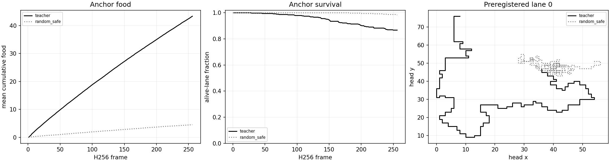

# CH: H256 native-PQN confirmation stopped at anchor calibration

**Status: COMPLETE_AND_AUDITED — CALIBRATION_FAILED.** CH completed its qualified anchor
screen on 32 fresh worlds (384 lanes) and stopped before any scientific learned-policy H256
gameplay. The unchanged GreedyFood anchor met its H256 food and random-separation
requirements, but missed both predeclared survival requirements: mean survival time
was **0.9499308268229166**, below .95, and **333/384** endpoints survived, below 348.
The calibration therefore passed 16 of 18 checks and did not authorize the six
learned-policy evaluations. This is an anchor-calibration outcome, **not** a learned
policy regression, training result, or replacement decision.

CH retains CG's fixed mark-2048 `train_h64` and `train_h128` policies only as intended
evaluation candidates. Both arms for each policy seed 2026095401–03 remain **NOT RUN in science**.
No checkpoints were selected, no optimizer update occurred, and no new fit inference
was performed.

## Frozen scope and stop rule

CH was the next fixed-policy branch after CG's completed H64/H128 study. It uses the
same native raster model, six relative actions and masks, CPU float32 evaluation, and
food-only reward contract. The fresh gameplay bank spans worlds 2026107800–2026107831,
with four headings and left/straight/right reachable-food placements per world. H64 and
H128 are exact prefixes of each H256 trace; they are not independent games.

The local adapter is a minimal extension of CG's qualified H128 native adapter: it
permits H256 and disallows label collection at H128/H256. It preserves
`GreedyFoodSimdPolicy`; no `SpaceTeacher` substitution occurred. Its separate smoke
proof compared all 14 raw fields, H64/H128 prefixes, initial food, and model identity
against the inherited H128 path for teacher, RandomSafe, and both learned roles.

The frozen calibration required six checks at each horizon: the teacher food floor,
mean survival time at least .95, at least 348 endpoint survivors, food in all 12 pose
cells, food at least twice RandomSafe, and a positive paired teacher-minus-RandomSafe
food interval. Every learned arm/seed required all 16 policy conditions across H64/H128/H256 only after this
screen passed. The stop preserves those conditions instead of redefining them after
observing the anchor result.

## Completed anchor evidence

| Horizon | Teacher food / time / endpoints | RandomSafe food / time / endpoints | Teacher late-window food | Calibration checks |
| --- | --- | --- | ---: | --- |
| H64 | 12.4296875 / .9976806640625 / 381 | 1.2708333333333333 / 1 / 384 | — | 6/6 pass |
| H128 | 23.544270833333332 / .9891357421875 / 371 | 2.421875 / 1 / 384 | — | 6/6 pass |
| H256 | 43.364583333333336 / .9499308268229166 / 333 | 4.505208333333333 / .9978535970052084 / 378 | 19.8203125 in frames [128:256) | 4/6 pass |

The two failed H256 checks are `teacher_time_ge0.95` and `teacher_endpoint_ge348`.
The H256 teacher food floor, all-pose-cell condition, two-times-RandomSafe condition,
and paired food interval all pass. The H256 failure is therefore a survival-calibration
failure, not a lack of food collection.

The figure was reviewed for legibility before this report. It describes the two
scripted anchors only and is not a learning curve.

## Learned-policy matrix

| Policy seed | `train_h64` mark 2048 | `train_h128` mark 2048 | Reason |
| --- | --- | --- | --- |
| 2026095401 | NOT RUN | NOT RUN | Predeclared H256 anchor survival gate failed |
| 2026095402 | NOT RUN | NOT RUN | Predeclared H256 anchor survival gate failed |
| 2026095403 | NOT RUN | NOT RUN | Predeclared H256 anchor survival gate failed |

The earlier [CG training-horizon report](../solo_food_pqn_training_horizon_2026-09-20/README.md)
contains the completed mark-2048 learning curves and H64/H128 behavior. CH does not
relabel those curves or create a new training curve.

## Resource and execution record

The qualified test invocation passed **21 tests in 14.297 seconds** of its 60-second
cap, with zero discarded or study optimizer updates. Three scientific jobs completed
naturally, with no failed attempt:

| Job | Elapsed seconds | Max RSS bytes | Minimum available bytes |
| --- | ---: | ---: | ---: |
| Teacher H256 evaluation | 22.603267709026113 | 462667776 | 37966626816 |
| RandomSafe H256 evaluation | 11.090561625023838 | 460242944 | 37948243968 |
| Calibration reduction | 5.853084000002127 | 523010048 | 37927976960 |

The charged science total is **39.54691333405208 / 2040 seconds**. The peak RSS was
**523010048 bytes**, and minimum available memory was **37927976960 bytes**. Evaluation
used two CPU threads and one inter-op thread. The independent audit passed: it verified 16,653 bound files, all three natural-exit receipts, source integrity, the fresh bank, and all 18 calibration checks. Qualification separately peaked at 996,376,576 RSS bytes with 37,800,738,816 bytes available. Its four-role prefix smoke included both learned arms at seed 5401 on the separate smoke world; those discarded checks are not scientific policy evaluations.

## Interpretation and next bounded question

The stopped screen does not say how either fixed CG arm behaves at H256. It also does
not weaken CG's established H64/H128 all-three absolute result, or repair CG's failed
relative horizon-benefit result. CH is not promotion-eligible.

The next proposed question is a separately frozen six-policy diagnostic on the same CH
bank, reusing these completed anchors. It would inspect the fixed policies under a
confidence-interval protocol before making any learner-world claim. It is prospective:
no learner outcome, criterion change, or formal reliability result is asserted here.

Apex remains the operational incumbent. Its larger historical training budget is a
confound, not evidence that its architecture is inherently superior; CH did not run the
shared tournament promotion gate.

## Primary records

- [CH frozen design](/Users/josenunez/Projects/ml/snake-dqn-artifacts/ongoing-research-20260913/solo-food-pqn-h256-confirmation/design.md)
- [CH frozen intent](/Users/josenunez/Projects/ml/snake-dqn-artifacts/ongoing-research-20260913/solo-food-pqn-h256-confirmation/intent.json)
- [CH qualified prefix proof](/Users/josenunez/Projects/ml/snake-dqn-artifacts/ongoing-research-20260913/solo-food-pqn-h256-confirmation/qualification-tests/prefix-proof.json)
- [CH qualification result](/Users/josenunez/Projects/ml/snake-dqn-artifacts/ongoing-research-20260913/solo-food-pqn-h256-confirmation/qualification-complete.json)
- [CH teacher report](/Users/josenunez/Projects/ml/snake-dqn-artifacts/ongoing-research-20260913/solo-food-pqn-h256-confirmation/evaluation/teacher-seed0-mark0/report.json)
- [CH RandomSafe report](/Users/josenunez/Projects/ml/snake-dqn-artifacts/ongoing-research-20260913/solo-food-pqn-h256-confirmation/evaluation/random_safe-seed0-mark0/report.json)
- [CH calibration report](/Users/josenunez/Projects/ml/snake-dqn-artifacts/ongoing-research-20260913/solo-food-pqn-h256-confirmation/calibration/report.json)
- [CH anchor behavior source](/Users/josenunez/Projects/ml/snake-dqn-artifacts/ongoing-research-20260913/solo-food-pqn-h256-confirmation/calibration/anchor-behavior.png)
- [CG completed learning and H128 behavior](../solo_food_pqn_training_horizon_2026-09-20/README.md)

- [CH independent audit](/Users/josenunez/Projects/ml/snake-dqn-artifacts/ongoing-research-20260913/solo-food-pqn-h256-confirmation/independent-audit.json)
- [CH final closeout](/Users/josenunez/Projects/ml/snake-dqn-artifacts/ongoing-research-20260913/solo-food-pqn-h256-confirmation/closeout.json)
