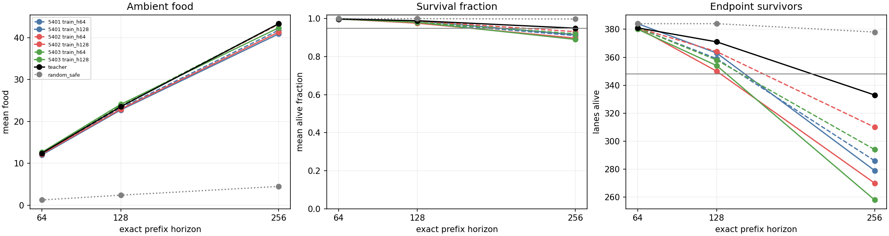
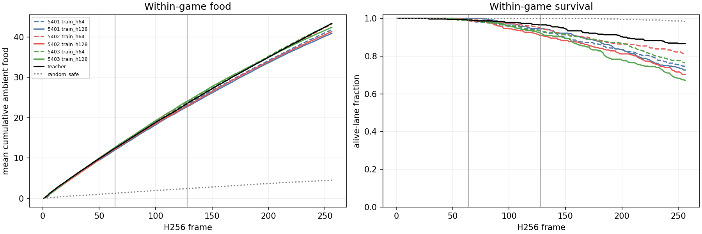
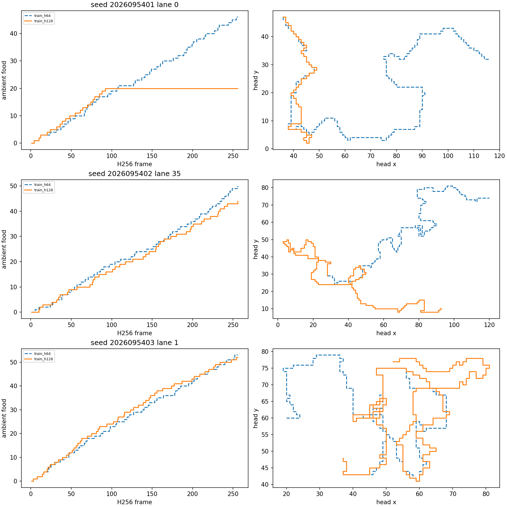

# CI: fixed-policy H256 diagnostic

**Complete and independently audited.** All six fixed native PQN policies retained strong food collection, including frames 129–256, but every policy failed both H256 survival conditions. The shorter H64/H128 prefixes met every declared diagnostic condition. Neither arm qualifies for fresh confirmation; this study does not establish long-game reliability or promotion eligibility.

CI deliberately reused CH's completed anchors and 32-world bank after CH failed teacher calibration. The bank was unseen by these six scientific policy evaluations, but its anchor results were already known. This is a separately frozen diagnostic, not a new fresh-bank confirmation or a repair to CH's result. CH's failed criteria remain unchanged.

## Fixed comparison and criteria

The six policies are all CG mark-2048 checkpoints: seeds 2026095401–5403, each with a training episode cap of 64 or 128 frames. No checkpoint was selected by CI performance, and no optimizer updates or new fit inference were run. Each policy played 32 worlds (2026107800–2026107831), four headings and three placements per world, for 384 greedy episodes. H64 and H128 metrics are exact prefixes of the same H256 trajectories.

Each policy had 16 fixed conditions: at each of H64/H128/H256, food ≥75% of teacher, all 12 pose cells ≥50% of teacher, survival time ≥.95, ≥348/384 endpoint survivors, and a positive lower 95% bound for paired policy-minus-random food; plus frames 129–256 food ≥75% of teacher. Every policy passed 14/16. The only failures were the H256 time and endpoint floors. Paired intervals use 32 world means with df=31; lanes and training seeds are never pooled.

## Every seed and arm

Food is mean ambient pickups over the full horizon. Time is mean alive-frame fraction, so dead frames remain in the denominator. Endpoint is the number alive at the horizon. Seed suffixes below retain the full 202609 prefix.

| Seed | Training cap | H64 food / time / endpoint | H128 food / time / endpoint | H256 food / time / endpoint | Late food | Deaths |
|---|---|---|---|---|---|---|
| 2026095401 | 64 | 12.2396 / 0.998942 / 381 | 23.2005 / 0.980937 / 359 | 41.8203 / 0.910675 / 286 | 18.6198 | 98 |
| 2026095401 | 128 | 12.0078 / 1.000000 / 384 | 22.7630 / 0.987976 / 363 | 40.9245 / 0.915253 / 279 | 18.1615 | 105 |
| 2026095402 | 64 | 12.4141 / 0.998820 / 381 | 23.7109 / 0.987142 / 364 | 43.2109 / 0.931559 / 310 | 19.5000 | 74 |
| 2026095402 | 128 | 12.2057 / 0.998739 / 381 | 22.9531 / 0.976074 / 350 | 41.3542 / 0.897603 / 270 | 18.4010 | 114 |
| 2026095403 | 64 | 12.5625 / 0.997965 / 381 | 23.8438 / 0.981201 / 358 | 43.3229 / 0.920695 / 294 | 19.4792 | 90 |
| 2026095403 | 128 | 12.6484 / 0.998494 / 380 | 24.1016 / 0.980611 / 354 | 42.3854 / 0.890727 / 258 | 18.2839 | 126 |

The reused teacher collected 43.3646 food at H256, with time .9499308268 and 333/384 endpoints. Its time is below .95 even though rounding to two decimals hides that failure. Random-safe collected 4.5052 food with .997854 time and 378/384 endpoints. High random survival alone is not food-seeking skill.

All six learned-policy endpoint differences from teacher have negative upper 95% bounds. Their recorded 607 deaths are all classified by the raw simulator cause code as self-collisions. CI did not replay actions or classify safety-mask behavior, so these cause counts do not yet establish a terminal mechanism or an earlier opportunity to escape.

## Behavioral evidence and learning references

Colors identify seeds; dashed lines are policies trained with a 64-frame cap and solid lines use a 128-frame cap. Teacher/random anchors are reused from CH. The absolute time and endpoint floors are unchanged.

These within-game curves show continued food collection and accumulating late deaths. They are gameplay curves, not training curves. This evaluation made no new updates; the corresponding [CG training, fit, and TD-exposure curves](../solo_food_pqn_training_horizon_2026-09-20/README.md) remain the learning evidence. CG's archived training and held teacher-label fit references are authenticated separately from CI greedy performance.

The fixed evidence uses predeclared lanes 0, 35, and 1 for seeds 5401, 5402, and 5403. The saved [selection record](fixed-selection.json) preserves that choice. Representative trajectories illustrate behavior; the full 384-lane metrics decide the result.

## Execution and next decision

All seven jobs ended naturally with exit code 0: six serialized CPU evaluations and one saved-evidence analysis. Science used 612.6042 of the declared 1,530 seconds. Qualification passed 13 tests in 1.635 of 60 seconds with no games, inference, or updates; it reused CH's qualified prefix-parity evidence. Science peak process-tree RSS was 940,130,304 bytes, and minimum available memory was 36,534,419,456 bytes. The existing two-thread CPU, two-slot exclusion, 4 GiB RSS, 12 GiB available-memory, and watchdog guards stayed intact. No source drift or guard violation was recorded.

The independent audit verified 16,629 distinct bound files/pointers, all receipts, every seed, world-based intervals, unchanged criteria, the 12-entry failure ledger, and explicit zero-work analysis counters. Root reviewed all three figures for legibility and agreement with the saved results.

The next bounded experiment is exact saved-action replay of every failing policy's deaths, including 16 preceding states. It will classify fatal decisions under the advisory/resolved action masks without loading a model or choosing new actions. That evidence will guide a representation or learning experiment; the cause census alone is insufficient. Apex remains incumbent under the shared tournament gate, with its larger historical training budget treated as a confound rather than architectural proof.

- [Frozen intent](/Users/josenunez/Projects/ml/snake-dqn-artifacts/ongoing-research-20260913/solo-food-pqn-h256-diagnostic/intent.json)
- [Complete per-seed analysis](/Users/josenunez/Projects/ml/snake-dqn-artifacts/ongoing-research-20260913/solo-food-pqn-h256-diagnostic/analysis/analysis.json)
- [Independent audit](/Users/josenunez/Projects/ml/snake-dqn-artifacts/ongoing-research-20260913/solo-food-pqn-h256-diagnostic/independent-audit.json)
- [Final closeout](/Users/josenunez/Projects/ml/snake-dqn-artifacts/ongoing-research-20260913/solo-food-pqn-h256-diagnostic/closeout.json)
