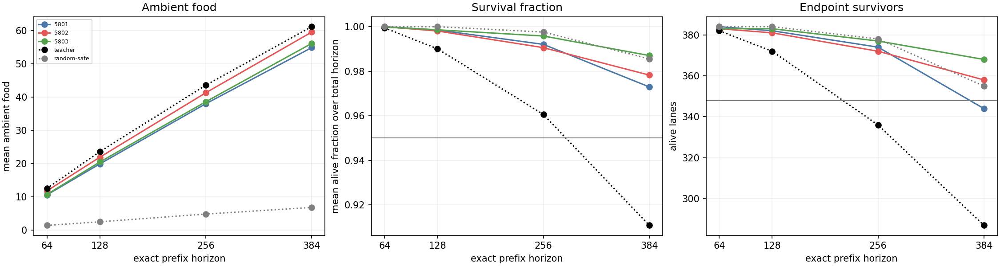
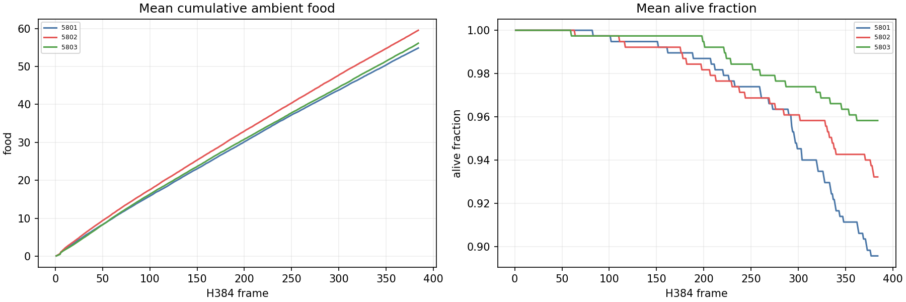
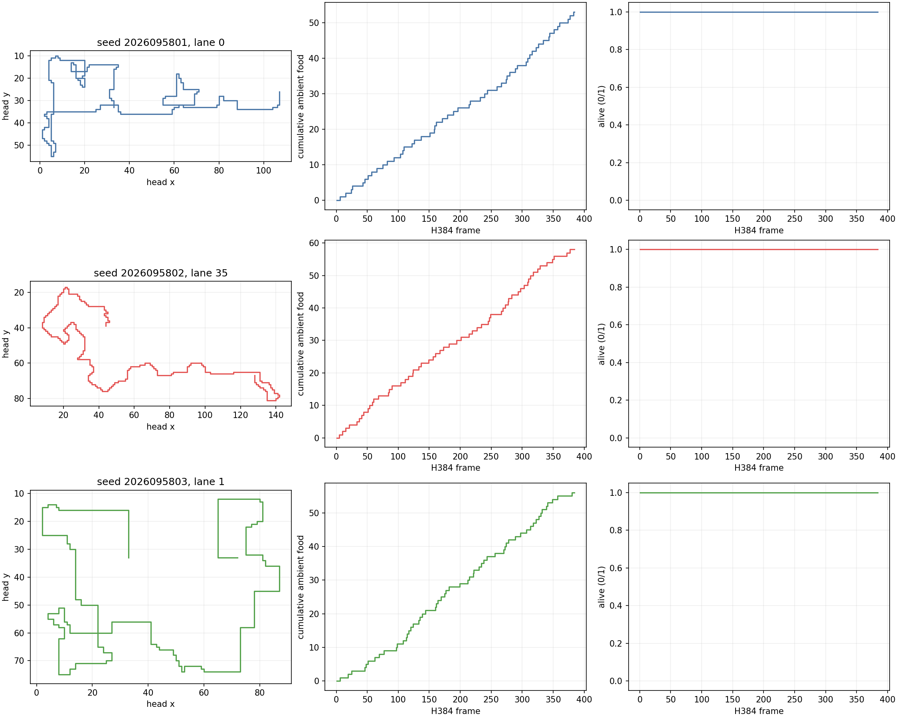
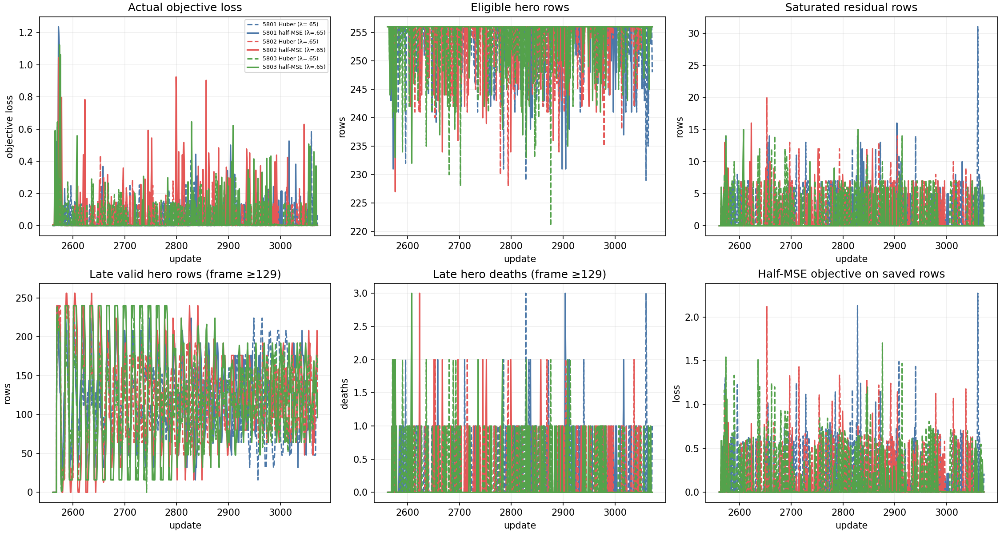

# CP: H384 confirmation of the fixed CO half-MSE cohort

**Status: complete and independently audited.** CP is an evaluation-only
duration check of all three completed CO `half_mse` final checkpoints, never a
new loss comparison. It selected the fixed `half_mse` mark-3072 cohort because
CO's absolute package passed in all three seeds, while preserving CO's failed
paired loss-effect result. CP does not support superiority, promotion, or a
tournament claim.

## Fixed evidence

The cohort is CO seeds 2026095801, 2026095802, and 2026095803, role
`half_mse`, mark 3072. Its saved CO model and Adam state were authenticated
unchanged. CP used the same three training lineages on a new bank of 32
worlds (2026108800--2026108831), four headings, and three reachable food
placements per world: 384 lanes at H384. H64, H128, and H256 are exact prefixes
of each sole H384 trace. CP made zero optimizer updates and zero new fit calls.

Each policy has 22 absolute conditions: the inherited 16 through H256, five H384
conditions (food, all 12 cells, survival time, endpoints, and paired food versus
RandomSafe), and the added late-food condition for frames 257--384. The 32 paired
world means use df 31; lanes and seeds are never pooled. Teacher and RandomSafe
are descriptive anchors. The earlier CH survival-calibration failure remains
failed.

## Final greedy behavior

Entries are `mean ambient food / survival fraction / endpoint survivors` on the
fresh 384-lane bank.

| Seed | H64 | H128 | H256 | H384 | 22-condition result |
| --- | --- | --- | --- | --- | --- |
| 2026095801 | 10.544271 / 1.000000 / 384 | 19.882812 / 0.998515 / 382 | 37.979167 / 0.992055 / 374 | 54.877604 / 0.972961 / 344 | Failed: H384 endpoints |
| 2026095802 | 11.747396 / 0.999959 / 383 | 21.898438 / 0.998067 / 381 | 41.286458 / 0.990580 / 372 | 59.552083 / 0.978265 / 358 | Passed |
| 2026095803 | 10.682292 / 0.999797 / 383 | 20.447917 / 0.998596 / 383 | 38.585938 / 0.995809 / 377 | 56.145833 / 0.987040 / 368 | Passed |

Only seed 5801 failed: 344 of 384 endpoints at H384, below the unchanged 348
floor. Its other 21 conditions passed. Seeds 5802 and 5803 passed all 22. The
required all-three conjunction therefore failed. CP preserves CO's relative
result as false and neither retries the failed seed nor selects another
checkpoint.

## Qualification and operations

Qualification passed 27 tests in 1.498 seconds and the CPU prefix-parity smoke
in 6.279411915980745 seconds: 7.777411915980745 seconds of the 120-second
budget. It made no optimizer updates, used no MPS, and ran 7,680 smoke gameplay
lane frames. The completed science receipts total 264.951447 seconds before the
independent audit: teacher 18.816105, RandomSafe 6.923843, the three fixed-policy
evaluations 75.604542, 76.543402, and 83.078262, and analysis 3.985293 seconds.
Maximum recorded RSS was 814,514,176 bytes; the lowest recorded available memory
was 36,185,456,640 bytes. The independent audit verified 1,501 file hashes and
recomputed every condition and paired world confidence interval. The first audit
mistakenly expected the nested historical fit scope to change; its failed result
is preserved. The corrected audit checks the complete inherited fit object with
only the declared top-level scope change. No scientific job was repeated.

The three panels below are CP saved-evidence reductions. The fixed representative
lanes are seed-order lanes 0, 35, and 1; each shows head path, cumulative ambient
food, and alive state. The final training panel is historical CO learning evidence
only: CP performed no optimization and has no CP training curve.

## Interpretation boundary

CP asks whether the fixed outcome-selected CO half-MSE family retains its
absolute package on fresh longer worlds. With one H384 endpoint-floor failure,
it does not establish all-seed H384 retention. It cannot establish that half-MSE
caused the CO H256 result, that any seed is preferred, or that the policy family
supersedes Apex. Apex remains incumbent; its larger historical training dose is a
confound, not evidence of inherent superiority.

- [CP intent](/Users/josenunez/Projects/ml/snake-dqn-artifacts/ongoing-research-20260913/solo-food-pqn-h384-confirmation/intent.json)
- [CP bank](/Users/josenunez/Projects/ml/snake-dqn-artifacts/ongoing-research-20260913/solo-food-pqn-h384-confirmation/bank.json)
- [CP analysis](/Users/josenunez/Projects/ml/snake-dqn-artifacts/ongoing-research-20260913/solo-food-pqn-h384-confirmation/analysis/analysis.json)
- [Qualification completion](/Users/josenunez/Projects/ml/snake-dqn-artifacts/ongoing-research-20260913/solo-food-pqn-h384-confirmation/qualification-complete.json)
- [Qualification accounting](/Users/josenunez/Projects/ml/snake-dqn-artifacts/ongoing-research-20260913/solo-food-pqn-h384-confirmation/qualification-accounting.json)
- [CO audited result](../solo_food_pqn_loss_shape_2026-09-20/README.md)
