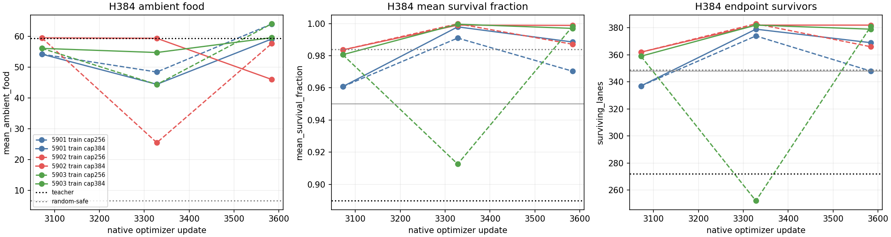
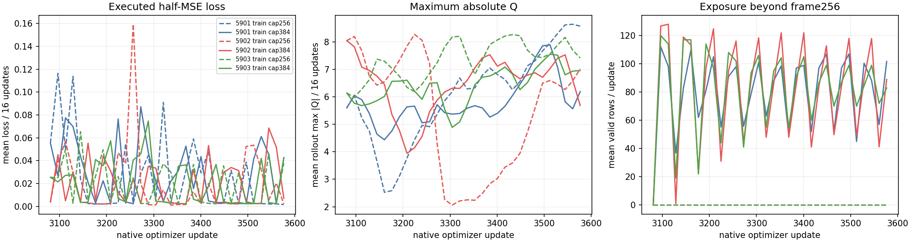
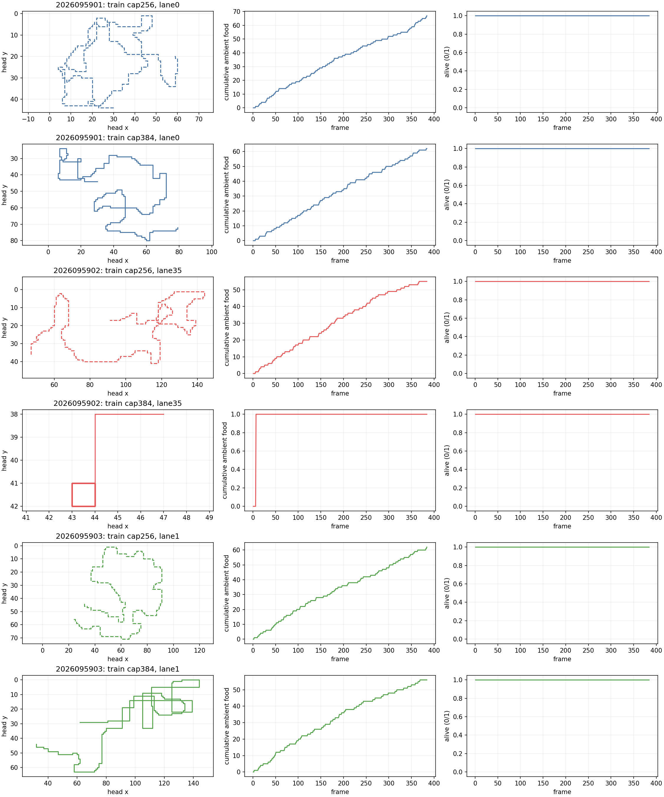

# CR: paired H256 versus H384 continuation

**Status: complete and independently audited.** All 24 predeclared scientific
jobs exited successfully. The three H256-trained control finals pass all 22
food/survival conditions at H384. The H384-trained treatment passes in two seeds;
its paired benefit rule fails in all three. The frozen primary result remains
false, alongside the separate control-cohort behavioral milestone.

## Frozen comparison

Each CR seed restored the corresponding CO `half_mse` final checkpoint at mark
3072, including model, full Adam state, counters, and odometer: CR 2026095901
from CO 5801, 5902 from 5802, and 5903 from 5803. `train_h256` and
`train_h384` then made the same 512-update native Q(lambda=.65), half-MSE
continuation with the same learning rate, sampler, masks, and fresh per-seed
streams. The only declared treatment difference was the 256- versus 384-frame
rollout cap. This is a matched episode-cap package contrast: reset behavior,
truncation boundaries, and later-state exposure change together.

Greedy evaluation used 32 fresh worlds (2026109000--2026109031), four headings,
and three reachable food positions per world: 384 H384 lanes. H64, H128, and
H256 are exact prefixes. The 22 absolute conditions and 48 cell subchecks apply
separately to every role and seed. Paired intervals use 32 world means as the
statistical units, and training seeds are not pooled. Mark 3328
is descriptive only. The saved learning curves are unstable and do not override
the final-mark criteria.

## Final H384 greedy behavior

Each entry is `mean ambient food / survival fraction / endpoint survivors`, with
the number of passed absolute conditions out of 22. The initial parent is
reported descriptively; final arm outcomes use mark 3584.

| Seed | Parent at 3072 | H256 control at 3584 | H384 treatment at 3584 |
| --- | --- | --- | --- |
| 2026095901 | 54.231771 / 0.960782 / 337; 21/22 | 64.031250 / 0.970350 / 348; 22/22 | 59.169271 / 0.988539 / 369; 22/22 |
| 2026095902 | 59.523438 / 0.983609 / 362; 22/22 | 57.710938 / 0.987135 / 366; 22/22 | 46.031250 / 0.998874 / 382; 19/22 |
| 2026095903 | 56.117188 / 0.980645 / 359; 22/22 | 64.104167 / 0.998311 / 381; 22/22 | 59.593750 / 0.997009 / 379; 22/22 |

The H256 control passed every one of its 22 conditions in all three seeds. The
H384 treatment passed in seeds 5901 and 5903. In seed 5902, it failed the food
threshold at H128 and H256 and the late-food threshold for frames 129--256;
its other 19 conditions passed. Thus the treatment absolute reliability is 2/3,
while the control absolute reliability is 3/3.

On the same H384 bank, the scripted teacher collected 59.429688 food with
272/384 survivors and mean survival fraction 0.889703. Random-safe collected
6.656250 with 349/384 survivors and survival fraction 0.983927. These anchors
remain descriptive; CH's earlier failed teacher-survival calibration is preserved.

## Paired final treatment comparison

The treatment-minus-control and treatment-minus-parent values below are exact
95% confidence intervals from the 32 paired world means (df 31). Endpoint is a
survival fraction; food is mean ambient food. Each seed required endpoint lower
bound > 0, treatment-control food lower bound > -5% of control food, and
treatment-parent food lower bound > -5% of parent food.

| Seed | Endpoint CI | Food vs H256 CI | Food vs parent CI | Failed relative checks |
| --- | --- | --- | --- | --- |
| 2026095901 | [0.01840069196491862, 0.09097430803508139] | [-6.014740920638273, -3.7092174126950597] | [3.9442440126903797, 5.93075598730962] | Food versus H256 |
| 2026095902 | [0.018772452383685783, 0.06456088094964756] | [-13.402410306451038, -9.956964693548962] | [-14.853647206659122, -12.130727793340878] | Food versus H256; food versus parent |
| 2026095903 | [-0.018287902122640445, 0.007871235455973773] | [-5.060394276428548, -3.9604390569047863] | [2.6215306208374436, 4.331594379162556] | Endpoint; food versus H256 |

No seed satisfies all three relative conditions. The relative all-three result
is therefore false, and the primary conjunction is false. The record supports
neither a treatment-superiority claim nor policy promotion.

## Training, qualification, and operations

The six learners completed 3,072 optimizer updates and 785,237 valid hero
transitions. The control had zero post-256 valid rows in every seed. Treatment
post-256 valid rows were 41,061, 41,827, and 42,078 for seeds 5901, 5902, and
5903. These are exposure evidence, not a behavioral gate. Training fit material
is historical only: no new fit calls were made. All six training input freezes
exclude evaluation arrays.

Qualification passed 42 tests in 0.968 seconds and the guarded smoke in
12.541131000034511 seconds, totaling 13.5091310000345 seconds of its 180-second
budget. It used two discarded MPS optimizer updates and no CPU optimizer updates.
The 24 science receipts total 2,180.3442560008843 seconds under the 6,600-second
science cap. Audit V3 passed after hashing 7,850 paths and independently
reconciling the 3,072 updates, 785,237 valid rows, and 124,966 post-256 rows.
Recorded extrema were 1,417,936,896 bytes RSS, 1,204,699,136 bytes MPS driver
memory, and 33,444,397,056 bytes available memory. The original full audit
preserved a schema failure; V2 passed, then a review found its aggregate rule
would have tested both arms rather than treatment only. V3 repaired that
calculation and passed, with no scientific rerun or changed result. One earlier
training-only audit attempt had a CLI-order expectation error; its first output
was overwritten rather than separately preserved. That operational provenance
limitation is recorded in the closeout. All scientific receipts and outputs remain intact.

Sol separately recomputed all 132 final gate booleans, 288 cell comparisons, and
33 paired confidence intervals. Root reviewed the three figures against the
reported values. The RSS and MPS values above are observed maxima; available
memory is the observed minimum.

The panels below are saved reductions of completed evidence. Fixed gameplay lanes
0, 35, and 1 are illustrative selections only.
The predeclared seed-5902 treatment example collects one food item and then
circles in a small area while surviving. It illustrates a failure behavior;
the population metrics, rather than that one lane, establish the result.

## Interpretation boundary and next study

The completed CR result does not establish a reliable benefit from increasing
the episode cap. The comparison changes resets, truncation boundaries, and late
state exposure together, so it cannot isolate their individual contributions.
CQ's prior self-death census motivates this question but does not show that a
longer cap rescues any terminal event. Apex remains the operational incumbent; its larger
historical training dose remains a confound rather than evidence of inherent
superiority.

The prospective CS study is not started. It will assess the fixed final H256
control cohort on a new fresh bank at H512, with no optimizer steps. The
outcome-informed family selection limits that study to duration generalization;
it is not an effect rescue or promotion test. Its 29 predeclared conditions add
H512 food at or above 64 and retain short-prefix checks.

- [Immutable CR intent](/Users/josenunez/Projects/ml/snake-dqn-artifacts/ongoing-research-20260913/solo-food-pqn-h384-training/intent.json)
- [Frozen CR design](/Users/josenunez/Projects/ml/snake-dqn-artifacts/ongoing-research-20260913/solo-food-pqn-h384-training/design.md)
- [CR numerical analysis](/Users/josenunez/Projects/ml/snake-dqn-artifacts/ongoing-research-20260913/solo-food-pqn-h384-training/analysis/analysis.json)
- [Independent audit](/Users/josenunez/Projects/ml/snake-dqn-artifacts/ongoing-research-20260913/solo-food-pqn-h384-training/independent-audit.json)
- [Audited closeout](/Users/josenunez/Projects/ml/snake-dqn-artifacts/ongoing-research-20260913/solo-food-pqn-h384-training/closeout.json)
- [Qualification completion](/Users/josenunez/Projects/ml/snake-dqn-artifacts/ongoing-research-20260913/solo-food-pqn-h384-training/qualification-complete.json)
- [Qualification accounting](/Users/josenunez/Projects/ml/snake-dqn-artifacts/ongoing-research-20260913/solo-food-pqn-h384-training/qualification-accounting.json)
- [CO completed result](../solo_food_pqn_loss_shape_2026-09-20/README.md)
- [CP completed duration check](../solo_food_pqn_h384_confirmation_2026-09-20/README.md)
- [CQ completed death census](../solo_food_pqn_h384_death_census_2026-09-20/README.md)
