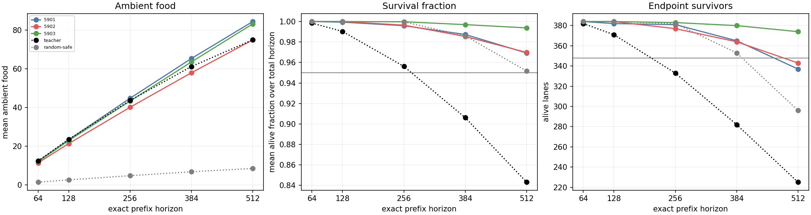
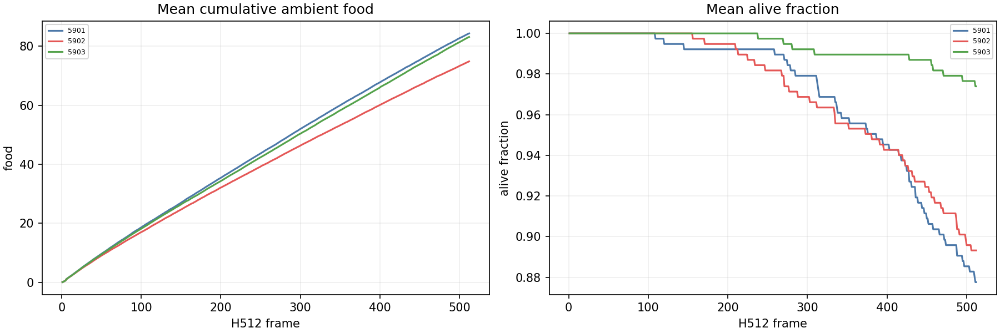
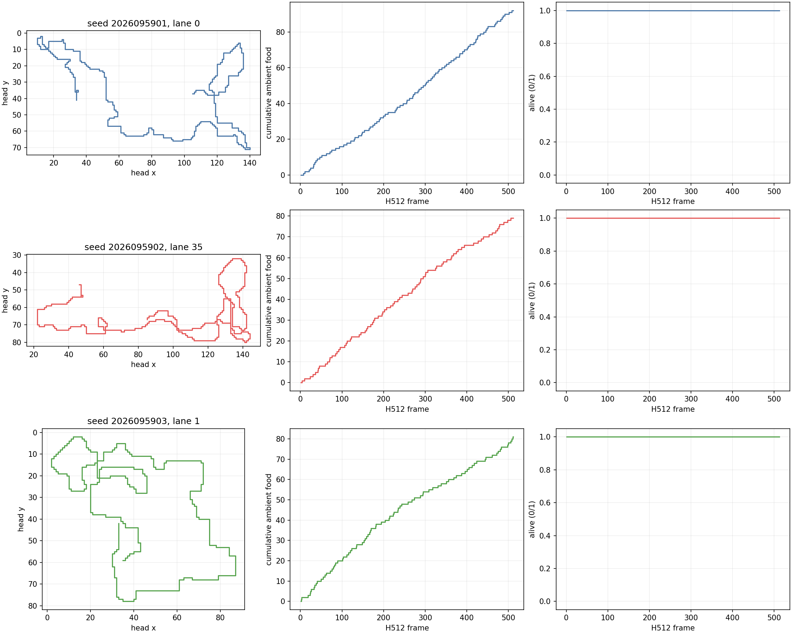

# CS: H512 fixed-control confirmation

**Status: complete and independently audited.** CS evaluated the fixed CR
`train_h256` final cohort on a new H512 bank. Two seeds fail only the H512
endpoint condition; the third passes all 29 conditions. The all-three H512
confirmation is therefore false. The original all-three rule is preserved.

## Fixed scope

CS evaluated exactly CR `train_h256` mark-3584 seeds 2026095901, 2026095902,
and 2026095903. This outcome-informed family was fixed because all three passed
CR's final H384 22-condition control package. CS made zero new optimizer updates,
training seeds, or fit calls. Its inherited fit material is historical evidence,
not a current measurement.

Each checkpoint ran once on 32 fresh worlds (2026109200--2026109231), four
headings, and three reachable food positions: 384 lanes at H512. H64, H128,
H256, H384, and H512 are exact prefixes of one trace. The 29 conditions and 60
cell subchecks apply separately to each seed; the 32 paired world means have
df 31, and neither lanes nor seeds are pooled.

## Final fresh behavior

Entries in the five horizon columns are `mean ambient food / endpoint survivors`
out of 384 lanes. H512 survival fraction is shown separately to keep the table
readable.

| Seed | H64 food/end | H128 food/end | H256 food/end | H384 food/end | H512 food/end | H512 survival | 29-condition result |
| --- | --- | --- | --- | --- | --- | ---: | --- |
| 2026095901 | 12.242188 / 384 | 23.330729 / 382 | 44.731771 / 381 | 65.281250 / 365 | 84.369792 / 337 | 0.969289 | 28/29; H512 endpoints |
| 2026095902 | 11.351562 / 384 | 21.341146 / 384 | 40.083333 / 377 | 57.916667 / 364 | 74.890625 / 343 | 0.969874 | 28/29; H512 endpoints |
| 2026095903 | 11.979167 / 384 | 22.882812 / 384 | 43.299479 / 383 | 63.520833 / 380 | 83.158854 / 374 | 0.993830 | 29/29; passed |

All three policies passed the inherited 22 conditions on this new bank. All food
thresholds passed, including the H512 absolute floor of 64 and the late
frames-385--512 food criterion. Their late-food means were 19.088542,
16.973958, and 19.638021, respectively, versus Teacher's 13.796875. Seeds 5901
and 5902 each fail only the endpoint floor: 337 and 343 survivors are below the
required 348. Seed 5903 ends with 374 survivors.

Teacher and RandomSafe remain descriptive anchors. At H512, Teacher collected
74.924479 ambient food with 225 survivors; RandomSafe collected 8.476562 with
296 survivors. Teacher's weak survival is not a gate or a calibration success.

## Execution and figures

The six predeclared scientific jobs completed as six physical attempts with zero
reruns, consuming 361.970 of the 1,080-second science budget. Qualification
passed 32 tests in 1.257 seconds and its smoke in 8.164 seconds, totaling
9.421 of the 180-second qualification budget. It made no optimizer updates. CS has no training
curve because it did not train a policy; the [CR training curves](../solo_food_pqn_h384_training_2026-09-20/training-curves.png) remain historical.
Peak observed process-tree RSS was 832,749,568 bytes (0.78 GiB), and minimum
available host memory was 36,312,170,496 bytes (33.82 GiB). All jobs were serialized.

The final audit checked 1,607 distinct hashes, all 87 per-seed conditions, 180 cell
predicates, 15 paired world intervals, and exact receipt inventory and chronology.
Its first two attempts exposed auditor-only metadata/duplicate-ledger errors; the
third passed, then root review strengthened inherited-conjunction and physical
attempt checks and correctly marked unmeasured MPS usage as unavailable. The
fourth audit passed. All four scripts and outputs are preserved; no scientific
job was repeated.

The saved panels below are descriptive reductions. Fixed lanes 0, 35, and 1 are
all alive at H512; they are illustrative examples and do not provide failure
coverage or replace the population criteria.

## Interpretation boundary

CS tests duration retention of an outcome-informed fixed cohort. It does not
rescue CR's failed H256-versus-H384 treatment comparison, establish a causal loss
or cap effect, or support promotion. Apex remains incumbent; its larger historical
training dose remains a confound rather than evidence of inherent superiority.

The next prospective CT step is a saved-actions and saved-CR-signal diagnostic.
It starts no new training. No CT numerical work has run.

- [CS immutable intent](/Users/josenunez/Projects/ml/snake-dqn-artifacts/ongoing-research-20260913/solo-food-pqn-h512-control-confirmation/intent.json)
- [CS numerical analysis](/Users/josenunez/Projects/ml/snake-dqn-artifacts/ongoing-research-20260913/solo-food-pqn-h512-control-confirmation/analysis/analysis.json)
- [CS qualification accounting](/Users/josenunez/Projects/ml/snake-dqn-artifacts/ongoing-research-20260913/solo-food-pqn-h512-control-confirmation/qualification-accounting.json)
- [CR audited result](../solo_food_pqn_h384_training_2026-09-20/README.md)

- [CS final independent audit](/Users/josenunez/Projects/ml/snake-dqn-artifacts/ongoing-research-20260913/solo-food-pqn-h512-control-confirmation/independent-audit.json)
