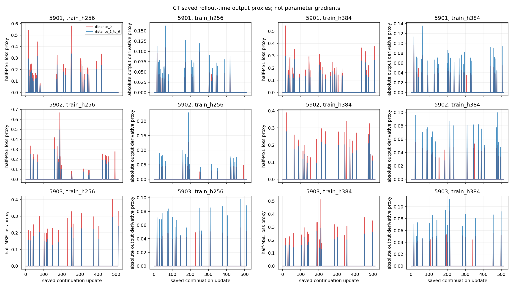
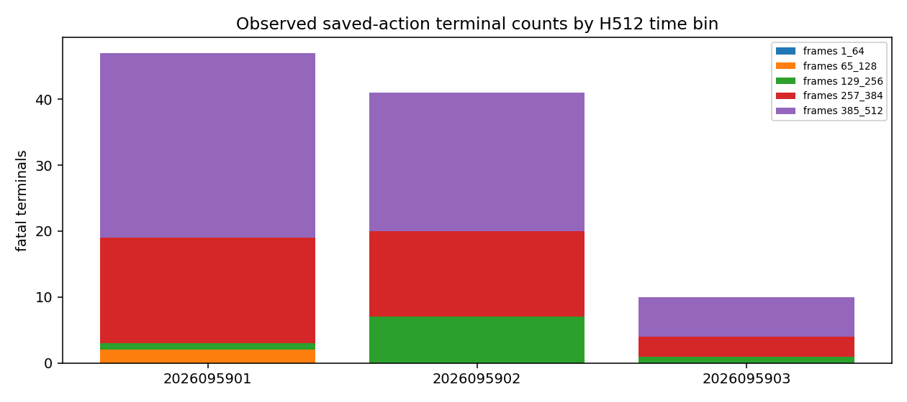
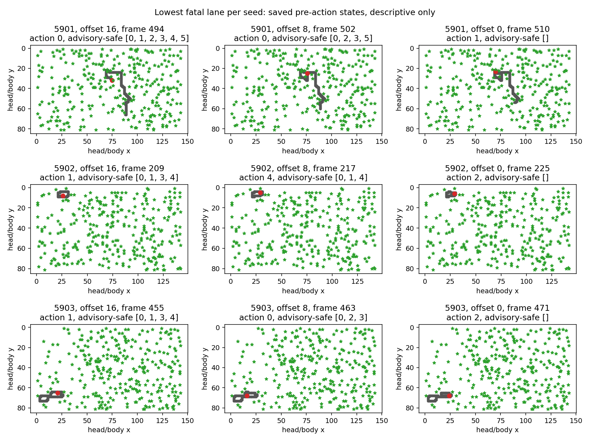

# CT: saved terminal-window and exact-action diagnostic

**Status: complete and independently audited.** CT reduced existing CR training
and CS gameplay records without changing a policy. It reports saved rollout-time
output proxies and exact replays of every CS fatal action. It makes no causal,
parameter-gradient, rescue, model-success, or promotion claim.

## Fixed evidence

CT reduced all 3,072 saved updates from the six CR learners (`train_h256` and
`train_h384`, seeds 2026095901--2026095903) and replayed the three fixed CS H512
policy archives. It made zero optimizer updates, training seeds, model loads,
policy decisions, or fit calls. Historical CR learning curves and CS behavior
remain source evidence; CT has not trained or evaluated a new policy.

The signal groups are `distance_0`, `distance_1_to_6`, `distance_7_to_15`, and
`no_visible_death`. Valid terminal rows enter distance 0; valid preceding rows
enter distances 1–6 or 7–15. Sticky invalid rows are excluded. `no_visible_death` means no death was visible before
the 16-frame rollout boundary, rather than survival beyond frame 15.

## Saved training-signal proxies

For each update with *n* valid rows, the loss proxy is
`sum(0.5 * residual^2) / n` and the absolute scalar-output-derivative proxy is
`sum(abs(residual)) / n`. The shares below use the declared update-weighted
denominator: per-update group contributions are summed, then divided by the sum
across all valid groups. The denominator *n* varies by update, shown as its
minimum--maximum range. Pooled-row shares are separately retained in the saved
analysis and are not mixed with these values.

Entries list valid rows; `n` range; group row counts in the order
`d0 / d1-6 / d7-15 / none`; then update-weighted loss-proxy shares in the same
order.

| Seed | Arm | Rows; n range | Group row counts | Loss-proxy shares |
| --- | --- | --- | --- | --- |
| 2026095901 | H256 | 130,783; 223--256 | 36 / 161 / 90 / 130,496 | 52.595% / 34.319% / 0.171% / 12.915% |
| 2026095901 | H384 | 130,817; 233--256 | 35 / 173 / 97 / 130,512 | 51.655% / 35.242% / 0.192% / 12.911% |
| 2026095902 | H256 | 130,877; 241--256 | 25 / 109 / 71 / 130,672 | 52.301% / 33.786% / 0.218% / 13.695% |
| 2026095902 | H384 | 130,891; 241--256 | 22 / 95 / 54 / 130,720 | 48.057% / 31.557% / 0.226% / 20.160% |
| 2026095903 | H256 | 130,952; 241--256 | 19 / 90 / 75 / 130,768 | 50.344% / 33.451% / 0.237% / 15.969% |
| 2026095903 | H384 | 130,917; 236--256 | 21 / 88 / 72 / 130,736 | 52.276% / 30.629% / 0.317% / 16.778% |

The corresponding absolute scalar-output-derivative shares are:

| Seed | Arm | d0 / d1–6 / d7–15 / none |
| --- | --- | --- |
| 2026095901 | H256 | 4.322% / 6.276% / 0.322% / 89.080% |
| 2026095901 | H384 | 4.169% / 6.480% / 0.346% / 89.005% |
| 2026095902 | H256 | 3.485% / 5.014% / 0.307% / 91.194% |
| 2026095902 | H384 | 2.720% / 3.995% / 0.239% / 93.045% |
| 2026095903 | H256 | 2.783% / 4.225% / 0.278% / 92.714% |
| 2026095903 | H384 | 2.922% / 3.861% / 0.336% / 92.881% |

Rare, high-error rows can contribute a large share of squared loss without a
similarly large share of absolute output derivatives. These two summaries do not
justify a terminal-weighting intervention by themselves.

The native target reconstruction and saved-SGD aggregate residual checks passed
under the qualified CR criteria. These results are selected-Q residual/output
proxies only. They do not measure parameter gradients, assign causal credit, or
show that an intervention would improve any policy.

## Exact saved-action replay

CT replayed every CS H512 archive in its original four 96-lane chunks with only
the saved actions. It matched the saved raw14 sequence and initial food, retained
every terminal lane, and reconciled terminal counts with the saved endpoints.
All 98 deaths classify as fallback: 97 self-collisions and one wall collision.

| Seed | Deaths | Cause | Frame bins 1--64 / 65--128 / 129--256 / 257--384 / 385--512 |
| --- | ---: | --- | --- |
| 2026095901 | 47 | 47 self-collisions | 0 / 2 / 1 / 16 / 28 |
| 2026095902 | 41 | 41 self-collisions | 0 / 0 / 7 / 13 / 21 |
| 2026095903 | 10 | 9 self-collisions; 1 wall | 0 / 0 / 1 / 3 / 6 |

The predeclared representative is the lowest fatal lane index for each seed at
pre-action offsets 16, 8, and 0. These panels are illustrative and do not measure
population prevalence, inevitability, or a successful alternative action.

## Qualification and interpretation boundary

Qualification passed 20 tests in 1.051 seconds. The final independent audit passed
7,659 hashes, exact job/closure checks, independently reconstructed varying-n
shares, and every replay census and representative selection. Three scientific
jobs used 60.387478 seconds of the 300-second cap, with no scientific reruns.
Peak RSS was 655,835,136 bytes and minimum available memory was 36,514,103,296
bytes. All jobs were CPU-only; MPS driver usage was unmeasured. The auditor
repair history is retained, including a mislabeled early source snapshot; the
final strengthened source and its output are paired exactly.
The saved-only diagnostic retains the prior CO, CP, CR, and CS negative results.
Apex remains the operational incumbent; its larger historical training dose
remains a confound rather than evidence of inherent superiority.

- [CT immutable intent](/Users/josenunez/Projects/ml/snake-dqn-artifacts/ongoing-research-20260913/solo-food-pqn-h512-terminal-diagnostic/intent.json)
- [CT analysis](/Users/josenunez/Projects/ml/snake-dqn-artifacts/ongoing-research-20260913/solo-food-pqn-h512-terminal-diagnostic/analysis/analysis.json)
- [CT training-signal report](/Users/josenunez/Projects/ml/snake-dqn-artifacts/ongoing-research-20260913/solo-food-pqn-h512-terminal-diagnostic/training_signal/report.json)
- [CT replay report](/Users/josenunez/Projects/ml/snake-dqn-artifacts/ongoing-research-20260913/solo-food-pqn-h512-terminal-diagnostic/replay/report.json)
- [CS audited H512 result](../solo_food_pqn_h512_control_confirmation_2026-09-21/README.md)
- [CR historical training curves](../solo_food_pqn_h384_training_2026-09-20/training-curves.png)
