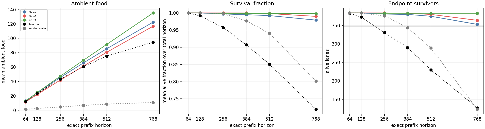
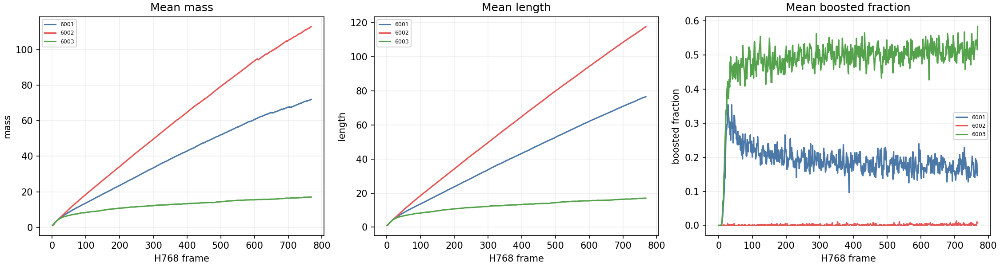
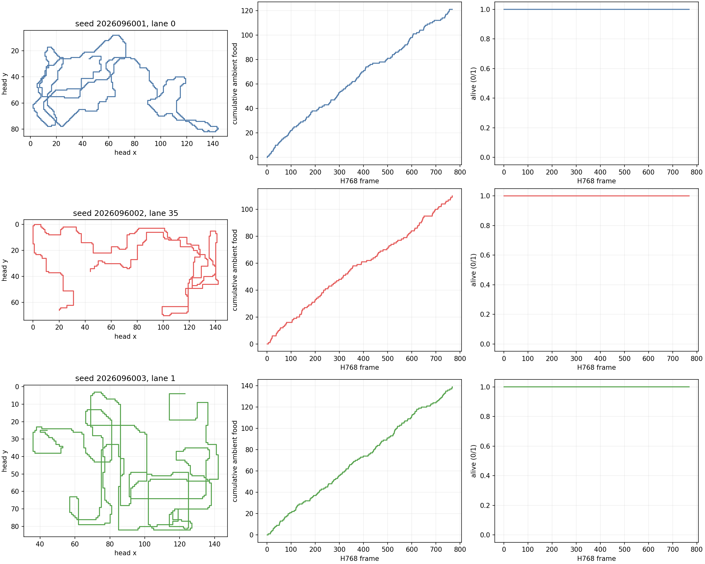

# CW: H768 fixed length-access confirmation

**Status: complete and independently audited.** All three fixed CV
length-access policies passed CW's complete 37-condition, 72-cell H768 package
on a fresh bank. This is a duration-screen result only: CV's strict relative
conjunction remains false, and CW does not support policy promotion.

## Fixed scope

CW evaluated all three CV `body_food_length` final mark-4096 policies: seeds
2026096001, 2026096002, and 2026096003. This family was outcome-informed: CV's
treatment passed its 29-condition absolute package in all three seeds, but
passed the stricter relative package in only one and had a false overall
conjunction. All three fixed policies were retained. CW made zero optimizer
updates, training changes, or teacher-label fit calls.

The checkpoint, input restriction, Q scale, simulator, observation pipeline,
six-action mask, and greedy selector are unchanged. CV training curves remain
historical evidence, rather than CW training results. Mass, logical length, and
boost are descriptive measurements; they are not retroactive success criteria.

## Fresh H768 behavior

Each policy ran once through H768 on 32 fresh worlds (2026109600--2026109631),
four headings, and three balanced food placements: 384 lanes. H64, H128, H256,
H384, H512, and H768 are exact prefixes of the same games. Each row gives H768
mean ambient food, survival fraction, and surviving endpoints.

| CV seed | Food | Survival fraction | Endpoints | Late food 513--768 | 37 conditions / 72 cells |
| --- | ---: | ---: | ---: | ---: | --- |
| 2026096001 | 122.5078125 | 0.9791667 | 353 / 384 | 36.9036458 | passed / passed |
| 2026096002 | 116.8541667 | 0.9900140 | 364 / 384 | 36.1614583 | passed / passed |
| 2026096003 | 135.3385417 | 0.9978468 | 383 / 384 | 43.7369792 | passed / passed |

All seeds passed the inherited 29 H512-and-shorter conditions and 60 associated
cell checks, together with the eight H768 conditions and 12 new cells. The new
late-food absolute floor was 32 during frames 513--768; it passed for every
seed. The H768 cumulative food floor of 96 is explicitly redundant with the
inherited H512 food floor and this late-food floor, so the 37 conditions are not
independent tests. Food confidence intervals use 32 paired world means with df
31; lanes and seeds are not pooled.

Teacher and RandomSafe supply the relative food comparisons; their own survival
has no separate calibration gate in CW. At H768, Teacher had
94.5234375 ambient food and 127 endpoints, while RandomSafe had 10.8098958 and
123. Teacher's survival is not a calibration success. The fixed lanes 0, 35, and
1 were alive at H768 and are illustrative only; they do not establish coverage of
all failures.

## Descriptive measurements and limits

At H768, boost fraction and mean mass integral were 18.8785% and 40.3234 for
seed 6001, 0.1468% and 60.9695 for seed 6002, and 48.3514% and 12.5211 for
seed 6003. These differences make neither a body-growth claim nor a causal
account of the observed food and survival metrics.

The six scientific jobs completed as their first attempts, consuming
565.685984 seconds of the 1,200-second science budget. Qualification consumed
12.269119 seconds of its separate 180-second cap. Peak process-tree RSS was
930,234,368 bytes; minimum available memory was 36,043,882,496 bytes; MPS use
was unavailable because execution used CPU inference. Root visual review found
the three panels readable. The first audit attempt is preserved as a failure
caused solely by an auditor copied-path typo. The repaired second audit passed
with no issues, recomputing 111 conditions, 216 cell predicates, and 18 CIs
across 1,977 hashes. No scientific job was rerun.

CW is a solo duration screen and cannot establish opponent competence or promote
a policy. Apex remains the operational incumbent, and its greater historical
training dose remains a confound rather than evidence of inherent superiority.

- [CW frozen design](/Users/josenunez/Projects/ml/snake-dqn-artifacts/ongoing-research-20260913/solo-food-pqn-h768-length-confirmation/design.md)
- [CW numerical analysis](/Users/josenunez/Projects/ml/snake-dqn-artifacts/ongoing-research-20260913/solo-food-pqn-h768-length-confirmation/analysis/analysis.json)
- [CW frozen qualification plan](/Users/josenunez/Projects/ml/snake-dqn-artifacts/ongoing-research-20260913/solo-food-pqn-h768-length-confirmation/qualification-plan.json)
- [CW independent audit attempt 2](/Users/josenunez/Projects/ml/snake-dqn-artifacts/ongoing-research-20260913/solo-food-pqn-h768-length-confirmation/audit-attempt2.json)
- [Historical CV training learning curve](../solo_food_pqn_length_access_2026-09-21/training-curves.png)
- [Historical CV greedy checkpoint learning curve](../solo_food_pqn_length_access_2026-09-21/gameplay-curves.png)
- [CV completed result](../solo_food_pqn_length_access_2026-09-21/README.md)
