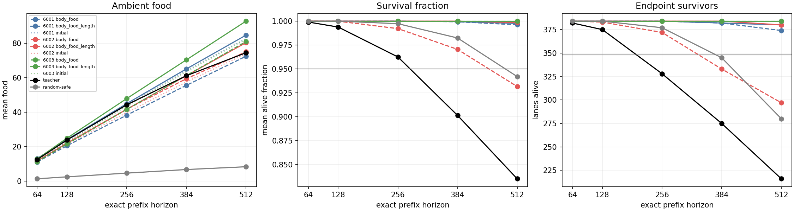
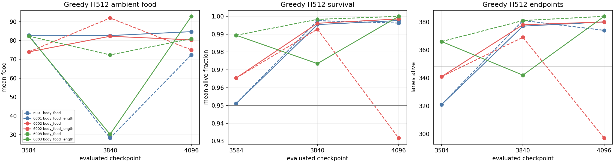
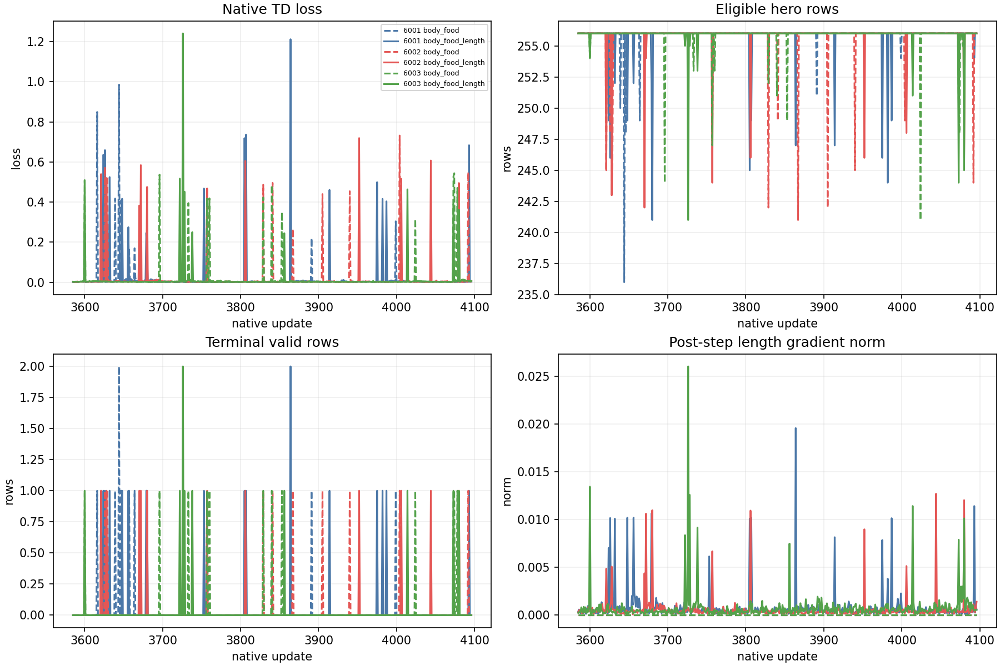
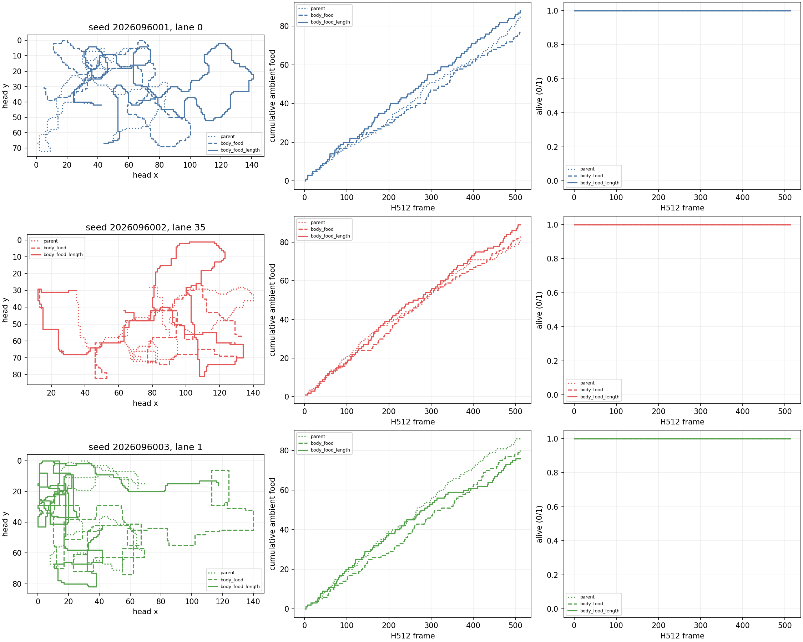

# CV: paired access to explicit body length

**Status: complete; first independent audit passed.** Adding the two logical-body-
length scalars met every treatment absolute package, but the required paired
endpoint benefit held for only seed 2026096002. The all-three relative package
and the study conjunction are false.

## Scope and method

CV fixed all three CR `train_h256` final mark-3584 parents: CR seeds 2026095901,
2026095902, and 2026095903 map to CV seeds 2026096001, 2026096002, and
2026096003. This family selection was outcome-informed, and all three lineages
were retained. CT and CU motivate the question through saved fatal-action and
onset observations, but do not prove an avoidable death or a representation
cause.

`body_food` was the control; `body_food_length` exposed only `length / 150` and
`log1p(length) / log1p(150)`. Both restored the full parent model and Adam state,
then received equal 512-update continuations from 3584 to 4096 under the same
cap-256, lambda-.65, half-MSE, Adam, and fresh per-seed streams. The shared
initialization zeroed only the formerly masked length columns and matching Adam
slices, preserving initial behavior and Adam parity. There were 3,072 scientific
optimizer updates and 785,926 valid hero transitions.

Each checkpoint ran once in 32 fresh worlds (2026109400--2026109431), with four
headings and three food placements: 384 H512 lanes. H64, H128, H256, H384, and
H512 are exact prefixes. The 29 absolute conditions and 60 cell checks apply per
policy and seed. The final paired treatment test uses 32 world means (df 31),
never pools lanes or seeds, and requires endpoint CI lower bound above zero plus
two food-retention lower bounds. Historical teacher-label fit is authenticated CG
reference material through CR, not a CV fit measurement.

## Final fresh behavior and gates

H512 entries are mean ambient food / surviving lanes. Treatment passed all 29
absolute conditions for every seed. The control passed for seeds 6001 and 6003;
seed 6002 failed H384 endpoints and H512 survival-time and endpoint conditions.

| Seed | Parent | Control final | Length final | Control absolute | Length absolute | Relative package |
| --- | --- | --- | --- | --- | --- | --- |
| 2026096001 | 82.752604 / 321 | 72.432292 / 374 | 84.682292 / 380 | 29/29 | 29/29 | failed |
| 2026096002 | 73.958333 / 341 | 75.031250 / 297 | 80.333333 / 380 | 26/29 | 29/29 | passed |
| 2026096003 | 82.312500 / 366 | 80.945312 / 384 | 92.807292 / 384 | 29/29 | 29/29 | failed |

All food-retention checks passed. The endpoint 95% CIs for length minus control
were [-0.003738, 0.034988], [0.163906, 0.268386], and [0, 0] for seeds 6001,
6002, and 6003. The strict boundary is lower CI > 0, so only seed 6002 passes.
There is no best-seed or best-mark selection: treatment absolute reliability is
3/3, control absolute reliability is 2/3, relative reliability is 1/3, and the
predeclared overall conjunction is false.

The complete parent, midpoint, and final H512 trajectory is retained below.
Each entry is `ambient food / survival fraction / endpoints`; midpoints are
descriptive and cannot replace the final decision.

| Seed | Parent | Control midpoint | Length midpoint | Control final | Length final |
| --- | --- | --- | --- | --- | --- |
| 6001 | 82.752604 / .951065 / 321 | 28.231771 / .997579 / 381 | 82.611979 / .995377 / 377 | 72.432292 / .996211 / 374 | 84.682292 / .997645 / 380 |
| 6002 | 73.958333 / .965408 / 341 | 91.927083 / .992783 / 369 | 82.250000 / .996109 / 378 | 75.031250 / .931676 / 297 | 80.333333 / .998530 / 380 |
| 6003 | 82.312500 / .989390 / 366 | 72.361979 / .998306 / 381 | 30.247396 / .973490 / 342 | 80.945312 / 1.000000 / 384 | 92.807292 / 1.000000 / 384 |

The behavioral and gameplay-curve panels retain every measured prefix and
checkpoint. Fixed lanes 0, 35, and 1 were alive at H512 and are illustrative;
they do not represent all failures or replace population criteria.

## Descriptive diagnostics and limits

At H512, the length treatment's boost fraction and mean mass integral were
19.3731% and 28.7464 for seed 6001, 0.1261% and 42.3395 for seed 6002, and
47.7086% and 10.8632 for seed 6003. The corresponding control mass integrals
were 38.3038, 38.2022, and 5.2333; parent values were 42.0880, 38.6420, and
43.4403. These measurements describe the food-and-survival behavior. They do not establish
improved body growth, a causal mechanism, or promotion eligibility.

A negative all-three result does not establish that length is useless: the new
columns and moments began at zero while inherited Adam age and epsilon .1
remained, and H512 can expose body geometry beyond the H256 training cap.
Qualification showed length-column access (positive treatment gradient versus
zero control gradient), which establishes accessibility but not sufficient
learning. Apex remains the incumbent; its larger historical training dose remains
a confound rather than evidence of inherent superiority.

## Execution and audit

All 24 scientific jobs completed as 24 physical attempts with no reruns, using
2,719.641345 seconds of the 6,660-second science cap. Qualification passed 23
tests and consumed 9.796038167 seconds of its 180-second cap; its two discarded
MPS PQN updates and two synthetic CPU Adam fixture steps have no scientific
lineage. The first independent audit passed 8,138 hashes and independently
checked 174 absolute conditions, 360 cell predicates, and 39 confidence intervals.
It preserves one audit attempt and found no issues. Root visual review found all
four panels readable.

The planned next screen is a separately frozen, fresh H768 fixed-cohort
assessment. It must preserve the full 29-prefix package and add its new H768 and
late-food conditions. It has not started.

- [CV immutable intent](/Users/josenunez/Projects/ml/snake-dqn-artifacts/ongoing-research-20260913/solo-food-pqn-length-access/intent.json)
- [CV numerical analysis](/Users/josenunez/Projects/ml/snake-dqn-artifacts/ongoing-research-20260913/solo-food-pqn-length-access/analysis/analysis.json)
- [CV qualification accounting](/Users/josenunez/Projects/ml/snake-dqn-artifacts/ongoing-research-20260913/solo-food-pqn-length-access/qualification-accounting.json)
- [CV independent audit attempt 1](/Users/josenunez/Projects/ml/snake-dqn-artifacts/ongoing-research-20260913/solo-food-pqn-length-access/audit-attempt1.json)
- [CR audited result](../solo_food_pqn_h384_training_2026-09-20/README.md)
