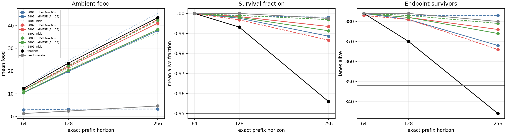
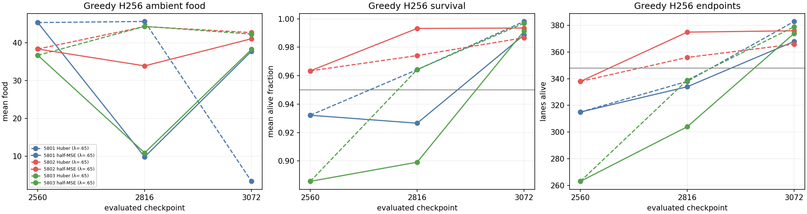
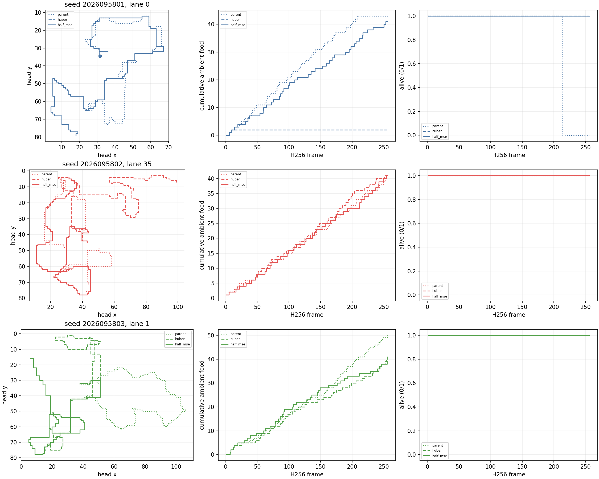

# CO: native Huber versus half-MSE continuation

**Status: complete and independently audited.** CO compares the trainer's native
Huber objective with half mean-squared TD error after a matched continuation.
Half-MSE met the inherited absolute package in all three seeds, but the required
paired half-MSE-versus-Huber benefit failed in all three. CO therefore does not
support a treatment-superiority or promotion claim.

## Frozen comparison

Each arm restores the same CK `body_food` parent at mark 2560, including the full
Adam state, counters, and odometer, then performs 512 further updates. The three
fresh optimization seeds are 2026095801, 2026095802, and 2026095803. Both arms
use native Q(lambda=.65), gamma .997, the original sampler, masks, rewards,
clipping, action space, observations, network, and forward count. There is no
selector cut.

| Arm | Objective |
| --- | --- |
| `huber` | Canonical `smooth_l1_loss(q_taken, target.detach())`, beta 1, mean |
| `half_mse` | `0.5 * mse_loss(q_taken, target.detach())`, mean over the same real rows |

The study has six learners: both arms for each seed. Mark 2816 is descriptive;
mark 3072 is the decision checkpoint. The fixed H256 evaluation bank contains 32
fresh worlds, four headings, and three balanced reachable food placements per
world (384 lanes). The existing common CK parents include canonical Huber-trained
Adam state, so this is a matched loss switch during continuation rather than
training both objectives from initialization.

The primary sources are the [PQN paper](https://arxiv.org/html/2407.04811v3) and
the authors' [MinAtar implementation](https://github.com/mttga/purejaxql/blob/main/purejaxql/pqn_minatar.py),
which uses a half-squared-error loss. They motivate a bounded local test; they do
not predict improved Snake behavior.

## Predeclared decision rule

At final H256, each policy must meet the inherited 16 absolute food and survival
conditions: food at least 75% of teacher at H64, H128, and H256; every one of the
12 pose cells at least 50% of teacher at those horizons; survival time at least
95%; at least 348 of 384 endpoint survivors; positive paired food-minus-random
lower confidence bound; and late-frame (129--256) food at least 75% of teacher.

For each seed, half-MSE must also beat Huber on all three paired conditions:
endpoint lower 95% confidence bound strictly above zero, food lower bound above
-5% of Huber mean food, and food-minus-initial lower bound above -5% of initial
mean food. The unit is the 32 paired world means (df 31); neither lanes nor seeds
are pooled. This report states Huber absolute reliability,
`mse_absolute_all_three`, and `loss_effect_all_three` separately. Overall success
requires the latter two conjunctions across all three seeds; Huber reliability is
reported independently.

## Completed fixed baselines

The five fixed H256 baseline roles completed on the CO bank before the learner
evaluations. These are reference values only: they neither decide a CO arm nor
replace a final paired comparison. Each entry is `mean ambient food / survival
fraction / surviving endpoints` out of 384 lanes.

| Role | Seed | H256 reference |
| --- | ---: | --- |
| Teacher | 0 | 43.466145833333336 / 0.9559834798177084 / 334 |
| RandomSafe | 0 | 4.653645833333333 / 0.9975077311197916 / 380 |
| Initial CK parent | 2026095801 | 45.3359375 / 0.932159423828125 / 315 |
| Initial CK parent | 2026095802 | 38.3359375 / 0.9633890787760416 / 338 |
| Initial CK parent | 2026095803 | 36.6796875 / 0.8856913248697916 / 263 |

## Qualification evidence

The qualification gate passed 41 tests in 1.687 seconds and its guarded MPS smoke
passed in 7.919393917 seconds, for 9.606393917 seconds of the 180-second
qualification budget. It charged three discarded MPS optimizer updates and zero
CPU optimizer updates, completed six checkpoint roundtrips, and dispatched 1,536
smoke gameplay lane frames.

The unwrapped canonical trainer and the Huber proxy were fully bit-exact. Their
first paired targets matched exactly, and each performed 18 learned forwards. The
first real batch had no saturated residuals; its maximum absolute residual was
0.453, so its actual Huber and half-MSE objectives coincided as expected. That
local batch cannot establish the intended difference. A separate MPS autograd
probe used residuals `[-2, -1, -0.5, 0, 0.5, 1, 2]`, detached targets, and no
optimizer updates to distinguish the two derivatives beyond beta 1.

A pre-freeze metadata mismatch was repaired before the intent froze by copying
the already hash-bound freshness scan into its expected metadata field. It started
no numerical process and made no optimizer update; the bank, criteria, and budget
were unchanged.

## Final H256 analysis

The six fixed final policies were evaluated greedily on the fresh bank, and the
analysis reconciled those saved evaluations.
Each entry is `mean ambient food / survival fraction / surviving endpoints` out
of 384 lanes. Midpoint mark 2816 remains descriptive; only final mark 3072
decides the gates.

| Seed | Huber final | Half-MSE final |
| --- | --- | --- |
| 2026095801 | 3.3072916666666665 / 0.99810791015625 / 383 | 37.7578125 / 0.9886372884114584 / 368 |
| 2026095802 | 42.6796875 / 0.986663818359375 / 366 | 41.052083333333336 / 0.9934895833333334 / 376 |
| 2026095803 | 42.283854166666664 / 0.996917724609375 / 379 | 38.234375 / 0.9913431803385416 / 374 |

| Result | Completed analysis outcome |
| --- | --- |
| Half-MSE absolute reliability | 3/3 seeds |
| Huber absolute reliability | 2/3 seeds |
| Complete paired half-MSE benefit | 0/3 seeds |
| Overall conjunction | Failed |

Half-MSE passes all 16 absolute conditions in every seed. Huber seed 5801 fails
the food and all-cell thresholds at H64, H128, and H256; the H256 paired
policy-minus-random food condition; and the late-food condition. Huber seeds 5802
and 5803 pass their 16-condition packages. The half-MSE cohort therefore meets
the absolute behavior screen, while relative superiority remains unestablished.

Every seed fails the strict endpoint lower-bound condition, and each has one
additional food non-inferiority failure:

| Seed | Half-MSE minus Huber endpoint lower CI | Food lower CI | Parent-food lower CI | Failed relative condition(s) |
| --- | ---: | ---: | ---: | --- |
| 2026095801 | -0.05923075218857056 | 33.83877629985138 | -8.825642327819352 | Endpoint; parent-food retention |
| 2026095802 | -0.0008718863626589225 | -2.3171802138929305 | 1.9976232643390448 | Endpoint; food versus Huber |
| 2026095803 | -0.033368761696438154 | -4.66079514813404 | 0.07831913458145423 | Endpoint; food versus Huber |

The endpoint condition requires a lower bound strictly above zero. The food
conditions require a lower bound above -5% of the corresponding Huber or initial
parent mean. The statistics use the 32 paired world means with df 31; no lane or
seed pooling was used.

## Training and analysis boundary

All six serialized learner jobs completed from update 2560 to 3072 with 512
optimizer updates each: 3,072 updates and 781,625 new valid hero transitions.
The largest recorded gradient norm was 2.121435, below the clip threshold of 10.
Their learning-rollout deaths were 147/121/133 for Huber and 87/81/71 for
half-MSE (seeds 5801/5802/5803). Those exploratory training counts are distinct
from the fresh greedy endpoint survivors above.

Analysis made zero new fit or teacher-fit calls; historical fit references remain
historical only. It neither establishes an objective effect nor supports policy
promotion.

The four saved panels passed visual QA. They show learning and fresh greedy
gameplay separately; neither substitutes a gate or changes the analysis JSON.

## Execution boundary

The scientific budget is 5,940 seconds. The six learners completed their 512
updates, for 3,072 study updates, and final H256 evaluation supplied saved H64
and H128 prefixes. The 24 scientific jobs consumed 1,765.2579427529126 seconds.
The independent audit passed: it hashed 7,702 paths, including 7,695 full analysis-closure
paths, independently recomputed 18 absolute horizon blocks, 216 cell checks, and
six late-food checks, rejected a mutation, and reported zero issues. Recorded
resource extrema were 1,504,231,424 bytes maximum RSS, 34,524,856,320 bytes
minimum available memory, and 1,205,092,352 bytes maximum MPS driver memory.
Jobs run serially with both compute locks, two CPU/BLAS threads, a 4 GiB process-tree
RSS cap, a 12 GiB available-memory floor, and an 8 GiB MPS driver cap.
No partial result, midpoint, or early seed result decides the study. The training
and evaluation evidence remains separate from historical teacher-fit references.

[CN's completed selector-cut result](../solo_food_pqn_selector_cut_2026-09-20/README.md)
did not support advancing to H384. CO likewise does not establish a paired loss
effect or support promotion. With audit and visual QA complete, the next fixed
confirmation is half-MSE's three final mark-3072 checkpoints on fresh H384 worlds.
That outcome-selected cohort tests duration generalization only; it is neither a
CO effect rescue nor a promotion decision. Apex remains the operational incumbent;
its larger historical training dose remains a confound rather than evidence of
inherent superiority.

- [Immutable CO intent](/Users/josenunez/Projects/ml/snake-dqn-artifacts/ongoing-research-20260913/solo-food-pqn-loss-shape/intent.json)
- [CO frozen design](/Users/josenunez/Projects/ml/snake-dqn-artifacts/ongoing-research-20260913/solo-food-pqn-loss-shape/design.md)
- [Qualification completion](/Users/josenunez/Projects/ml/snake-dqn-artifacts/ongoing-research-20260913/solo-food-pqn-loss-shape/qualification-complete.json)
- [Qualification accounting](/Users/josenunez/Projects/ml/snake-dqn-artifacts/ongoing-research-20260913/solo-food-pqn-loss-shape/qualification-accounting.json)
- [Completed analysis](/Users/josenunez/Projects/ml/snake-dqn-artifacts/ongoing-research-20260913/solo-food-pqn-loss-shape/analysis/analysis.json)
- [Independent audit V2](/Users/josenunez/Projects/ml/snake-dqn-artifacts/ongoing-research-20260913/solo-food-pqn-loss-shape/independent-audit.json)
- [Completed closeout](/Users/josenunez/Projects/ml/snake-dqn-artifacts/ongoing-research-20260913/solo-food-pqn-loss-shape/closeout.json)
- [Primary-source note](/Users/josenunez/Projects/ml/snake-dqn-artifacts/ongoing-research-20260913/solo-food-pqn-loss-shape/research.md)
