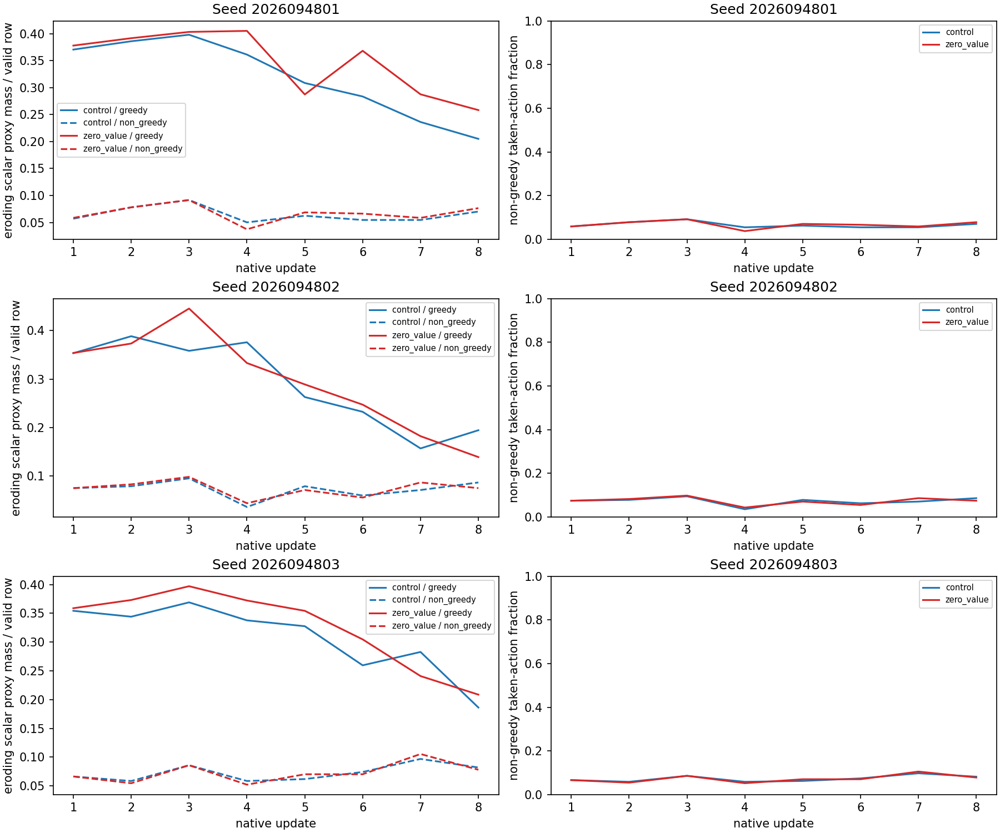

# BW: PQN action-margin pressure on saved BV updates

**Status: COMPLETE_AND_AUDITED.** The declared routing rule selects
`return_objective_relationship` for each of the three ordinary BV controls in both
windows: update 1 alone and updates 1–2 together. In every control, the direct
margin-eroding scalar mass is larger on rows whose sampled action was already
masked-greedy than on the rarer non-greedy rows. This is a saved-update diagnosis,
not a learned-policy improvement, a causal parameter claim, or a promotion result.

## Question and frozen scope

BV's three ordinary PQN controls regressed from their AN warm starts. BW asks where
those **saved** Q(lambda) corrections directly press on action margins. It reads the
48 immutable BV diagnostic archives: seeds 2026094801–2026094803, `control` and
`zero_value` arms, and updates 1–8. The native masked argmax and lowest-index tie
rule classify each sampled action as greedy or non-greedy. This is a classification
of the sampled action, not an exploration-coin flag.

The archive contains 12,254 valid hero-transition rows. BW ran no environment,
checkpoint inference, optimizer update, training, or gameplay. At update 1, the two
arms had exact actions, masks, rewards, validity flags, death/edge flags, and
aggregate-food-contact parity; later updates may diverge. The frozen parent mapping is BV 4801 → AN 3401, 4802 → AN 3402, and
4803 → AN 3403, each at checkpoint 500; both BV arms retain their original update
packages.

For a policy-time target residual \(Q(s,a)-G_\lambda\), `eroding mass` is positive
output-coordinate derivative for a greedy sampled action and negative derivative
for a non-greedy sampled action, summed after the SmoothL1 derivative clip. It is a
direct scalar proxy for the selected Q coordinate. It is **not** a parameter
gradient or causal attribution: shared-network updates can alter unsampled actions,
and this partition cannot rule out a contribution from exploration.

## Declared routing result

The predeclared rule compares greedy with non-greedy eroding mass in each ordinary
control. Greedy mass was at least as large in all three seeds in both windows, so the
rule returns `return_objective_relationship` rather than the
experience-distribution branch. The two windows agree.

| BV seed | Update 1: greedy / non-greedy mass | Updates 1–2: greedy / non-greedy mass | Routing result |
|---|---:|---:|---|
| 4801 | 94.820 / 14.605 | 193.596 / 34.605 | return/objective relationship |
| 4802 | 90.492 / 19.000 | 189.968 / 39.000 | return/objective relationship |
| 4803 | 90.711 / 17.000 | 178.802 / 32.000 | return/objective relationship |

Non-greedy rows were only 15/256, 19/256, and 17/256 in the first control update,
yet their mean absolute scalar derivatives were 0.974, 1.000, and 1.000,
respectively, compared with 0.847, 0.838, and 0.852 for greedy rows. Their lower
exposure therefore does not make them irrelevant, and this diagnostic does not rule
out exploration or experience distribution as a later question.

## All-arm descriptive summary

The treatment and later-update values do not participate in the routing rule. They
are included to show all six saved arm/seed combinations. A cell `rows / mass` gives
the group count and direct eroding mass; the last column sums mass over updates 1–2.

| Seed | Arm | U1 greedy rows / mass | U1 non-greedy rows / mass | U1–2 greedy / non-greedy mass |
|---|---|---:|---:|---:|
| 4801 | Control | 241 / 94.820 | 15 / 14.605 | 193.596 / 34.605 |
| 4801 | Zero value | 241 / 96.719 | 15 / 15.000 | 196.947 / 35.000 |
| 4802 | Control | 237 / 90.492 | 19 / 19.000 | 189.968 / 39.000 |
| 4802 | Zero value | 237 / 90.598 | 19 / 19.000 | 186.203 / 40.000 |
| 4803 | Control | 239 / 90.711 | 17 / 17.000 | 178.802 / 32.000 |
| 4803 | Zero value | 239 / 91.865 | 17 / 17.000 | 187.378 / 31.000 |

The figure is descriptive: it plots the saved scalar-pressure partitions and does
not select a checkpoint or estimate a parameter-level effect.

## Retained behavioral context from BV

BW does not rerun, reinterpret, or replace BV gameplay. The retained BV final-bank
values below are mean ambient food / survival fraction; `Initial` is the shared
warm-start policy. They establish the behavior that prompted this diagnostic.

| Seed | Initial | Control 8 | Zero-value 8 |
|---|---|---|---|
| 4801 | 11.708 / 1.000000 | 6.448 / 0.999186 | 8.062 / 1.000000 |
| 4802 | 11.323 / 0.992350 | 6.583 / 1.000000 | 3.396 / 1.000000 |
| 4803 | 11.156 / 0.997721 | 7.333 / 1.000000 | 5.698 / 1.000000 |

All three ordinary controls regressed from their initial policy; zero value beat its
control only in seed 4801 and still finished below initial in every seed. The BW
result neither repairs those failures nor identifies the value offset as their sole
cause. See the [BV report](../solo_food_pqn_value_offset_2026-09-20/README.md), its
[learning, margin, offset, and TD curves](../solo_food_pqn_value_offset_2026-09-20/learning-curves.png),
[behavior comparison](../solo_food_pqn_value_offset_2026-09-20/behavior-comparison.png),
and [fixed gameplay evidence](../solo_food_pqn_value_offset_2026-09-20/fixed-gameplay-evidence.png).

## Execution and limits

The guarded diagnostic completed in 2.097247792 seconds against its 30-second CPU
science budget. Its receipt recorded peak RSS 428,752,896 bytes and minimum
available memory 37,026,873,344 bytes. Qualification passed six tests in 1.215
seconds. A preserved, pre-amendment case-sensitive regex fixture failure consumed
1.237 seconds; the aggregate qualification charge is 2.452 / 60 seconds. Neither
attempt ran an optimizer update, inference, or simulation.

The resource rollup, independent audit, scientific review, visual QA, and closeout
all passed. The independent audit checked 1,032 closure hashes, 54 direct hashes,
and all 48 partitions. The complete analysis remains a single CPU diagnostic
receipt, so its results are archive-consistent scalar evidence, not independent
gameplay confirmation or a model comparison.

The next selected question is a fixed positive Q-multiplier package: compare 0.1
against 1.0 on every forward pass while retaining the same parent tensors and using
fresh Adam state. This is an output-scale package test, not a claim that Q values are
calibrated or a one-time rescaling of weights. It has no result in this report.

Apex remains the operational incumbent until the shared tournament gate supports a
replacement. Its larger historical training budget is a confound, not evidence of
inherent architectural superiority.

## Primary records

- [BW frozen design](/Users/josenunez/Projects/ml/snake-dqn-artifacts/ongoing-research-20260913/solo-food-pqn-margin-pressure-r1/design.md)
- [BW intent](/Users/josenunez/Projects/ml/snake-dqn-artifacts/ongoing-research-20260913/solo-food-pqn-margin-pressure-r1/intent.json) — SHA-256 `39957aa148356b128869a461e2d69916cb229fa971fd4233978994cb52bc3bee`
- [BW analysis](/Users/josenunez/Projects/ml/snake-dqn-artifacts/ongoing-research-20260913/solo-food-pqn-margin-pressure-r1/analysis/analysis.json) — SHA-256 `aa14bca46401d15b6d42c880a54e5bab6d8a9cface9a16d4486c64cebe311b3c`
- [BW qualification](/Users/josenunez/Projects/ml/snake-dqn-artifacts/ongoing-research-20260913/solo-food-pqn-margin-pressure-r1/qualification-complete.json)
- [BW qualification accounting](/Users/josenunez/Projects/ml/snake-dqn-artifacts/ongoing-research-20260913/solo-food-pqn-margin-pressure-r1/qualification-accounting.json)
- [BW science receipt](/Users/josenunez/Projects/ml/snake-dqn-artifacts/ongoing-research-20260913/solo-food-pqn-margin-pressure-r1/supervisor-runs/analysis/receipt.json)
- [BW frozen input closure](/Users/josenunez/Projects/ml/snake-dqn-artifacts/ongoing-research-20260913/solo-food-pqn-margin-pressure-r1/input-freeze.json)
- [BW resource rollup](/Users/josenunez/Projects/ml/snake-dqn-artifacts/ongoing-research-20260913/solo-food-pqn-margin-pressure-r1/resource-rollup.json)
- [BW independent audit](/Users/josenunez/Projects/ml/snake-dqn-artifacts/ongoing-research-20260913/solo-food-pqn-margin-pressure-r1/independent-audit.json)
- [BW scientific review](/Users/josenunez/Projects/ml/snake-dqn-artifacts/ongoing-research-20260913/solo-food-pqn-margin-pressure-r1/science-review.json)
- [BW visual QA](/Users/josenunez/Projects/ml/snake-dqn-artifacts/ongoing-research-20260913/solo-food-pqn-margin-pressure-r1/visual-qa.json)
- [BW closeout](/Users/josenunez/Projects/ml/snake-dqn-artifacts/ongoing-research-20260913/solo-food-pqn-margin-pressure-r1/closeout.json) — SHA-256 `e67af6590ff2421c5eeaaee1f1c27eafafe6f0de32a948d3d879244c0c96fa72`
- [BV audited parent analysis](/Users/josenunez/Projects/ml/snake-dqn-artifacts/ongoing-research-20260913/solo-food-pqn-value-offset-r3/analysis/analysis.json)
