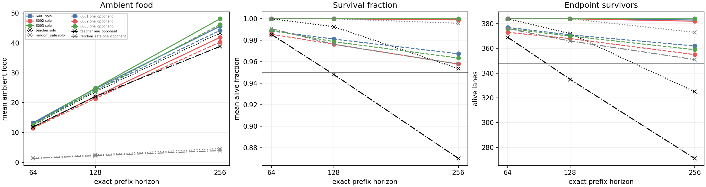
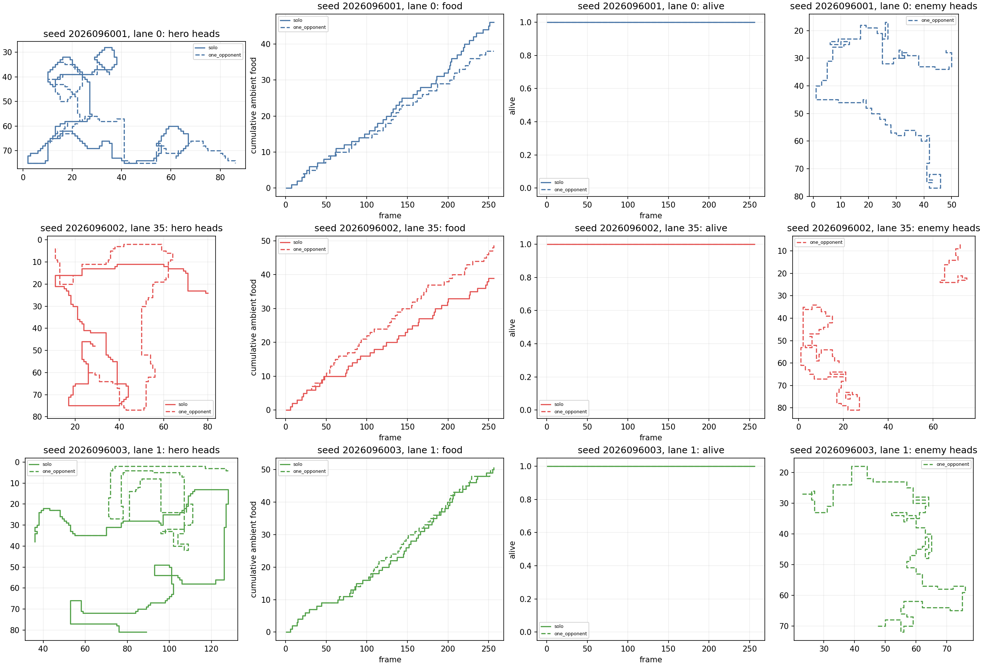

# CX: first fixed-policy one-opponent screen

**Status: complete and independently audited.** Each fixed policy met the independent solo and
one-opponent absolute packages, with adequate measured exposure. Every policy
failed all three paired-retention checks, so the all-three 39-condition screen is
false. This does not identify a cause.

## Fixed scope and paired screen

CX evaluated the completed CV `body_food_length` final mark-4096 policies, seeds
2026096001--2026096003. The cohort was outcome-informed: CV passed its absolute
package in all treatment seeds but had a false strict relative conjunction; CW
later passed its declared solo H768 screen for the same cohort. CX made zero
training changes, optimizer updates, or teacher-label fit calls.

Each policy ran solo and with one native GreedyFood opponent on 32 new worlds
(2026109800--2026109831), four headings, and three food placements: 384 lanes
per condition through H256. H64 and H128 are exact prefixes. The paired S2
condition preserves the initial hero state, food order, and post-placement RNG,
then adds only the declared opponent slot. This is an S1-to-S2 diagnostic, not a
promotion profile or a test that isolates any single missing-perception mechanism.

## Results

Each condition independently passed all 17 absolute booleans and all 36 cell
checks. Food therefore remained well above the independently required baseline
margin in both conditions. The paired requirement was stricter: food-retention
CI lower bound above -5% of paired solo food, survival within .01 of solo, and
endpoints within eight of solo. All three policies failed each of those retention
checks, while both exposure checks passed.

| Seed | Solo food / time / endpoints | One-opponent food / time / endpoints | Absolute solo / S2 | Food-retention CI | Exposure lanes / worlds | Screen result |
| --- | --- | --- | --- | --- | --- | --- |
| 2026096001 | 45.596354 / .999074 / 383 | 44.208333 / .967458 / 362 | 17/17 / 17/17 | [-2.490848, -0.285194] | 169 / 32 | 36/39 |
| 2026096002 | 41.877604 / .998993 / 382 | 40.283854 / .957906 / 355 | 17/17 / 17/17 | [-2.538527, -0.648973] | 155 / 32 | 36/39 |
| 2026096003 | 48.117188 / 1.000000 / 384 | 46.166667 / .963501 / 359 | 17/17 / 17/17 | [-2.999273, -0.901769] | 195 / 32 | 36/39 |

Every seed had sufficient dynamic post-frame-16 exposure: the threshold was 48
lanes spanning 24 worlds, and observed interaction covered all 32 worlds for
all three policies. Thus the result is not marked inconclusive for weak exposure.
It is also not evidence that a particular observation, action, food-competition,
or collision mechanism caused the paired losses; [CY](../solo_food_pqn_one_opponent_death_census_2026-09-21/README.md) separately
completed an audited saved-death census and presentation repair.

Teacher remains the relative food reference and RandomSafe the paired food baseline;
their own survival results are descriptive rather than separate calibration gates.
At H256, Teacher had 43.356771 food and 325 endpoints solo, then 38.820312 food
and 271 endpoints in S2. RandomSafe had 4.609375 and 373 solo, then 3.927083 and
351 in S2.

These two presentation panels were repaired from the same saved arrays in CY,
without replay or inference. Enemy paths now break across death and respawn;
encounter exposure shows cumulative unique lanes against its 48-lane threshold.
The original frozen CX figures remain preserved. The predeclared lanes 0, 35,
and 1 all survived in both conditions and are illustrative, not a substitute
for the complete 384-lane result.

CV's [training curves](../solo_food_pqn_length_access_2026-09-21/training-curves.png)
and [greedy checkpoint curves](../solo_food_pqn_length_access_2026-09-21/gameplay-curves.png)
remain authenticated historical learning evidence. CX and CY perform no new fitting.

## Execution, audit, and limits

All 11 scientific jobs completed as first physical attempts with no reruns,
using 461.542542 seconds of the 1,380-second science cap. Qualification passed
29 tests (1.236 seconds) plus a 5.008529-second smoke, totaling 6.244529 seconds of its separate 180-second cap; its 2,304 smoke
lane-frames and zero optimizer updates have no study lineage. Peak RSS was
928,415,744 bytes and minimum available memory was 34,730,901,504 bytes; MPS was
not observed. The independent audit passed on its first attempt with 2,049
hashes and no issues.

CX supports only the observed H256 one-scripted-opponent screen. It does not
establish general competition capability, causality, or promotion. Apex remains
the incumbent, and its greater historical training dose remains a confound rather
than evidence of inherent superiority.

- [CX numerical analysis](/Users/josenunez/Projects/ml/snake-dqn-artifacts/ongoing-research-20260913/solo-food-pqn-one-opponent/analysis/analysis.json)
- [CX independent audit](/Users/josenunez/Projects/ml/snake-dqn-artifacts/ongoing-research-20260913/solo-food-pqn-one-opponent/audit-attempt1.json)
- [CX qualification accounting](/Users/josenunez/Projects/ml/snake-dqn-artifacts/ongoing-research-20260913/solo-food-pqn-one-opponent/qualification-accounting.json)
- [CW completed H768 screen](../solo_food_pqn_h768_length_confirmation_2026-09-21/README.md)
- [CV completed fixed-cohort evidence](../solo_food_pqn_length_access_2026-09-21/README.md)

- [CX closeout](/Users/josenunez/Projects/ml/snake-dqn-artifacts/ongoing-research-20260913/solo-food-pqn-one-opponent/closeout.json)
