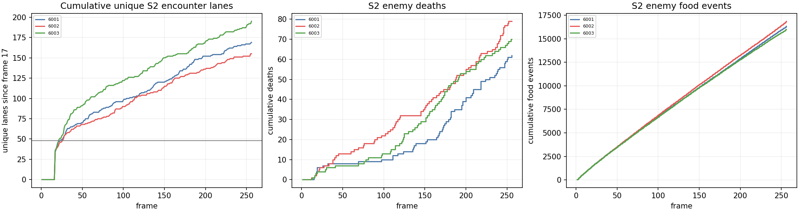

# CY: one-opponent saved-death census

**Status: complete and independently audited.** CY is a saved-evidence census
of the completed CX one-opponent games. It ran no game, inference, training, or
policy selection and changes no CX gate or policy result. Its purpose is to
describe the recorded deaths and food-delta timing, without explaining why those actions were learned or proving a counterfactual
rescue.

## Census scope

The frozen CY intent (`e8249f1f7772c444318fd7ed479dc69c7035f496c7dd98e5e3082843e5c43f0c`)
reads the three fixed CV-length policies from CX: seeds 2026096001--2026096003,
paired H256 solo and one-GreedyFood-opponent reports. CX's failed paired-retention
screen remains the policy result. CY neither adds a policy gate nor treats an
advisory-safe action as a counterfactual rescue.

| Seed | S2 deaths | Head | Enemy body | Self | Wall | Fatal advisory nonempty | Mask fallback | Solo deaths |
| --- | ---: | ---: | ---: | ---: | ---: | ---: | ---: | --- |
| 2026096001 | 22 | 21 | 0 | 1 | 0 | 21 | 1 | 1 self |
| 2026096002 | 29 | 26 | 3 | 0 | 0 | 26 | 3 | 2 self |
| 2026096003 | 25 | 23 | 2 | 0 | 0 | 23 | 2 | none |

Across S2, 70 deaths were head collisions and each had a nonempty advisory set
at the recorded fatal action. The other six S2 deaths were mask-fallback cases:
one self collision in seed 6001, three body collisions in seed 6002, and two
body collisions in seed 6003. This describes the saved state/action record only.
A nonempty advisory set does not prove that selecting another action would have
survived the live trajectory.

The S2 death windows (frames 1--64 / 65--128 / 129--256) were 7 / 6 / 9 for
seed 6001, 11 / 5 / 13 for seed 6002, and 8 / 6 / 11 for seed 6003. Solo had one,
two, and zero deaths respectively, all within frames 129--256 and all self
collisions.

## Paired food-delta census

Food-delta counts partition each paired trace by the hero's alive-before-action
state in the two conditions. `both alive` means the hero was alive in both paired
conditions; it does not mean that the opponent was jointly alive. The partitions
are descriptive accounting, not causal attribution.

| Seed | Both heroes alive | Solo only alive | S2 only alive | Neither alive | Total S2 minus solo food |
| --- | ---: | ---: | ---: | ---: | ---: |
| 2026096001 | +11 | -561 | +17 | 0 | -533 |
| 2026096002 | +30 | -660 | +18 | 0 | -612 |
| 2026096003 | -78 | -671 | 0 | 0 | -749 |

These corrected presentation panels were visually approved. They illustrate the
fixed saved lanes and census reductions; they do not replace the full CX
population criteria or establish a mechanism.

## Execution boundary

The sole physical census attempt completed in 1.044834 seconds of its 30-second
budget, with peak RSS 330,088,448 bytes and minimum available memory
36,649,926,656 bytes. It made zero games, inference calls, optimizer updates, or
training changes. The independent audit passed on its first physical attempt,
checking 157 hashes with no issues. CX remains a failed
all-three paired-retention screen, and CY provides no cause, rescue, promotion,
or new-learning claim.

- [CY immutable intent](/Users/josenunez/Projects/ml/snake-dqn-artifacts/ongoing-research-20260913/solo-food-pqn-one-opponent-death-census/intent.json)
- [CY census analysis](/Users/josenunez/Projects/ml/snake-dqn-artifacts/ongoing-research-20260913/solo-food-pqn-one-opponent-death-census/analysis/analysis.json)
- [CY execution receipt](/Users/josenunez/Projects/ml/snake-dqn-artifacts/ongoing-research-20260913/solo-food-pqn-one-opponent-death-census/supervisor-runs/census/receipt.json)
- [CX completed one-opponent screen](../solo_food_pqn_one_opponent_2026-09-21/README.md)

- [CY independent audit](/Users/josenunez/Projects/ml/snake-dqn-artifacts/ongoing-research-20260913/solo-food-pqn-one-opponent-death-census/audit-attempt1.json)
- [CY closeout](/Users/josenunez/Projects/ml/snake-dqn-artifacts/ongoing-research-20260913/solo-food-pqn-one-opponent-death-census/closeout.json)
