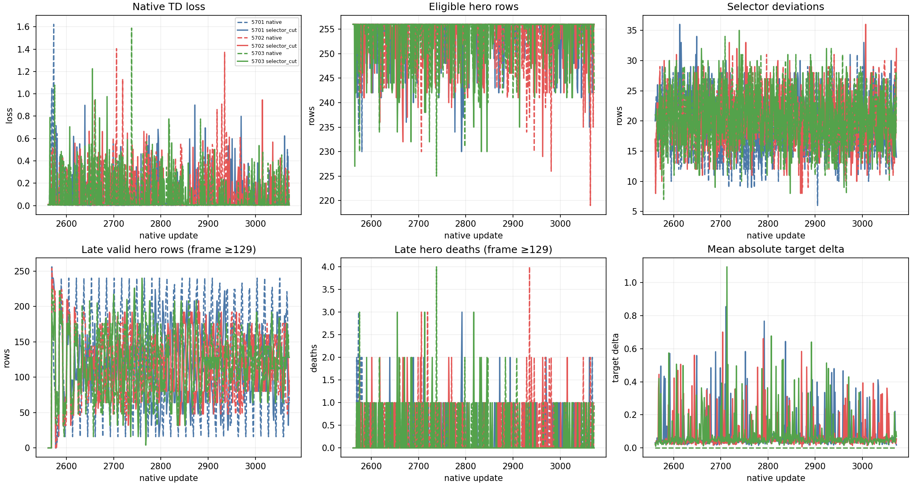
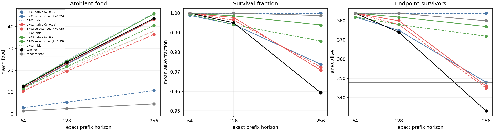
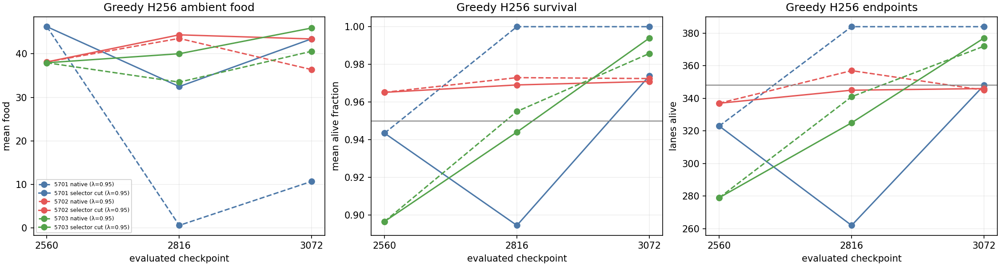
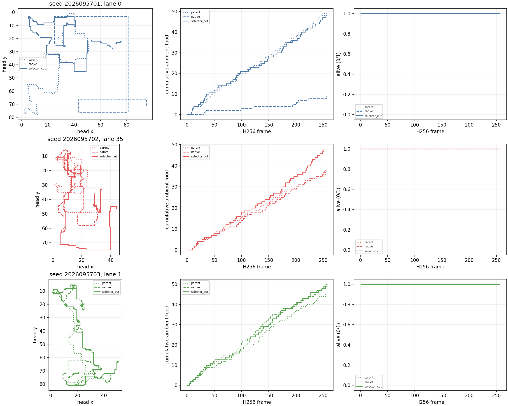

# CN: matched PQN selector-cut comparison

**Complete and not successful.** CN tested native Q(λ=.95) against a
selector-cut recurrence at equal continuation dose. Neither arm produced the
all-seed reliability required for a policy claim; selector-cut also failed the
paired endpoint-benefit requirement in every seed. Apex remains incumbent.

Both arms restored the same three CK body-aware mark-2560 parents, including
Adam and counters, then received 512 updates for each fresh seed. The fresh
H256 bank has 32 worlds, four headings, and balanced left/straight/right food
placements (384 lanes). Mark 2816 is descriptive; only mark 3072 decides the
predeclared criteria.

## Final result

The 16 inherited absolute food/survival gates were assessed per final policy,
and the three selector-cut versus native paired criteria were assessed per seed.
No values were pooled across seeds.

| Result | Outcome |
| --- | --- |
| Native absolute reliability | 1/3 seeds |
| Selector-cut absolute reliability | 2/3 seeds |
| Complete paired selector-cut benefit | 0/3 seeds |
| Overall conjunction | Failed |

Seeds 5701 and 5703 pass all 16 selector-cut absolute conditions. Seed 5701 sits exactly on the endpoint floor. Its final food was
43.447916666666664, survival fraction 0.973876953125, and endpoint count
348/384. Seed 5702 narrowly failed the unchanged endpoint floor: selector-cut
ended at 346/384 despite food 43.419270833333336 and survival fraction
0.9709269205729166. Its native counterpart also failed the floor, at 345/384.

The complete absolute-gate failure ledger is:

| Seed | Native failed gates | Selector-cut failed gates |
| --- | --- | --- |
| 2026095701 | H64/H128/H256 `food_ge0.75_teacher`; H64/H128/H256 `all12cells_ge0.50_teacher`; late `food_128_256_ge0.75_teacher` | None |
| 2026095702 | H256 `endpoints_ge348` | H256 `endpoints_ge348` |
| 2026095703 | None | None |

Every seed failed the strict paired endpoint lower-bound test:

| Seed | Cut − native endpoint lower CI | Food lower CI | Parent-food lower CI | Failed relative condition(s) |
| --- | ---: | ---: | ---: | --- |
| 2026095701 | -0.12851270309529905 | 32.26387373250902 | -3.8774468878939974 | Endpoint; parent-food retention |
| 2026095702 | -0.04021636220304286 | 6.207835250996334 | 4.5008082208220985 | Endpoint |
| 2026095703 | -0.008711090817467529 | 4.748602117446997 | 6.63890426079835 | Endpoint |

The two food conditions require a lower bound greater than -5% of the relevant
native or initial-parent mean. All three endpoint conditions require a lower
bound strictly above zero. A favorable mean or a midpoint cannot rescue a
failed final condition.

## Per-seed H256 observations

Each entry is `food / survival fraction / endpoint survivors`, rounded to six decimal places. Full precision is retained in the analysis JSON. Midpoints are
shown for trajectory context only and have no decision authority.

| Seed | Initial parent | Native midpoint | Selector-cut midpoint | Native final | Selector-cut final |
| --- | --- | --- | --- | --- | --- |
| 2026095701 | 46.239583 / 0.943502 / 323 | 0.601562 / 1.0 / 384 | 32.481771 / 0.894582 / 262 | 10.708333 / 1.0 / 384 | 43.447917 / 0.973877 / 348 |
| 2026095702 | 38.143229 / 0.965159 / 337 | 43.541667 / 0.972972 / 357 | 44.364583 / 0.969096 / 345 | 36.380208 / 0.972473 / 345 | 43.419271 / 0.970927 / 346 |
| 2026095703 | 37.950521 / 0.896657 / 279 | 33.507812 / 0.955027 / 341 | 40.026042 / 0.944092 / 325 | 40.591146 / 0.985758 / 372 | 45.929688 / 0.993927 / 377 |

The teacher anchor was 43.828125 / 0.9593302408854166 / 333; random-safe was
4.609375 / 0.998809814453125 / 380. They remain descriptive anchors. The earlier
CH teacher-survival calibration failure remains failed; CN does not reverse it.

## Evidence and operations

Qualification passed 49 tests plus the separate MPS admission smoke in a combined
9.696872125 seconds of its 180-second budget, with three discarded MPS updates
and no discarded CPU updates. Scientific execution completed 3,072 updates over 781,219 eligible
hero rows in 1,848.482942420058 seconds of the 5,940-second cap.

There were 24 logical scientific jobs and 25 physical science attempts: the
first native seed-5701 attempt failed before Torch, output, or any update due
to the `VECNIB_MAXIMUM_THREADS` typo for `VECLIB_MAXIMUM_THREADS`. That
zero-update failure is charged and retained. One supplemental plot-rendering
attempt makes 26 physical attempts in the complete operational record.

The main independent audit passed after hashing 10,882 paths and reconciling
all 25 prior attempts. Recorded scientific resource extrema were maximum RSS
1,606,582,272 bytes, minimum available memory 34,517,630,976 bytes, and MPS
driver memory 1,207,468,032 bytes. The analysis JSON is unchanged; the
supplemental corrected learning plot rendered in 1.050799584 seconds with zero
optimizer updates, inference calls, or gameplay.

The original artifact remains immutable. The corrected local figure below
supersedes the mislabeled panel ordering in the original `training-curves.png`.

## Next bounded candidate

CN does not support advancing to H384. CO is the next prospective study: native
Q(λ=.65) with Huber versus half-MSE, restored from the common CK body-food
parents and trained for 512 updates on a new seed bank (5801–5803). Its loss
seam must first qualify with an exact Huber control, a residual-derivative
probe, and unchanged sampler/optimizer/mask/forward evidence.

Apex remains the operational incumbent. Its much larger historical training
dose is a confound, not evidence of inherent architectural superiority; CN did
not earn a tournament-gate replacement decision.

- [Frozen design](/Users/josenunez/Projects/ml/snake-dqn-artifacts/ongoing-research-20260913/solo-food-pqn-selector-cut/design.md)
- [Final analysis JSON](/Users/josenunez/Projects/ml/snake-dqn-artifacts/ongoing-research-20260913/solo-food-pqn-selector-cut/analysis/analysis.json)
- [Independent audit](/Users/josenunez/Projects/ml/snake-dqn-artifacts/ongoing-research-20260913/solo-food-pqn-selector-cut/independent-audit.json)
- [Audited closeout](/Users/josenunez/Projects/ml/snake-dqn-artifacts/ongoing-research-20260913/solo-food-pqn-selector-cut/closeout.json)
