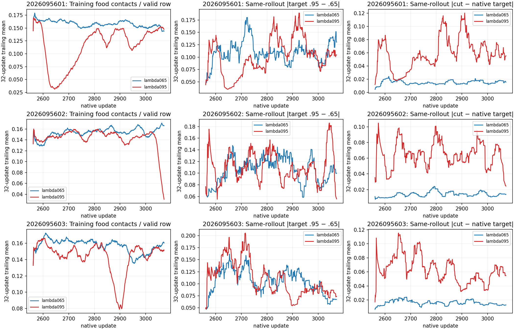

# CM: saved PQN return and terminal-signal diagnostic

**Complete and independently audited.** All 3,072 completed CL rollout batches
and 781,367 valid hero transitions pass target replay and archive-integrity
checks. This study adds no model inference, optimizer updates, or gameplay.
It narrows the next update experiment; it does not demonstrate a better policy.

The [CL behavioral comparison](../solo_food_pqn_credit_trace_2026-09-20/README.md)
remains the outcome evidence: current λ=.65 passes the H256 absolute criteria in
2/3 seeds, longer λ=.95 in 1/3, and the full trace-benefit rule in 0/3. The longer
trace in seed 5602 ends with 384/384 survivors but only 1.7474 food, below random
4.6771. Those decisions, learning curves and fixed gameplay examples are
retained unchanged. CM uses the saved data from every seed, including failure.

## Fixed diagnostic and every-seed results

The population is all six CL learners, every update 2561–3072, with fixed
all512/first64/last64 windows. Each archived diagnostic joins its episode-frame
archive. Native targets reproduce **exactly on every valid row** (maximum error
0 across all six runs); actual-SGD aggregate differences are at most 1.602e-7,
below the predeclared 1e-4 limit. Masks, episode identities, resets, action
legality, odometers and row coverage pass. No alternate-max tie was observed.
Sampled actions differed from deterministic native argmax on 7.91–8.12% of valid
rows; this is not a complete measure of epsilon exploration, because random
selection can also pick the greedy action.

Each target sensitivity compares identical saved trajectories. The two
*generating arms* have divergent trajectories and are not paired states.

| Seed | Generating arm | Valid rows | Terminal rows | Mean absolute terminal TD error | Terminal share of absolute clipped derivative | Mean target .95−.65 | Mean cut-.95−native-.95 target |
| --- | --- | ---: | ---: | ---: | ---: | ---: | ---: |
| 2026095601 | lambda065 | 130,168 | 122 | 13.2714 | 1.582% | -0.05640 | +0.05331 |
| 2026095601 | lambda095 | 130,074 | 135 | 10.7228 | 1.064% | -0.04643 | +0.04131 |
| 2026095602 | lambda065 | 130,267 | 114 | 13.2528 | 1.566% | -0.05383 | +0.04837 |
| 2026095602 | lambda095 | 130,114 | 134 | 11.8388 | 1.052% | -0.05327 | +0.04643 |
| 2026095603 | lambda065 | 130,353 | 106 | 13.3386 | 1.439% | -0.05334 | +0.05785 |
| 2026095603 | lambda095 | 130,391 | 107 | 12.1025 | 0.774% | -0.04812 | +0.04353 |

Terminal rows are only 0.081–0.104% of valid transitions. Every terminal residual
has absolute value at least 1, so the Huber derivative is clipped there. The
preceding 1–15 recorded steps contribute another 6.68–9.13% of total absolute
clipped-derivative mass. These are policy-time **output-space derivative
proxies**, not parameter gradients: network Jacobians, per-update averaging
and Adam prevent a direct gradient-attribution claim. Rows with no later death
visible in the rollout are censored, not certified safe. Death-distance 0 alone
counts terminal rows; distances 1–15 count preceding exposure.

On each fixed archive, changing native λ=.65 to .95 lowers mean targets by
0.0464–0.0564. Its mean absolute target change is 0.1009–0.1107. The deterministic
selector-match cut at .95 raises mean targets by 0.0413–0.0579, with mean absolute
change 0.0591–0.0725. At .65 its mean absolute change is smaller, 0.0128–0.0159.
This consistent sensitivity supports testing the carry rule before a broader
loss change. It does not establish that the changed targets caused seed 5602's
food collapse or that the cut will improve gameplay.

The left panels show training food contacts with epsilon .1, not fresh-world
greedy performance. The other panels show within-archive target differences.
All curves use the disclosed 32-update trailing mean; the report retains every
unsmoothed update and each fixed window. In seed 5602, training food also drops
late, consistent with the final gameplay regression, without proving its cause.

## Definition and limits

For residual d=Q_taken−target, the native Smooth-L1 output derivative is
clip(d,−1,1). CM records counts, loss, signed/absolute derivative mass, positive
Q-reducing pressure, negative Q-increasing pressure and saturation. The squared
loss derivative d is only a reference measurement, not a trained alternative.
Saved actual SGD rows are permuted without source indices, so their arithmetic
and means are checked independently while positional groups use policy-time Q.

The cut recomputation uses λ only when the next valid sampled action matches
its saved masked argmax, choosing the lowest index on ties. Otherwise the carry
coefficient is 0 and the target bootstraps at that row. Terminal rewards remain
unchanged. Changes can propagate backward through earlier eligible returns;
this is not restricted to terminal credit. [PQN's paper](https://arxiv.org/html/2407.04811v3)
is relevant background on multi-step, parallel TD learning, but it does not
establish an optimum for this task. [Robust Losses for Learning Value Functions](https://arxiv.org/abs/2205.08464)
explains why squared-error updates can be sensitive to large outliers. Neither
source predicts which change will improve this particular learner.

## Qualification, audit and resources

The final guarded qualification passed 21 tests, including one authenticated
first-death rollout from each of the six learners. Total qualification is
**2.893 / 60 seconds**. An original fixture incorrectly expected 2 rather than 1
unit of greedy-positive clipped pressure; its 0.964-second failure is preserved.
The repaired r1 qualification passed in 0.881 seconds. Its saved-data analysis
then stopped after 1.891660 seconds because the helper rejected native sticky
terminal flags on invalid post-death rows. R2 correctly accepts those flags,
uses validity for carries and death counts, and adds real-archive fixtures.
This repairs the diagnostic's interpretation of existing native data.

Final science completed naturally in 17.770482 seconds. Including the preserved
failed analysis, total science is **19.662142 / 120 seconds**. No training or
gameplay was repeated. The final process-tree RSS peak was 558,039,040 bytes;
minimum sampled available memory was 37,092,343,808 bytes. CPU/BLAS threads stayed
at 2, interop at 1, and the existing 4 GiB RSS/12 GiB available-memory/watchdog and
exclusive-slot guards remained active.

Independent audit joins source receipts, freezes, per-update clocks, every
seed/window partition, pressure identities, figure hashes and CL behavior
references. Its first attempt mistakenly compared all preterminal exposures
(distance 0–15) with the terminal-only count. That output and script are
preserved; the correction uses distance 0 and the audit passes. The numerical
analysis was not rerun for this auditor repair.

## Next bounded comparison

CN will compare native λ=.95 with the selector-match-cut λ=.95 from the same
three CK body-aware mark 2560 parents. Each pair restores full model, Adam and
counters; both receive 512 updates with matching fresh pre-update RNG streams.
The planned new training seeds are 5701–5703 in the existing date-prefixed
namespace, subject to a freshness audit, with a separate fresh 32-world bank.
The food, observations, loss, action contract, masks and exploration settings
remain the same within the pair. Only the trace-carry rule changes.

CN will retain all 16 absolute food/survival conditions and the three per-seed
paired-benefit conditions used by CL, with final 3072 as the decision mark and
2816 as descriptive only. It will report absolute reliability separately from
intervention benefit; neither an early peak nor averaging across seeds can
rescue a failed final gate. Planned caps are 5,940 science seconds and 180
qualification seconds, frozen before execution. Apex remains incumbent pending
the shared tournament gate; its larger historical dose is a confound, not proof
of inherent superiority.

- [Frozen design](/Users/josenunez/Projects/ml/snake-dqn-artifacts/ongoing-research-20260913/solo-food-pqn-terminal-signal-r2/design.md)
- [Full saved-array analysis](/Users/josenunez/Projects/ml/snake-dqn-artifacts/ongoing-research-20260913/solo-food-pqn-terminal-signal-r2/analysis/analysis.json)
- [Independent audit](/Users/josenunez/Projects/ml/snake-dqn-artifacts/ongoing-research-20260913/solo-food-pqn-terminal-signal-r2/independent-audit.json)
- [Audited closeout](/Users/josenunez/Projects/ml/snake-dqn-artifacts/ongoing-research-20260913/solo-food-pqn-terminal-signal-r2/closeout.json)
