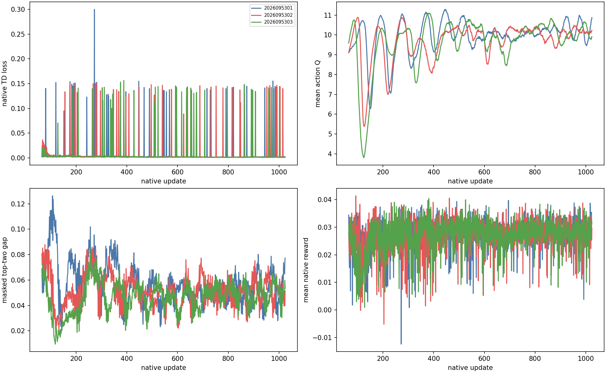
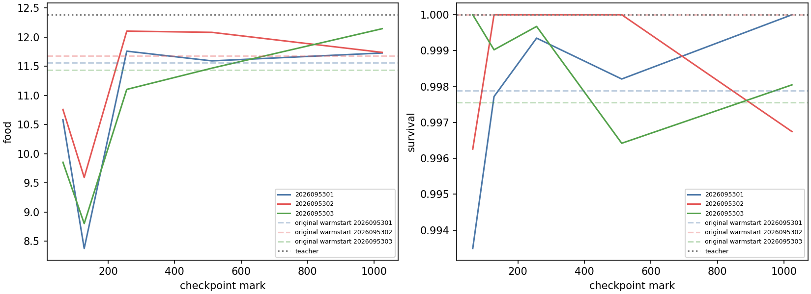
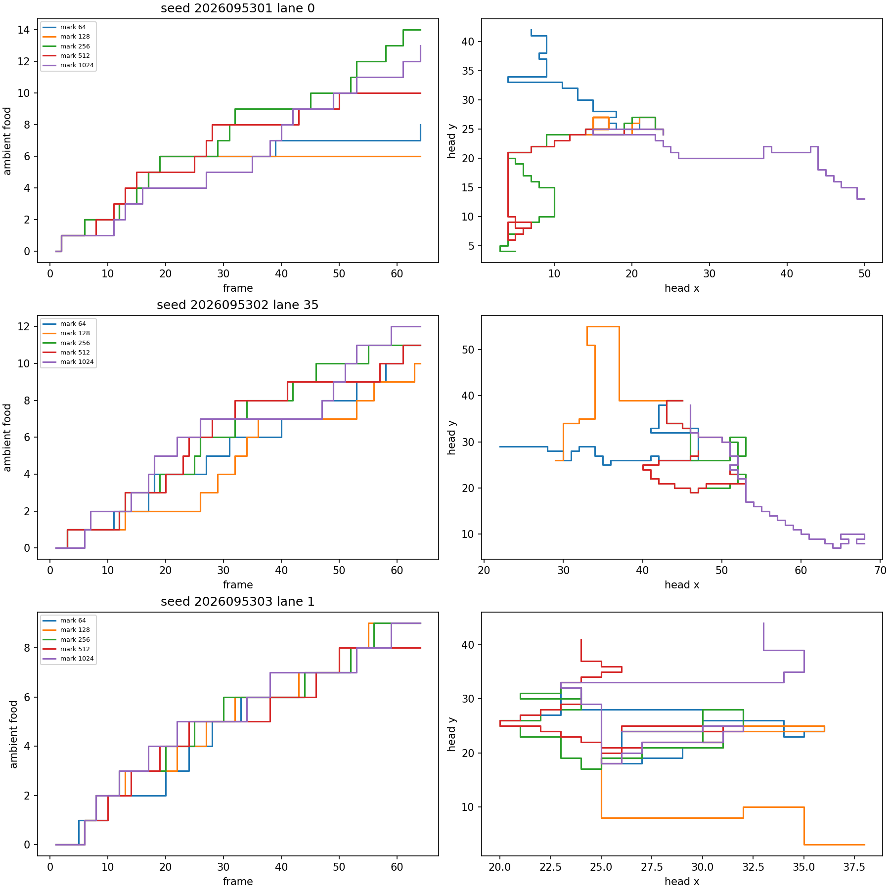

# CC: unchanged native PQN learning through update 1024

**Status: COMPLETE_AND_AUDITED.** Continuing the unchanged 0.1 native
PQN recipe to update 1024 recovered food collection from its mark-64 parent while
meeting survival-time and endpoint retention limits in all three fresh runtime seeds.
It does **not** meet the stricter
primary result: the paired final-food interval against the original released-anchor
reference crosses zero in seeds 2026095301 and 2026095302. CC is therefore not a
promotion result, nor evidence that the native recipe reliably improves on that
reference at this dose.

## Frozen comparison

The three lineages restore the full CB `food01` mark-64 network, Adam, counters, and
tripwire state: 2026095301 from CB 5201, 2026095302 from CB 5202, and 2026095303 from
CB 5203. The matching BY released-anchor mark-64 network is the original reference.
Parents were fixed before outcomes. Simulator, episode, pool, action, and SGD streams
are newly derived from the CC seeds, so this is a fresh-runtime continuation, not an
exact simulator resume.

The coefficient remains 0.1. Q scale, gamma/lambda, epsilon, rollout, environments,
H64 horizon, food count, learning rate, Adam epsilon, clipping, native loss, food-only
raster transform, masks, and mechanics are unchanged. No teacher CE, feature change,
value-head change, or optimizer reset was introduced. Each learner completed 960 new
updates through mark 1024; marks 64, 128, 256, 512, and 1024 were saved, with mark
1024 fixed as the only decision endpoint. Mark 512 supplies the frozen late-retention
floor only. CB was not rerun and no earlier checkpoint can rescue a failed endpoint.

Fresh worlds 2026107000–2026107007 provide 96 H64 lanes per checkpoint, balanced
across four headings and reachable left/straight/right first-food placements. Original
and mark-64 references were evaluated on that same new bank. Training, gameplay, the
original AN training data, and the reused BV 1,526-row held set are distinct; held fit
is descriptive and is not a fresh final test. Eight paired world means are the
statistical units (df 7); lanes and seeds are not pooled.

## Behavioral result

The teacher/random calibration passed all six frozen checks. Its teacher-minus-random
food difference was 10.8958, 95% CI [10.2268, 11.5648], over the eight worlds.

| Full seed | Mark | Food | Survival time | Endpoints / 96 |
| --- | ---: | ---: | ---: | ---: |
| 2026095301 | original | 11.5625 | 0.9979 | 95 |
|  | 64 | 10.5833 | 0.9935 | 93 |
|  | 128 | 8.3750 | 0.9977 | 95 |
|  | 256 | 11.7604 | 0.9993 | 95 |
|  | 512 | 11.5938 | 0.9982 | 95 |
|  | 1024 | **11.7292** | **1.0000** | **96** |
| 2026095302 | original | 11.6771 | 1.0000 | 96 |
|  | 64 | 10.7604 | 0.9963 | 95 |
|  | 128 | 9.5938 | 1.0000 | 96 |
|  | 256 | 12.1042 | 1.0000 | 96 |
|  | 512 | 12.0833 | 1.0000 | 96 |
|  | 1024 | **11.7396** | **0.9967** | **94** |
| 2026095303 | original | 11.4375 | 0.9976 | 95 |
|  | 64 | 9.8542 | 1.0000 | 96 |
|  | 128 | 8.8021 | 0.9990 | 95 |
|  | 256 | 11.1042 | 0.9997 | 95 |
|  | 512 | 11.4688 | 0.9964 | 93 |
|  | 1024 | **12.1458** | **0.9980** | **95** |

The first continuation checkpoint is unstable: all three train fits drop at mark 128,
and food also drops below mark 64 for all three seeds. Gameplay recovers by marks
256–1024. This trajectory supports measuring the full fixed dose; it does not turn
shorter evaluation or the intermediate marks into selection rules.

At mark 1024, all nine retention checks and both recovery checks passed in every seed.
That includes food at least 95% of original and 75% of teacher, every pose cell at
least half of teacher food, time at least .95, endpoints at least 87, appropriate
original and mark-512 retention, and a positive final-minus-random interval. Final
food exceeded mark 64 in all three paired comparisons. The only ledger failures were
the two final-minus-original food intervals below.

| Full seed | Final − mark 64 food, 95% CI | Final − original food, 95% CI | Final − random food, 95% CI | Final decision |
| --- | ---: | ---: | ---: | --- |
| 2026095301 | +1.1458 [0.4434, 1.8482] | +0.1667 [−0.1493, 0.4827] | +10.2396 [9.7753, 10.7039] | Primary fails |
| 2026095302 | +0.9792 [0.4502, 1.5081] | +0.0625 [−0.3977, 0.5227] | +10.2500 [9.9275, 10.5725] | Primary fails |
| 2026095303 | +2.2917 [1.5450, 3.0383] | +0.7083 [0.2388, 1.1779] | +10.6563 [10.1034, 11.2091] | All 13 pass |

Thus recovery over mark 64 passes 3/3, and improvement beyond the original reference
passes 1/3. The predeclared all-13-in-all-three requirement fails, so `overall_success`
is false and `promotion_eligible` remains false. The result also does not compare
against Apex; Apex remains the operational incumbent, and its larger historical budget
does not establish architectural superiority.

## Learning fit, distinct from play

The model can still collect and survive while its frozen-label fit declines. The table
keeps this distinction visible. Values are accuracy on the separate 3,072-row training
set and 1,526-row held set, respectively.

| Seed | Mark 64 | Mark 128 | Mark 256 | Mark 512 | Mark 1024 |
| --- | --- | --- | --- | --- | --- |
| 2026095301 train / held | .930 / .881 | .723 / .688 | .899 / .856 | .779 / .715 | .730 / .671 |
| 2026095302 train / held | .960 / .868 | .760 / .841 | .935 / .859 | .784 / .716 | .723 / .631 |
| 2026095303 train / held | .958 / .858 | .722 / .814 | .927 / .877 | .800 / .720 | .738 / .701 |

This is not fresh evidence of ordinary-label generalization. It instead motivates the
next exploratory question: **can the recovered fixed mark-1024 policies sustain their
behavior when the solo game horizon doubles to H128?** That would be a new study with
its own frozen criteria, not a revision of CC’s gate.

## Representative evidence and execution scope

The preregistered representative lanes are 0 for seed 5301, 35 for 5302, and 1 for
5303. At mark 1024 they finish alive with 13, 12, and 9 ambient food respectively.
They illustrate fixed trajectories only; they neither replace the eight-world analysis
nor select the reported result.

All 25 logical science jobs completed in 25 physical receipts with no failed attempts.
The science audit independently recomputed 3,985 hashes, 736,669 new agent steps,
2,880 optimizer updates, the 13-condition ledger, and the reported confidence
intervals. The receipt audit also passed: science used 1,466.3722 of 2,530 seconds;
qualification passed 20 tests in 6.672 of 120 seconds with one discarded MPS update
and no discarded CPU update. Observed peak RSS was 1,531,478,016 bytes, minimum
available memory was 32,673,890,304 bytes, and peak MPS-driver allocation was
1,204,633,600 bytes. These are guard observations, not temperature measurements.

## Primary records

- [CC frozen design](/Users/josenunez/Projects/ml/snake-dqn-artifacts/ongoing-research-20260913/solo-food-pqn-training-dose/design.md)
- [CC frozen intent](/Users/josenunez/Projects/ml/snake-dqn-artifacts/ongoing-research-20260913/solo-food-pqn-training-dose/intent.json)
- [CC final analysis](/Users/josenunez/Projects/ml/snake-dqn-artifacts/ongoing-research-20260913/solo-food-pqn-training-dose/analysis/analysis.json)
- [CC learning curves](learning-curves.png)
- [CC food and survival evidence](allseed-food-survival.png)
- [CC fixed gameplay evidence](fixed-gameplay-evidence.png)
- [CC science audit](/Users/josenunez/Projects/ml/snake-dqn-artifacts/ongoing-research-20260913/solo-food-pqn-training-dose/science-audit.json)
- [CC independent receipt audit](/Users/josenunez/Projects/ml/snake-dqn-artifacts/ongoing-research-20260913/solo-food-pqn-training-dose/independent-audit.json)
- [CC resource rollup](/Users/josenunez/Projects/ml/snake-dqn-artifacts/ongoing-research-20260913/solo-food-pqn-training-dose/resource-rollup.json)
- [CC closeout](/Users/josenunez/Projects/ml/snake-dqn-artifacts/ongoing-research-20260913/solo-food-pqn-training-dose/closeout.json) — `c16eda7b04c9e6c62baea23700191352793fa772e2b12275dcc3f302176b29a3`
- [CC qualification](/Users/josenunez/Projects/ml/snake-dqn-artifacts/ongoing-research-20260913/solo-food-pqn-training-dose/qualification-complete.json)
- [CB audited mark-64 parent study](../solo_food_pqn_food_reward_2026-09-20/README.md)
- [BY released-anchor original reference](../solo_food_pqn_anchor_release_2026-09-20/README.md)
