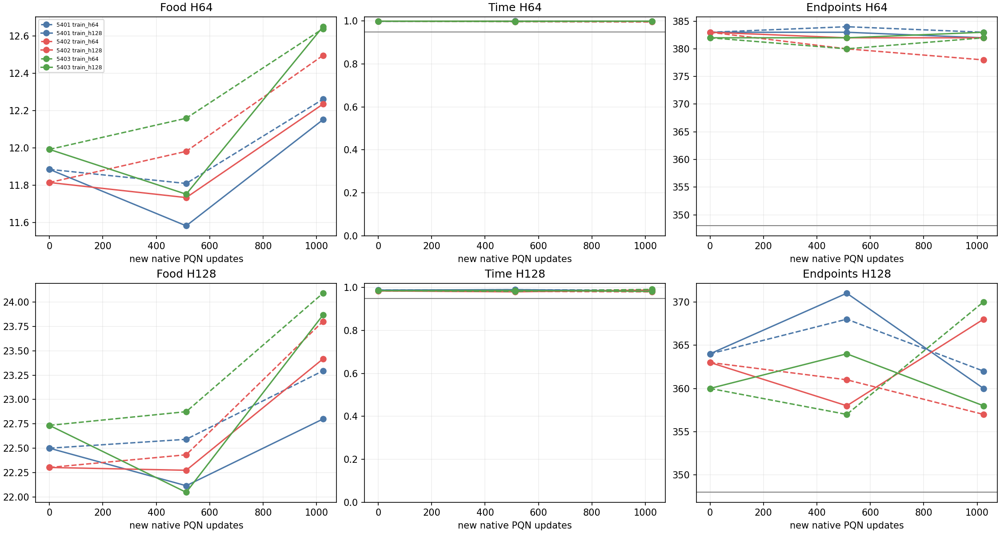
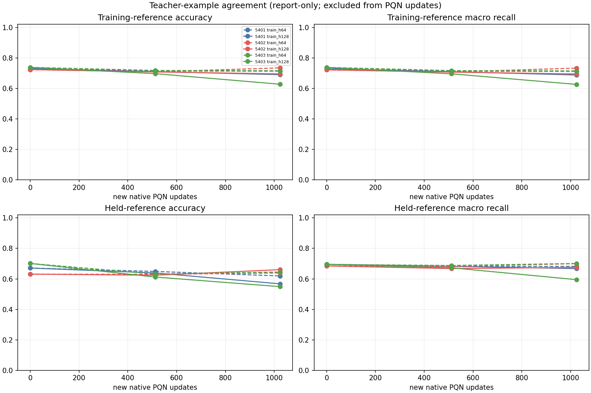
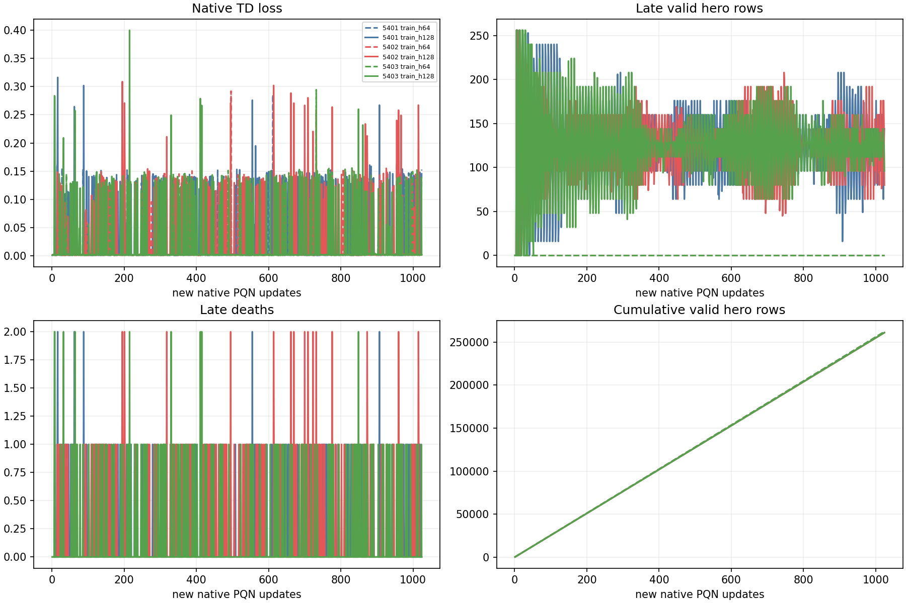
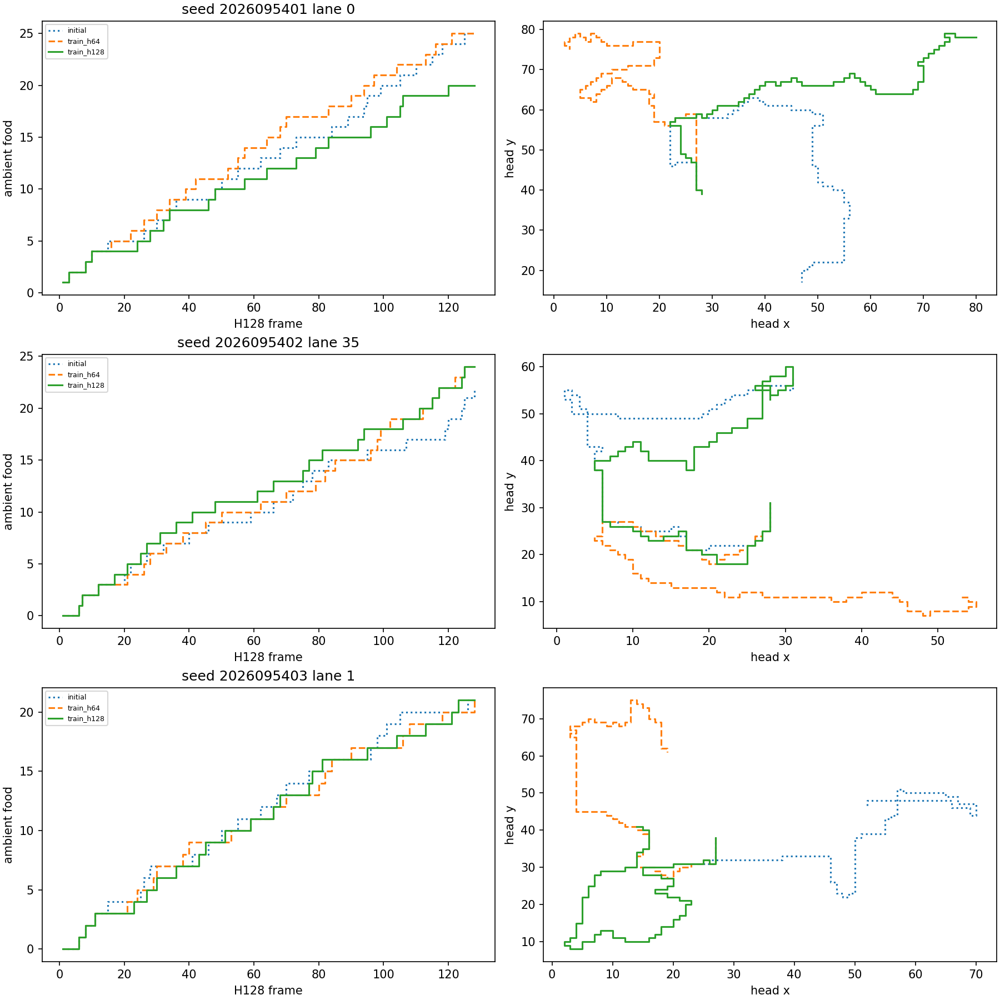

# CG: paired native PQN training-horizon comparison

**Status: COMPLETE_AND_AUDITED.** All three final policies in **both** training arms
pass the 17 absolute food/survival-retention checks at H64/H128. This establishes the
specified H128 capability on 32 fresh worlds per seed after the additional native PQN
dose. The separate claim that H128 training improves endpoint survival over matched
H64 training passes in **0/3 seeds**: every paired interval crosses zero.
Thus CG's combined `overall_success` remains **false**. Absolute reliability and
horizon-specific benefit are separate results; neither promotes a checkpoint.

The H64-trained controls increased H128 mean food from 22.50/22.30/22.73 to
23.29/23.80/24.09 across the three seeds. These are warm-start continuations with
restored Adam state, not from-scratch learners. The next cycle evaluates both fixed
final arms at H256 on fresh worlds with no additional training.

## Frozen contrast and lineage

For fresh runtime/SGD seeds 2026095401–03, both arms restore the same audited CC 5301–03
mark-1024 network, full Adam state, update and hero odometers, and tripwire counters.
`train_h64` and `train_h128` differ only in `max_frames`: 64 versus 128. Environments,
pool, and RNG streams are deliberately fresh, so this is a model-and-optimizer
continuation rather than an exact simulator resume. Smoke seed 5409 maps to 5301 and is
excluded from results.

All remaining native settings are fixed: FoodGeometry channels/scalars, action masks,
six actions, Q scale .1, food reward .1, gamma .997, lambda .65, epsilon .1, rollout
16, 16 environments × 1 snake, one SGD epoch, minibatch 256, learning rate .0005, Adam
epsilon .00015, and gradient clip 10. FoodGeometry drops progress scalar 5, so its
normalization does not directly change transformed inputs; the cap can still change
experience through resets and the sampled state distribution.

Each arm receives 1,024 new updates, for 2,048 total per learner. Checkpoints at 1,536
are descriptive; mark 2,048 is the only endpoint. Actual valid-hero counts can differ
because termination padding differs and are reported without resampling. The maximum
new valid-hero count is 1,572,864. CG creates learning curves and on-policy diagnostics;
the original 3,072-row teacher-training and 1,526-row held-teacher sets remain
report-only references, separate from native TD optimization and fresh gameplay.

## Evaluation and decisions

The fresh bank contains worlds 2026107600–2026107631, each with four headings × three
reachable left/straight/right placements at distance 6: 384 lanes. The smoke world
2026107700 is disjoint. Every checkpoint plays once to H128; H64 is the exact prefix,
not an independent rollout. The schedule is 17 evaluations: three shared initials, 12
trained evaluations (two arms × three seeds × marks 1,536/2,048), teacher, and random.
There is no checkpoint, seed, or bank selection.

Teacher and random must pass six calibration checks at each horizon. Each final
H128-trained policy then needs CF's 17 absolute/retention conditions against its shared
CC-1024 start: eight checks at H64, eight at H128, and H128 food noninferiority. The
checks cover food versus initial and teacher, all 12 pose cells, time, absolute and
relative endpoint counts, random separation, and the H128 lower-bound margin. All
paired confidence intervals use 32 world means at df 31; lanes and training seeds are
not pooled.

The eight conditions at each horizon are: mean food at least 95% of the shared
initial and 75% of teacher; food in every heading/placement cell at least 50% of its
teacher cell; mean survival fraction at least .95 and no more than .01 below the
initial; at least 348 of 384 endpoint survivors and no more than eight fewer than the
initial; and a positive lower bound for the paired food difference versus RandomSafe.
The seventeenth condition requires the H128 paired food difference versus the initial
to have a lower bound strictly above −5% of initial mean food. These thresholds were
fixed before execution and apply independently to each seed.

The separate horizon-specific question compares H128-trained final food with the
H64-trained control by a strict noninferiority lower bound greater than −5% of control
mean food. It then requires the H128 endpoint-survival difference versus the H64 control
to have a positive paired 32-world CI lower bound in all three seeds. Passing absolute
retention alone is not horizon benefit. Both decisions are reported independently, and
neither promotes a policy or repairs CF's earlier failure.

| Seed | H64-trained control at H128: food / time / endpoints | H128-trained treatment at H128: food / time / endpoints | Treatment absolute retention | Relative food guard | Endpoint-fraction benefit CI |
| --- | --- | --- | --- | --- | --- |
| 2026095401 | 23.2943 / 0.988017 / 362 | 22.7995 / 0.984273 / 360 | 17/17 pass | Pass | [-0.033699, 0.023282] — fail |
| 2026095402 | 23.8021 / 0.980103 / 357 | 23.4167 / 0.988729 / 368 | 17/17 pass | Pass | [-0.001505, 0.058797] — fail |
| 2026095403 | 24.0911 / 0.991679 / 370 | 23.8672 / 0.982137 / 358 | 17/17 pass | Pass | [-0.066841, 0.004341] — fail |

## Behavioral and fit evidence

The only three failed gates are the three `endpoint_CI_lower_gt0` horizon-benefit
conditions. Every absolute/retention condition passes for both arms, as does H128
food noninferiority of treatment versus control. No seed, mark, or world bank was
selected after seeing results; mark 1,536 remains descriptive and mark 2,048 decides.

The H128-trained minus H64-trained paired food differences are −.4948
(95% CI [−.8432, −.1464]), −.3854 ([−.7960, .0252]), and −.2240
([−.7789, .3310]). All clear the declared −5% noninferiority margin, but none
establishes food superiority. Endpoint differences are −2, +11, and −12 of 384;
all three world-cluster intervals include zero.

Dashed lines denote H64-trained controls; solid lines denote H128-trained policies.
Color denotes seed. The horizontal endpoint line is the unchanged 348/384 floor.
Survival time uses a 0–1 axis; exact values are in the table above. H64 is a prefix of
H128, so those panels are not independent samples.

Teacher-reference agreement is measured separately and excluded from native PQN
updates. Final training-reference/held-reference accuracies are:

| Seed | H64-trained reference accuracy (train / held) | H128-trained reference accuracy (train / held) |
|---|---|---|
| 2026095401 | 71.29% / 61.93% | 68.98% / 56.75% |
| 2026095402 | 73.44% / 63.89% | 69.50% / 66.06% |
| 2026095403 | 71.55% / 64.48% | 62.70% / 54.91% |

Each reference uses 3,072 archived training rows or 1,526 separate held rows. Native
PQN optimizes its own TD experience; these percentages are agreement with an earlier
teacher, not native training-loss accuracy. Agreement can decline while food play
improves, so it cannot replace the behavioral gates.

The same dashed-control/solid-treatment convention applies. The passive observer
confirms late exposure in every treatment, zero late exposure in every control, and
matched initial model/Adam state plus the declared first-three-update parity.

The fixed gameplay examples use lanes 0, 35, and 1 for seeds 5401, 5402, and 5403,
respectively. They show actual cumulative food and head paths from saved greedy
rollouts, not selected best games. Full raw14 trajectories and selection hashes are
preserved in the analysis record.

## Completed training exposure

All six learners completed the fixed dose, totaling 6,144 new optimizer updates and
1,568,614 valid hero transitions. These counts describe exploratory training, not
final greedy gameplay. The longer-cap manipulation is present in all three seeds.

| Runtime seed | Arm | New valid hero transitions | Transitions after frame 64 | Training deaths (after 64) |
|---|---|---:|---:|---:|
| 2026095401 | H64 | 261,928 | 0 | 34 (0) |
| 2026095401 | H128 | 260,974 | 127,533 | 173 (152) |
| 2026095402 | H64 | 261,934 | 0 | 29 (0) |
| 2026095402 | H128 | 260,830 | 127,246 | 207 (198) |
| 2026095403 | H64 | 261,976 | 0 | 29 (0) |
| 2026095403 | H128 | 260,972 | 127,836 | 177 (165) |

## Completed calibration and operational recovery

Teacher and RandomSafe completed naturally. The saved calibration report is complete and
passes all 12 H64/H128 checks. At H64, teacher records food 12.5390625, time
.9991861979166666, and 382 endpoints; RandomSafe records food 1.3203125, time 1, and
384 endpoints. At H128, teacher records food 23.622395833333332, time
.9924112955729166, and 373 endpoints; RandomSafe records food 2.4557291666666665,
time 1, and 384 endpoints. These anchors support proceeding to the learned-policy
comparisons; they are not a CG outcome.

The original calibration supervisor recorded a 10.06217-second wall stop after that
report had been written, during redundant final-freeze work. Its partial receipt is
preserved and charged conservatively within the original 5,770-second science cap. A
separate guarded verification passed in 7.966256 seconds using the saved raw evidence.
It performed zero games, policy inferences, or optimizer updates. The stopped attempt
is conservatively charged 10.182361 seconds, including its full launch-to-finish
interval; combined calibration accounting is 18.148617 seconds. The partial physical
receipt remains partial. No original experiment file or completed game was replaced.

All three shared initial policies have completed their fresh-bank evaluation:

| Training seed | H64 food / time / endpoints | H128 food / time / endpoints |
| --- | --- | --- |
| 2026095401 | 11.8854 / .999186 / 383 | 22.5000 / .988302 / 364 |
| 2026095402 | 11.8151 / .999797 / 383 | 22.3021 / .984314 / 363 |
| 2026095403 | 11.9922 / .999552 / 382 | 22.7344 / .985514 / 360 |

These are starting policies, not outcomes from the new training dose. Endpoints are
out of 384 lanes; time is the mean fraction of the fixed horizon spent alive.

The final raw-data reducer likewise completed its input checks, results, and four
figures before a post-report heartbeat timeout during final housekeeping. Its
`partial` receipt remains unchanged and is charged 111.710425 seconds including the
supervisor tail. A separate 7.732702-second guarded verification checked the 16,501
original inputs, a 16,560-file recovery closure, all 126 source files, the saved
decisions, all 6,144 update records, and figure hashes. It added zero games,
inferences, raw-array reductions, or optimizer updates. No completed result was rerun.

Both independent audits pass. The physical ledger contains 27 attempts: 25 natural
zero exits and two preserved partial attempts; these reconcile to all 25 declared
logical jobs. Total science charge is **3,937.940750 / 5,770 seconds**, including both
recovery attempts. Qualification remains separate at **23.223 / 120 seconds**.
Peak observed RSS was **1,606,696,960 bytes (1.496 GiB)**, peak MPS driver memory
**1,205,026,816 bytes (1.122 GiB)**, and minimum available memory
**34,358,116,352 bytes (31.998 GiB)**. Heavy jobs were serialized under the unchanged
4 GiB RSS, 8 GiB MPS-driver, 12 GiB available-memory, two-thread and heartbeat guards.

## Outcome-dependent next cycle

The verified late exposure and all-three absolute passage select the planned H256
branch: evaluate both fixed final arms on a new bank, reusing the existing simulator,
network, action contract, saved fit references, and qualified evaluator. There is no
additional training or promotion. H256 food collection in its second half must be
measured separately from cumulative early food. Arm-to-arm differences remain
descriptive and cannot repair CG's failed relative endpoint claim.

The own-body-input experiment stays conditional on a later diagnosed survival
failure. CG does not justify attributing any death to body blindness, and CE's earlier
self-collision replay concerned different CD policies.

The horizon intervention includes reset distribution and boundary-preview effects;
it does not isolate late-state exposure alone. Continuing-task time-limit bootstrap
handling follows the distinction discussed by [Pardo et al. (2018)](https://proceedings.mlr.press/v80/pardo18a.html).

## Qualification and capacity guards

The original qualification at `solo-food-pqn-training-horizon` performed all eight
real MPS updates, three rollout-only checks without optimizer updates, and three CPU
prefix roles successfully. It recorded 22 passing tests and one failed synthetic reader
fixture in 20.981 seconds: the fixture intercepted the deterministic bank read by
mocking every JSON read as an evaluation report. No science job ran.

R1 constrains that mock to `report.json`, retains the original frozen bytes and receipt,
and reuses the completed numerical proofs. Its repair passed 17 tests in 2.242 seconds,
with no added optimizer update or inference. Qualification totals are therefore 23.223
seconds of the 120-second cap, with eight discarded real MPS updates and zero discarded
CPU updates. The science bank, thresholds, learner/evaluator/observer code, job matrix,
and dose are unchanged.

The frozen science cap is 5,770 seconds: six serial MPS learners at 600 seconds, 17 CPU
evaluations at 120 seconds, calibration at 10 seconds, and saved-evidence analysis at
120 seconds. It permits 6,144 science updates under the existing CPU, memory,
MPS-driver, and heartbeat guards. No paid or cloud compute is used.

Apex remains the operational incumbent until the shared tournament gate supports a
replacement. Its larger historical training budget is not evidence of inherent
architectural superiority. CG is not promotion-eligible.

## Primary records

- [CG frozen r1 design](/Users/josenunez/Projects/ml/snake-dqn-artifacts/ongoing-research-20260913/solo-food-pqn-training-horizon-r1/design.md)
- [CG frozen r1 intent](/Users/josenunez/Projects/ml/snake-dqn-artifacts/ongoing-research-20260913/solo-food-pqn-training-horizon-r1/intent.json)
- [CG qualification accounting](/Users/josenunez/Projects/ml/snake-dqn-artifacts/ongoing-research-20260913/solo-food-pqn-training-horizon-r1/qualification-accounting.json)
- [CG qualification repair](/Users/josenunez/Projects/ml/snake-dqn-artifacts/ongoing-research-20260913/solo-food-pqn-training-horizon-r1/qualification-recovery.json)
- [CG recovery authority](/Users/josenunez/Projects/ml/snake-dqn-artifacts/ongoing-research-20260913/solo-food-pqn-training-horizon-r1/calibration-recovery-intent.json)
- [CG saved-evidence completion](/Users/josenunez/Projects/ml/snake-dqn-artifacts/ongoing-research-20260913/solo-food-pqn-training-horizon-r1/calibration-verification/completion.json)
- [CG completed calibration report](/Users/josenunez/Projects/ml/snake-dqn-artifacts/ongoing-research-20260913/solo-food-pqn-training-horizon-r1/calibration/report.json)
- [CC parent training result](../solo_food_pqn_training_dose_2026-09-20/README.md)
- [CF H128 fixed-policy replication](../solo_food_pqn_h128_replication_2026-09-20/README.md)

- [CG completed analysis](/Users/josenunez/Projects/ml/snake-dqn-artifacts/ongoing-research-20260913/solo-food-pqn-training-horizon-r1/analysis/analysis.json)
- [CG analysis recovery authority](/Users/josenunez/Projects/ml/snake-dqn-artifacts/ongoing-research-20260913/solo-food-pqn-training-horizon-r1/analysis-recovery-intent.json)
- [CG analysis verification](/Users/josenunez/Projects/ml/snake-dqn-artifacts/ongoing-research-20260913/solo-food-pqn-training-horizon-r1/analysis-verification/completion.json)
- [CG independent scientific audit](/Users/josenunez/Projects/ml/snake-dqn-artifacts/ongoing-research-20260913/solo-food-pqn-training-horizon-r1/science-audit.json)
- [CG independent receipt audit](/Users/josenunez/Projects/ml/snake-dqn-artifacts/ongoing-research-20260913/solo-food-pqn-training-horizon-r1/independent-audit.json)
- [CG final closeout](/Users/josenunez/Projects/ml/snake-dqn-artifacts/ongoing-research-20260913/solo-food-pqn-training-horizon-r1/closeout.json)
