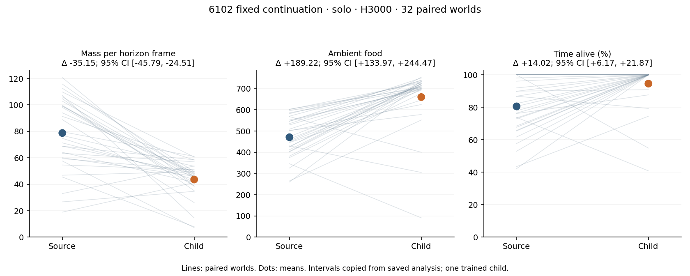
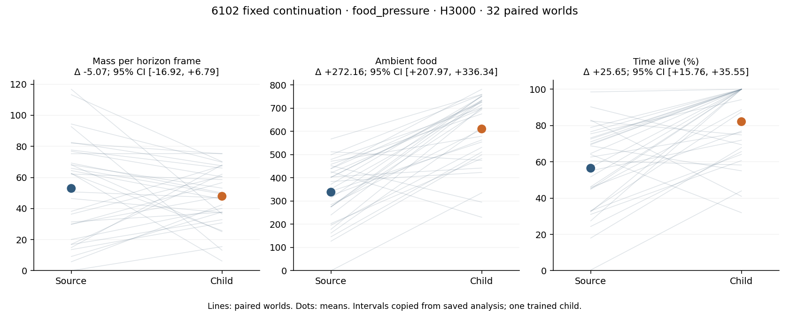
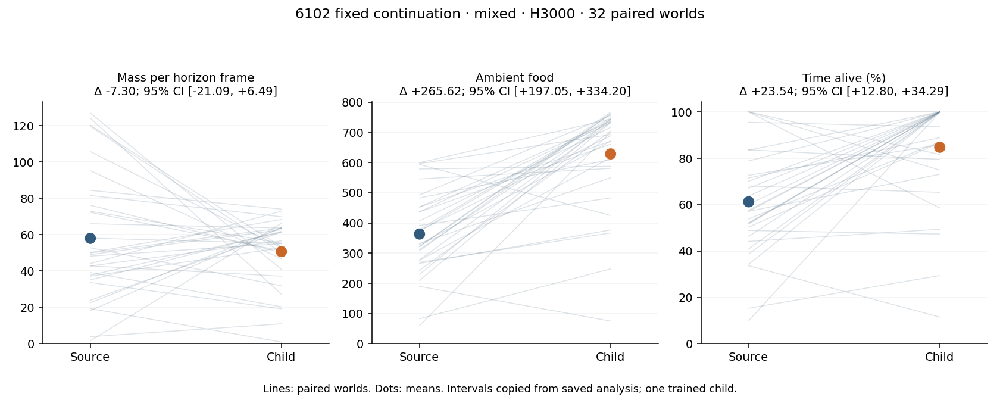
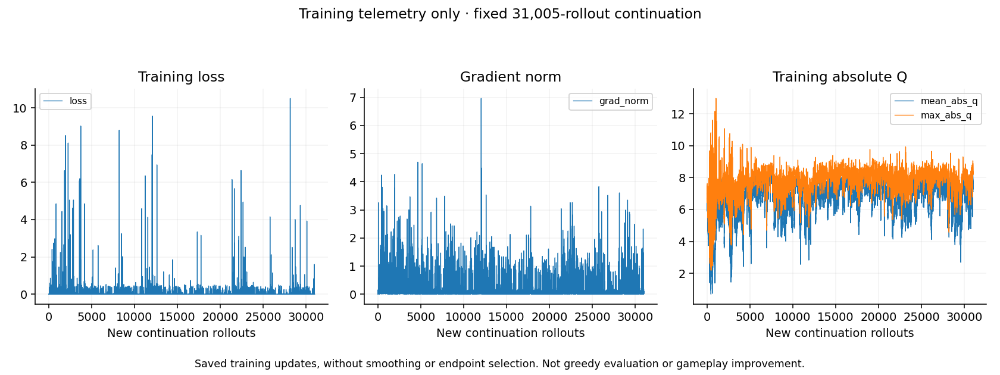

# Fresh-game continuation of lineage 6102

**Completed 2026-09-24. Decision: `NEGATIVE_CONTINUATION_SCREEN`. Independent audit:
`PASS`. No promotion.** The fixed continuation collected more food and survived longer
in all three evaluation profiles, but lost substantial solo living mass. The original
lineage `2026096102` checkpoint remains preserved; this result does not change the earlier
study's `INCONCLUSIVE_SCREEN` or the incumbent champion.

This page transcribes completed saved results. Tables and figures below are copied
unchanged from the original analysis output, with byte identities in
[artifact-manifest.json](artifact-manifest.json). No training, evaluation, statistical
analysis, plotting or audit was rerun to produce this documentation.

## Fixed intervention and completed dose

One source was fixed prospectively: lineage `2026096102` at global update **35,613**.
The child received exactly **31,005 additional rollouts and optimizer updates**, ending
at update **66,618**, with **7,933,551 valid hero transitions** and the same number of
sampled training rows. Scheduled capacity was 7,937,280 rows. Only the final endpoint
was evaluated; there was no intermediate checkpoint selection.

The source's full model, Adam state and global clocks were restored. Runtime worlds and
sampling RNG used new namespaces. This was fresh-game continuation, without pooling old
experience or claiming restoration of the original runtime/RNG trajectory. Architecture,
restricted native observations, Q scaling, PQN targets, half-MSE loss, reward and the
one-coverage-epoch update rule were retained. Training used MPS, E16 × T16, H1024 and
epsilon 0.1. The repeating rollout schedule was `[solo, s2, s2, s6, s6]`:

| Task | Rollouts | Valid training rows | Opponents |
| --- | ---: | ---: | --- |
| solo | 6,201 | 1,587,062 | None |
| s2 | 12,402 | 3,173,762 | One GreedyFood |
| s6 | 12,402 | 3,172,727 | Three GreedyFood, two RandomSafe |

These are scheduled rollout proportions, not equal episode or valid-row proportions.
The [training report](training-report.json) preserves the full physical counters,
configuration and task contract. The original
[study protocol](../../../research/task_aligned_continuation_20260924/protocol.md) and
[evaluation protocol](../../../research/task_aligned_continuation_20260924/protocol-evaluation.md)
describe the prospectively frozen rules; their source-draft status text is historical,
not this completed run's status.

## All three evaluation profiles

Source, child, GreedyFood hero and RandomSafe hero each played 32 fixed procedural worlds
per profile: **12 cells, 384 episodes**, with H3000 and CPU float32 E32 serving. Source
and child shared initial descriptors within each world/profile. Hero death terminated
the recorded trajectory; all subsequent frames contributed zero to the full 3,000-frame
mass and alive-time denominators. Opponents could respawn.

| Profile | Opponent roster |
| --- | --- |
| solo | None |
| food_pressure | Four GreedyFood, one RandomSafe |
| mixed | Two GreedyFood, three RandomSafe |

The headline metric is mean living mass over the **entire horizon**, not mean mass only
while alive. Food counts ambient-food events, not shaped reward. Intervals below are
saved paired child-minus-source Student-t 95% intervals over 32 worlds, df31. They
describe one fixed trained lineage, not a population of independently trained models.

| Profile | Source mass | Child mass | Mean delta | 95% CI of delta |
| --- | ---: | ---: | ---: | --- |
| solo | 78.75025 | 43.5984375 | −35.1518125 | [−45.7942, −24.5094] |
| food_pressure | 52.9521458333 | 47.8853125 | −5.0668333333 | [−16.9237, 6.7900] |
| mixed | 58.0358229167 | 50.7371666667 | −7.29865625 | [−21.0897, 6.4924] |

| Profile | Ambient food, source → child | Alive fraction, source → child | Boost fraction, source → child | Reached H3000, source → child |
| --- | --- | --- | --- | --- |
| solo | 470.90625 → 660.125 | 0.806125 → 0.946323 | 0.362125 → 0.645729 | 0.25 → 0.8125 |
| food_pressure | 338.09375 → 610.25 | 0.564844 → 0.821385 | 0.269594 → 0.554938 | 0 → 0.46875 |
| mixed | 363.4375 → 629.0625 | 0.612406 → 0.847823 | 0.287271 → 0.575542 | 0.125 → 0.53125 |

Food, alive fraction and boost fraction all have positive saved paired lower confidence
bounds in all three profiles. Opponent-profile mass means declined, but both mass
intervals crossed zero: neither a gain nor the specified clear-harm condition was
established there. Solo mass provides the decisive negative result.

## Every frozen decision gate

The decision order was harm, exposure, advancement, then inconclusive. Clear harm takes
precedence over insufficient exposure. The completed result was determined by the first
branch; the remaining gates are shown to preserve the complete screen.

| Frozen check | Saved evidence | Outcome |
| --- | --- | --- |
| Any profile: mass CI upper bound below minus 5% of source mean mass | Solo upper −24.5094 versus threshold −3.9375125. Food-pressure upper 6.7900 versus −2.6476072917; mixed upper 6.4924 versus −2.9017911458 | **Solo clear harm; negative branch triggered** |
| Solo food: CI upper below minus 5% of source mean food | Upper 244.4724 versus −23.5453125 | No clear food harm |
| Solo alive fraction: CI upper below −0.02 | Upper 0.218679 | No clear survival harm |
| Exposure: source and GreedyFood hero each encounter an opponent after frame 16 in at least 8 worlds, in both opponent profiles | Food-pressure source/anchor 31/31; mixed 32/30, each out of 32 | Pass |
| Food-pressure gain: mean mass delta at least max(10% of source mean, 1), with CI lower strictly positive | Required mean 5.2952145833; observed −5.0668333333, lower −16.9237 | Fail |
| Mixed gain: same rule | Required mean 5.8035822917; observed −7.29865625, lower −21.0897 | Fail |
| Solo mass retention: CI lower within minus 5% of source mean | Lower −45.7942 versus −3.9375125 | Fail, with clear harm also established |
| Solo food retention: CI lower within minus 5% of source mean | Lower 133.9651 versus −23.5453125 | Pass |
| Solo alive-time retention: CI lower within −0.02 | Lower 0.0617172 | Pass |
| Fallback `INCONCLUSIVE_SCREEN` | Used only if none of the preceding ordered branches determines the result | Not reached |

Encounter means an enemy body within pre-action L1 distance 16, counted from frame 17.
Exposure was adequate under the frozen criterion; no cases were filtered by the child's
exposure. The [saved decision](decision.json) retains exact precision, all metric
intervals, gate flags, anchor summaries and the paired world deltas.

## Saved tables and figures

All policies and all worlds remain available, including the two scripted hero anchors:

- [All 12 cells](presentation/all-cells.md) · [CSV](presentation/all-cells.csv)
- [All 384 cases](presentation/all-cases.md) · [CSV](presentation/all-cases.csv)
- [All 96 paired world comparisons](presentation/paired-world-differences.md) ·
  [CSV](presentation/paired-world-differences.csv)

Training telemetry is optimization evidence, not a substitute for the held-world result.
Higher boost use co-occurred with higher food and survival and lower mean mass. This
study did not intervene on boost independently, so it does **not** establish an isolated
causal explanation for the mass loss. It evaluates the complete continuation package.

## Completion and artifact identity

The controller completed at approximately **18:15 UTC on 2026-09-24**. Root administrative
closure reports all seven child stages exited naturally with code 0, **12,692.3468 guarded
seconds**, peak monitored RSS **4,793,761,792 bytes**, and minimum available RAM
**28,793,667,584 bytes**. Controller PIDs 6943/6960 were gone and both shared compute locks
were checked free. Closure reconciled the independent audit receipt once; it did not
rerun the science. The training stage itself recorded 11,808.1513 seconds.

The saved decision accounts for 562,578 actual evaluation hero transitions/native lane
frames, 17,956 batched model forwards, two checkpoint loads and zero optimizer updates.
The independent audit passed receipt integrity, bounds and saved-frame arithmetic;
its decision comparison reused the frozen reducer rather than an independent statistical
implementation. Audit `PASS` establishes execution/evidence integrity, not improvement.

| Identity | SHA-256 |
| --- | --- |
| Preserved source checkpoint, global 35,613 | `8d67915ef1ea5dbb0804ffd8bf9874dedb27c95878bacdd5b5e5ae77682aa46f` |
| Final child checkpoint, global 66,618 | `dc1fe4c31174e4ca5da63239d596a0017cd8247c5b3a72c8a2044de3e92d5ef8` |
| Saved decision | `247d4add564ec1e52f569c227dbb99baed6a50a4bd485dea095004b04a4683c3` |
| Independent audit report | `4305f328ccfbb166e9e06340f760171b7cd52644f63be8b2a6a083dd510db056` |
| Administrative closeout | `59655dd53c2f14b08c396151442a6d3781ce5c4711ef21186c878bfa069e7a7e` |

Original run: `snake-dqn-artifacts/ongoing-research-20260913/`
`task-aligned-continuation-20260924/admission-v2/run/`; closeout is one directory above
`run`. Checkpoint identities are transcribed from saved receipts, not rehashed here.

New held-world IDs were checked against the specifically declared prior and continuation
seed inventories. This is no claim of exhaustive historical or geometric novelty.
There was no incumbent comparison, no champion promotion and no population-level proof
that longer training helps or harms every lineage. For this fixed child and frozen
screen, more fresh training failed the primary retention requirement despite improved
food and survival. The result does not authorize another continuation, a parameter sweep
or a replacement of the preserved source.
