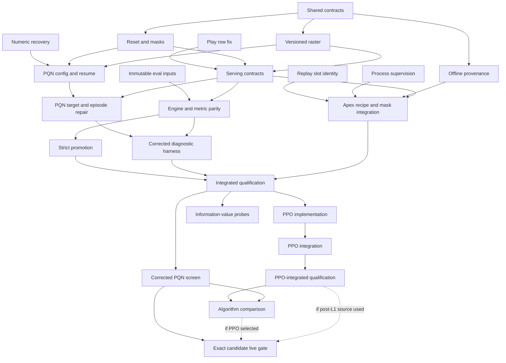

# RL repair and experiment implementation plan

**Status: planned, not started.** This plan turns the completed audits into
24 bounded agent packages. The first six can start concurrently. Shared-file
changes then move through explicit handoffs; a dependency is satisfied only
when its code and acceptance evidence are integrated.

The goal is a reproducible, correctly observed and evaluated learning problem,
followed by a bounded comparison of corrected PQN and PPO. Existing champion
weights, legacy inference, historical experiment artifacts and gameplay rules
remain available. This planning turn does not implement or launch these jobs.

## Start here

- [Dispatch manifest](dispatch.json): authoritative IDs, dependencies, roles,
  exact file ownership, tests, acceptance criteria and conditional prerequisites.
- [Agent runbook](agent_runbook.md): worktree preparation, launch prompt,
  resource scheduling, verification and handoff procedure.
- [Plan validator](validate_plan.py): dependency, ownership, path and card checks;
  prints the initial ready group. It does not launch agents.
- [Expanded audit](../../state_and_system_review_2026-09-06.md) and
  [training result](../../pqn_sampler_results_2026-09-06.md): why these repairs
  precede another substantial experiment.

The plan is based on assessment commit `6986fd3`, whose product source is
`c1cf7e8`; clean main is `950d583`. Execute from the commit containing this plan
(a descendant of `6986fd3`), not by applying isolated cards directly to main.
The earlier sampler/cap/statistical corrections are already in this lineage.
The root should create `codex/rl-contract-repair` and isolated package worktrees
only when beginning execution. No implementation worktrees are created here.

## Decisions agents should implement

These choices close the interfaces needed for parallel work. They are intended
implementation decisions, not claims that the current source already supports
the proposed types, profiles or CLI flags.

| Decision | Initial implementation |
| --- | --- |
| Observation version | Add a corrected `raster31v3` descriptor/digest. Preserve explicit `vector61` and `raster31v2` inference paths and golden output fixtures. Missing metadata can be legacy; it cannot count as verified v3. |
| Model/feature scope | Keep the current raster network topology, tensor shapes and all 26 scalar slots. No new channels, larger crop, GRU, attention, convolution normalization or optimizer-family change in the first repair. |
| Raster precedence | V3 walls dominate outside-arena cells; discard out-of-world predictions. Otherwise own head > enemy head > enemy body > own body > prediction > corpse food > ambient food > empty. Equal-type overlaps use maximum value byte. V2 retains its historical preparation path. |
| Augmentation | First corrected recipe disables flip. Preserve raw world coordinates. Correct physical reflection or coordinate removal is a later independently versioned experiment. |
| Masks | Alive normal controls are domain-legal; boost controls require the configured minimum length. Advice is a separate collision estimate. Resolve to `legal & advisory` when nonempty, otherwise legal. Dead rows have no actions. Apply the same resolved-set convention in the new recipe's acting and bootstrap. |
| Termination | Actual death uses reward only. Advisory-empty is not death. Truncation bootstraps without carrying lambda returns through invalid/reset successors. A legal-only bootstrap is a separate later ablation. |
| Reset | Fix constructor-versus-reset RNG consumption. Keep batch-wide reset initially; freeze finished environments' state, frame and RNG. An inactive row emits no new transition. Asynchronous reset is deferred. |
| Reward | The initial PQN recipe supports actual reward-v2 arithmetic only and records its coefficients. Reject a request for v1 rather than writing a false label. Do not change reward economics in this repair. |
| Sampler | Retain the legacy sampler initially; full-epoch remains opt-in. The earlier five-seed result did not establish its superiority. Preserve the old diagnostic source/protocol rather than rewriting it for v3. |
| Deployment target | New named `promotion-v2-watch-rect` profile: rectangular mechanics v2, resolved mechanics_v2 world, frame_rate=1, train_mode=false, learn=false, allow_respawn=true. The evaluated hero is terminal; opponents respawn. |
| Training episode mode | Explicitly record train_mode=true, allow_respawn=false, population-floor ending and batch-frozen reset. Intentional training/serving episode differences are provenance, not a reason to reject every trained checkpoint. |
| Metric and time | Post-step logical mass, zero if dead, divided by the fixed total evaluation horizon. Initial final profile uses 5000 scored frames and 5000 observation-progress normalization. Store these as separate fields even when equal. |
| Resume | Implement weights-only warm start and explicitly labeled optimizer/odometer continuation with fresh episode/pool state. Reject exact-resume requests. Full state serialization and continuation-equivalence proof are deferred; distributed Apex also lacks replay/IPC state. |
| Defaults and release | New experiment commands explicitly select v3. No card silently changes the served champion or global algorithm default. Passing a gate produces a receipt; a later explicit release action uses that exact receipt. |

The mask convention removes the false-death branch with a small, shared change;
it does not certify the advisory set as a perfect safety oracle. Legacy replay
masks retain their original semantic tag. Never infer a different mask meaning
from width alone.

Semantic incompatibility (observation meaning, action meaning, supported arena,
normalization contract) blocks verified loading. Deliberate transfer between
training and deployed geometry/food/mode is recorded in a target manifest and
must earn deployed evaluation. In particular, the legacy A5 incumbent can be
evaluated in the declared v2 deployment target even if its training provenance
is older. Do not fabricate its historical training conditions.

## Shared API freeze: C0 owns this boundary

Use one additive module, `src/core/runtime_contract.py`, alongside the existing
`obs_spec.py` and checkpoint validator. Avoid a hierarchy that forces PQN into
ApexPolicy. C0 supplies:

- `ObservationContract`: ordered channel/scalar descriptors, dimensions, scales,
  crop/origin/rotation, paint rule, action interpretation, supported arena modes
  and semantic digest. A separate recipe field records augmentation/sampler.
- `EffectiveWorldConfig`: complete resolved dynamics values and normalization;
  validate cell alignment and supported fields instead of quietly rounding.
- `RuntimeModeContract`: train/respawn/hero-terminal/population-floor/reset modes.
- `ModelHeadContract`: closed descriptors for Apex/PQN action-Q heads and the
  optional PPO categorical actor plus scalar critic. Unknown algorithm/head
  combinations fail. A recognized descriptor does not enable a loader: S1
  enables Q heads and L1 enables PPO using the same validation API.
- `AppConfig.pqn`: frozen `PQNOverrides` exposing the validated YAML block,
  including `None` for omitted overrides. P1 consumes this single resolved
  configuration without reopening YAML or editing C0's config files.
- `AppConfig.provided_fields`: frozen dotted paths explicitly supplied in YAML,
  captured before schema defaults. This also covers shared `game.*` and
  `rewards.*` fields. PQN must distinguish omitted legacy AppConfig v1 defaults
  from explicit v1 requests, preserving its current no/partial-config defaults
  unless a named v3 recipe is selected. Log effective values and their sources.
- `ActionMaskSet(legal, advisory)`: shape-validated booleans, with `resolved()`
  implementing the convention **per row**: `intersection = legal & advisory`;
  use that intersection when it has any true action, otherwise use legal. Dead
  rows remain all false. Test mixed batches with illegal-advised and
  advisory-empty rows; a batch-wide `.any()` is incorrect. Engine adapters
  construct the masks.
- A canonical finite-JSON digest and versioned run/replay/checkpoint provenance.
- `src/core/seeding.py`: one effective run seed, stable named child streams,
  Python/NumPy/Torch initialization and explicitly supported state capture.

Checkpoint metadata must distinguish observation schema, model-head/algorithm,
world, runtime mode, reward, target/mask, sampler and optimizer recipe. These are
related but not interchangeable identities. Do not hide reset or reward changes
inside an observation shape number.

P1 and P2 implement continuation only, with restored and reset state explicitly
listed. Full simulator/pool/replay/IPC restoration is outside this repair. An
exact-resume request fails clearly; it is not an optional feature left for an
agent to infer from another package's unfinished work.

P2 pins opponents by immutable snapshot ID and content hash until assigned
episodes end. Pool admission cannot change a live opponent through FIFO index
reuse; when every bounded pool slot is pinned, admission is deferred.

## Waves and packages

Wave numbers are earliest launch groups, not promises about wall-clock duration.
The manifest DAG controls readiness. Root integration is serial even when
builders work in parallel.

| Wave | Packages that can work in parallel | Exit condition |
| --- | --- | --- |
| 0 | [C0 contracts](packages/c0.md), [N0 numeric recovery](packages/n0.md), [A0 replay IDs](packages/a0.md), [A1 process supervision](packages/a1.md), [S0 Play rows](packages/s0.md), [E0 input snapshots](packages/e0.md) | Six independent fixes/APIs reviewed; no file overlap. Merge C0 first, then the remaining verified commits. |
| 1 | [ENV reset/masks](packages/env.md), [OBS raster](packages/obs.md), [OFF offline provenance](packages/off.md) | Frozen v2 fixtures, corrected v3 producer, repeat-reset/inactive-world contract and replay validation pass. |
| 2 | [P1 PQN configuration/resume](packages/p1.md), [S1 inference/serving](packages/s1.md) | Effective config and real serving use the agreed contracts; N0/S0 regressions retained. |
| 3 | [P2 PQN targets/self-play](packages/p2.md), [A2 Apex recipes/masks](packages/a2.md), [E1 engine/event metrics](packages/e1.md) | Each learning/runtime path implements its stated episode/mask/metric contract. |
| 4 | [E2 strict gate](packages/e2.md), [H0 diagnostic harness](packages/h0.md) | Diagnostic tools and strict promotion authority are distinct and tested. |
| 5 | [G0 qualification](packages/g0.md), one verifier/executor | Combined source gate, required slow parity and bounded 100k MPS operability run pass. No skill claim yet. |
| 6 | [X0 corrected learning screen](packages/x0.md); optional [L0 PPO builder](packages/l0.md), [H1 information probes](packages/h1.md) | X0 and corpus/probe computation are serialized on the Mac. L0 may edit in an isolated worktree while X0's source is frozen. |
| 7 | [L1 PPO runtime/control integration](packages/l1.md), if pursuing PPO | Both policy head types load, evaluate and display honestly; changed runtime gates repeat. |
| 8 | [G1 PPO-integrated qualification](packages/g1.md), one verifier/executor | Requalify the changed evaluator, serving paths and both policy heads on the post-L1 SHA; run bounded operability shakedowns. |
| 9 | [X2 matched algorithm screen](packages/x2.md), one executor | Consume G1 receipts; report fixed-budget, five-seed pairs with uncertainty and no automatic winner or extension. |
| 10 | [REL exact-candidate qualification](packages/rel.md), only for a selected candidate | Fresh powered live comparison plus serving receipt; every post-L1 source requires G1, and a PPO candidate also requires X2. Incumbent remains until a separate release action. |

Waves 0–4 implement the repair. G0 qualifies it. Waves 6–10 are
conditional experiment/algorithm work, not prerequisites for landing the early
correctness fixes. PPO quality cannot be a dependency of repairing the current
system. Likewise, a statistically inconclusive PQN screen does not prohibit a
well-controlled PPO diagnostic.



This is a readability view; use `dispatch.json` for the full dependency list.

## Shared-file handoffs that must be serialized

| Files | Owner sequence |
| --- | --- |
| `pqn_trainer.py`, `train_pqn.py`, their main tests | N0 → P1 → P2 |
| `obs_spec.py` | C0 → S1 |
| `raster_policy.py`, serving tests | S0 → S1 → L1 |
| `apex_buffer.py`, `apex_learner.py`, associated tests | A0 → A2 |
| `apex_train.py`, `apex_actor.py`, associated tests | A1 → A2 |
| `tournament_eval.py`, associated tests | E0 → E1 → E2 → L1 |
| `eval_engine.py`, associated tests | E1 → L1 |
| Featurizers/live adapter | OBS only in the repair waves |
| `batch_sim.py` / parity implementation | ENV only in the repair waves |
| Core config/schema/contract helpers | C0 only; consumers request a new scheduled handoff if the agreed API is insufficient |

The validator checks all unordered package pairs, not just pairs sharing a wave.
Thus moving a ready package earlier cannot accidentally create a competing
writer. If a new file is needed outside a card, amend the manifest and rerun its
checks before dispatching that edit. A merge conflict is not the only way a
semantic dependency can fail.

## Verification and resource gates

Use the shared project venv. Begin with at most six disjoint writers and two
small CPU test commands, one native thread each. Allow read-only specialists
without delegating independent local training jobs. Run the full suite alone,
with at most two pytest workers. Do not use `-n auto` or launch a full suite,
build, corpus job, evaluation or second learner during MPS training.

The root issues named test/compute tokens before any command starts. Six writers
do not each receive permission to run tests concurrently: they queue for the
two small-CPU tokens and return them with command receipts. All heavier modes
are exclusive. Editing and read-only review can continue during a learner run.

Before dispatch, the root resolves `EVIDENCE_ROOT` to a durable absolute directory
outside disposable worktrees, following the template in `dispatch.json`. Every
package writes to its allocated subdirectory. Accepted dependency receipts and
artifact hashes are verified there before a worktree is removed.

The initial training limits are one MPS process with two native CPU threads,
4 GiB process RSS, 8 GiB MPS-driver allocation and a 6 GiB system-available-memory
reserve. RSS and MPS allocations overlap in unified memory; do not add them as
physical consumption. These are conservative starting caps, not measured
requirements of corrected PQN or PPO. A cap breach stops and records an incident;
revised caps require a new explicit protocol, not silent relaxation.

The old ten-arm campaign took about 36.2 training minutes plus 5.18 evaluation
minutes and peaked near 1.59 GiB RSS/1.08 GiB MPS-driver allocation. That is a
reference, not a timing forecast. G0 measures a new 100k shakedown before X0 caps
are fixed. Training is followed by evaluation after the learner exits. The
[runbook](agent_runbook.md) defines the root-owned compute queue and handoff.

Regression fixtures are essential for the reproduced semantic failures. Avoid
tests that merely restate an implementation: use independent priority/return
oracles, clone/RNG identity, actual GameState dispatch, bounded child-failure
processes, and immutable checkpoint replacement cases. Keep prior failures and
fixes together in the evidence; never edit archived receipts to look green.

## Scientific protocol and release decisions

X0: five fresh training seeds ×500k hero transitions, final versus same-seed
initial checkpoints on 12 fixed development worlds per chosen mix. Retain the
legacy sampler and current model/optimizer so corrections have a clear recipe.
This is a screen; no reliable improvement is not evidence of equivalence or
proof that the architecture cannot learn.

G1 produces one 100k operability shakedown per algorithm on the integrated SHA.
X2 consumes those receipts, then runs five fresh paired training seeds ×500k
hero transitions ×two algorithms. Use fixed common opponents and
hero-assignment/reset rules, a new development world set, and the same frozen
observation/reward/action APIs. Hero transitions, world frames, gradient updates,
wall time and memory are separate denominators. Average repeated worlds/mixes
within each trained-seed pair for the primary five-unit comparison.

L0/X2 require identical preprocessing and convolution/fusion trunk topology,
normalization and paired initial weights. Predeclare the unavoidable output-head
differences. An unplanned trunk change blocks this algorithm comparison and
belongs in a separately named architecture experiment.

An algorithm practical-effect band must be an explicit absolute number of mass
integral units derived from separate calibration and recorded before test data.
A reasonable starting target is 3% of a pinned reference policy's positive mean
under the new profile; record the reference hash/seeds/mean and resulting number.
Do not use a moving candidate-dependent denominator. Intervals wholly within a
predeclared band support practical equivalence; overlapping either boundary are
inconclusive. No in-session score-based seed replacement, extension or tuning.

REL uses one selected checkpoint; its world-seed confidence interval is about
that checkpoint in the target population, not the algorithm across training
seeds. A PQN candidate can use the pre-L1 G0-qualified source without the
optional PPO packages. Every post-L1 evaluator/serving source needs G1's matching
receipt even for a PQN candidate, because L1 changes shared runtime code. Later
material changes invalidate affected receipts. The proposed **new, versioned
strict rule** is:

1. At least 40 untouched paired final worlds and any larger number recommended
   by a paired pilot for 80% power at the predeclared minimum effect. Freeze pilot,
   training, development, shakedown and final seed namespaces separately.
2. Predeclare three opponent mixes and balanced roster rotations. Test positive
   per-mix paired effects using one-sided t tests with Holm correction over the
   three superiority hypotheses at family alpha .05; at least two must succeed.
   Report ordinary per-mix 95% intervals as estimates, not as an additional rule.
3. Require a scripted-mix one-sided 95% paired lower bound above `-delta_NI`.
   Freeze `delta_NI` in absolute mass units from independent reference/pilot data;
   initial proposal is 3% of pinned incumbent scripted mean. Zero/undefined
   reference means require an explicit absolute margin, not division by zero.
4. Require all readiness/provenance/metric gates and behavioral bands that were
   calibrated before final evaluation. Unimplemented required probes block
   readiness; do not substitute numeric zeros or arbitrary blueprint bands.
5. Run 50 separate serving-path episodes for compatibility. Use the same
   immutable candidate, deployed profile, and action semantics. They do not
   increase the number of independent trained models.

The margin, pilot-sized sample count, actual checkpoint hashes and concrete seed
sets are execution-protocol inputs produced after corrected calibration. Their
absence does not block writing/test-driving E2 against synthetic fixtures, but
it blocks a real strict-promotion run. A statistical failure retains the
incumbent; a passing receipt still does not trigger a copy or remote deployment.

## Deliberately separate follow-up work

- Rewriting contested-food ownership, three-way collisions or boost substep
  physics changes documented game rules. Propose a mechanics revision with
  permutation/substep tests and new training/evaluation before attempting it.
- Asynchronous environment resets require new return-boundary and history tests
  plus matched utilization/learning evidence. The first repair freezes inactive
  worlds and measures the remaining waste.
- Legal-only targets, corrected flip, world-coordinate removal, wider strategic
  view, enemy headings/timers, body vacancy features and altered optimizer/LN
  recipes are separate ablations. H1 first measures prevalence/action relevance.
- Recurrence/entity attention requires an evidence-backed bounded proposal,
  compatible inference/reset state and its own paired training protocol.
- Full circular raster/CUDA support is not required for this Mac repair. Fail
  unsupported modes; validate actual CUDA before claiming CUDA parity.
- Nothing here launches a database migration on user data, overwrites a champion,
  pushes main or publishes a service. Those are distinct execution operations.

## Validate and dispatch

```bash
/Users/josenunez/Projects/ml/snake-dqn/venv/bin/python \
  docs/plans/rl_repair_2026-09-06/validate_plan.py --self-test
```

On execution, read the ready cards, create their isolated worktrees at the same
accepted wave SHA, assign the listed role/ownership, and reserve compute slots.
The reusable prompt is in the runbook. Root integrates accepted commits in the
listed dependency order, records the new SHA and test receipts, then starts the
next ready group. All 24 packages remain **PLANNED** in this delivery.
