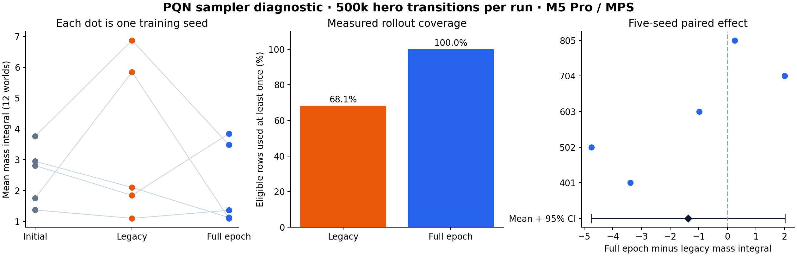

# PQN sampler results — 2026-09-06

**The complete-epoch recipe did not establish a performance improvement over the legacy recipe in this small screen.** The paired effect was -1.369 mass-integral units,
with a 95% interval of [-4.748, 2.009].
All ten training arms and all 17 evaluation conditions completed. This is a
sampler-recipe diagnostic, not a PQN-versus-PPO comparison or a promotion gate.
The production sampler, reward, and incumbent champion are unchanged.

The broader correctness audit and research recommendations are in
[the RL review](rl_review_2026-09-06.md).



## Measured performance

Mass integral is mean hero mass over the entire 1,000-frame evaluation horizon;
dead frames contribute zero. Each learned-policy row below averages the five
training-seed means, each measured on the same twelve worlds against five SIMD
greedy-food opponents. The scripted rows are references on those twelve worlds.

| Policy stage | Mean mass integral |
| --- | ---: |
| Initial networks | 2.531 |
| Trained legacy sampler | 3.553 |
| Trained complete-epoch sampler | 2.184 |
| Scripted random-safe reference | 3.048 |
| Scripted greedy-food reference | 28.076 |

| Training seed | Initial | Legacy | Complete epoch | Epoch minus legacy |
| ---: | ---: | ---: | ---: | ---: |
| 401 | 3.767 | 6.872 | 3.486 | -3.387 |
| 502 | 1.756 | 5.844 | 1.101 | -4.743 |
| 603 | 2.949 | 2.103 | 1.125 | -0.978 |
| 704 | 2.810 | 1.846 | 3.846 | +2.000 |
| 805 | 1.371 | 1.100 | 1.360 | +0.260 |

The primary interval uses **five independently trained seed pairs** (Student-t,
four degrees of freedom). The 60 learned-model/world cells per arm are not 60
independent training replicates. Generalization is over training randomness,
conditional on this fixed suite of twelve SIMD worlds and this opponent roster.
Five seeds give a small exploratory screen; no power or non-inferiority claim is made.
The [independent statistical review](experiments/pqn_sampler_2026-09-06/statistical_review.md)
recomputed the result from all 204 raw world outcomes.

Secondary comparisons with initialization are descriptive:

- Legacy minus initial: +1.022, 95% CI [-1.945, 3.990].
- Complete epoch minus initial: -0.347, 95% CI [-1.635, 0.941].

These secondary intervals do not define diagnostic success and are not adjusted
for multiple comparisons. The scripted scores are context, not promotion thresholds.

## What the sampler actually changed

| Accounting across five runs | Legacy | Complete epoch |
| --- | ---: | ---: |
| Eligible hero transitions | 2,500,981 | 2,503,528 |
| Real SGD draws | 2,903,004 | 2,503,528 |
| Unique rows used / eligible | 68.1% | 100.0% |
| Optimizer steps | 12,024 | 11,237 |
| Mean valid-slot fraction | 55.1% | 52.0% |
| Training seconds | 1,017.5 | 1,155.6 |

The legacy recipe takes four independently shuffled subsets of up to 256 rows
per update, with overlap between subsets. The complete-epoch recipe shuffles
all eligible rows once and partitions them into balanced batches of at most
256. Independent artifact validation checked every epoch optimizer-step count
against `ceil(eligible / 256)`, every legacy draw/step count, and every saved
checkpoint tensor hash. Complete-epoch coverage was exactly 100% at every update.
The valid-slot fraction is the arithmetic mean across updates within each run,
then across runs; it is not a time-weighted utilization measure.

This estimates the effect of the **whole sampler recipe at equal collected
hero-transition targets**. Optimizer draws, steps, and wall time differ. It does
not establish that coverage alone caused the performance difference or provide
an equal-wall-time comparison.

## Frozen recipe and resource use

Each of the five seeds (401, 502, 603, 704, 805) received both recipes, alternating
which recipe ran first across pairs. Every arm collected at least 500,000 real
hero transitions. Recipe: MPS, two numerical CPU threads, sixteen worlds, six
snakes, sixteen-frame rollouts, the existing raster network, unchanged reward
and mechanics v2, gamma .997, horizontal augmentation, and epsilon decay to .02
over 300,000 transitions. Episodes were capped at 5,000 frames.

All slots were heroes and the frozen opponent pool was disabled. The snakes
still co-learn against one another; this is not a stationary-opponent experiment.
Both arms used the independent SGD/augmentation seed `training_seed + 10000000`.
Paired initial tensor hashes matched for all five seeds. All scientific source,
configuration, evaluator, and analysis inputs were frozen before revision 3;
all 87 recorded hashes still matched after evaluation.

Both samplers padded network inputs to 256 rows and sliced predictions back to
real rows before loss and metrics. Padding never adds a training target or
sample. CPU gradient/update parity tests cover this for the present per-row
LayerNorm network; a future batch-dependent architecture needs new validation.

The campaign collected **5,004,509 hero transitions** in
36.22 minutes of training and
5.18 minutes of evaluation. Peak process RSS
was 1.59 GiB and peak MPS driver allocation
was 1.08 GiB; these are separate counters
on unified memory and should not be added as distinct physical allocations.
One trainer ran at a time, at reduced process priority, with a 4-GiB RSS cap,
8-GiB MPS-driver cap, six-GiB system-memory reserve, and eight-minute per-arm
wall budget. A one-thread CPU verification suite briefly overlapped training.
These observed timings are not an isolated hardware benchmark.

## Retained operational failures and protocol amendments

The protocol was adapted using training-health and resource telemetry. **No
held-out checkpoint evaluation scores were inspected before any revision.**
This is an adaptive exploratory diagnostic, not a preregistered confirmatory test.
All ten final arms restarted from initialization; no favorable completed arm
from an earlier attempt was selectively reused.

- Revision 1: legacy seed401 completed 500,346 transitions in 176.577 seconds
  at .766 GB RSS. Its unpadded epoch pair was stopped at 407,662 transitions
  after exceeding the predeclared 4-GiB RSS cap (4.318 GB observed). That arm
  used 67 distinct minibatch sizes and has no final checkpoint. Shape-dependent
  MPS graph caching is a plausible explanation, supported by a related
  [PyTorch issue](https://github.com/pytorch/pytorch/issues/181213), not a proven
  internal allocator diagnosis.
- Revision 2: both recipes used fixed forward padding and separate SGD RNGs.
  Epoch seed401 completed 500,471 transitions in 180.478 seconds at 1.455 GB
  peak RSS. Legacy seed401 stopped at 332,548 transitions after one update's
  sampled/augmented action entropy was zero. Only 64 real rows fed that update,
  while 96% of slots were inactive; prior Q values and losses were finite.
  This was too little, too correlated evidence to diagnose global collapse.
- Revision 3: both recipes used the same raw-rollout guard, requiring the same
  dominant action across at least three consecutive near-zero-entropy updates
  and at least 2,048 eligible rows. Noncollapsed, empty, or changed-action
  windows reset the evidence. Numerical, Q, time, and memory guards remained.
  This is an emergency heuristic, not a statistical global-collapse test.
  The diagnostic now retains the triggering update when a tripwire fires.

Revision-3 epoch401 reproduced revision-2 epoch401's initial and final tensor
hashes and exact transition count. This is one full 500k MPS replay, not another
independent seed or proof of general backend determinism. The memory-safe
revision also changed RNG plumbing, so it does not isolate padding as the sole
cause of the memory improvement. Earlier attempts and short device/replay probes
are excluded from the primary paired performance analysis.

## Verification and delivery boundary

The final non-slow CPU suite passed **1,943 tests**, with six skipped, three
deselected, and one warning in 60.69 seconds. Black, isort, flake8, and diff
whitespace checks passed. Independent tests cover raw-action guard resets,
numeric-priority stops, checkpoint metadata, and legacy-checkpoint compatibility.
All ten final arms completed without a tripwire or non-finite recorded metrics.
The [artifact audit](experiments/pqn_sampler_2026-09-06/verification.json)
validated all ten checkpoints, 204 raw world outcomes,
exact per-update optimizer accounting, and identical invariant paired configs.

The grouped SIMD evaluator was previously checked against its old implementation
with real checkpoints: hero-plus-greedy and all-checkpoint rosters matched over
four worlds and 100 frames, with zero action mismatches in an additional
20-frame all-slot trace. This proves dispatch equivalence for those fixtures,
not complete live-versus-SIMD policy parity.

The reproduced safety-mask target and flip-coordinate defects remain unchanged
in both experimental arms. This campaign cannot settle PQN under corrected
target semantics. Its one scripted opponent mix and 1,000-frame horizon also
cannot satisfy the multi-mix promotion gate. No checkpoint was promoted.

## Evidence and reproduction

Portable review evidence is under
[`docs/experiments/pqn_sampler_2026-09-06`](experiments/pqn_sampler_2026-09-06/):
[protocol](experiments/pqn_sampler_2026-09-06/protocol.json),
[analysis](experiments/pqn_sampler_2026-09-06/analysis.json),
[raw evaluation](experiments/pqn_sampler_2026-09-06/evaluation.json),
[training summaries](experiments/pqn_sampler_2026-09-06/training_runs.json),
[source manifest](experiments/pqn_sampler_2026-09-06/campaign_source_manifest.json),
and [test log](experiments/pqn_sampler_2026-09-06/pytest-nonslow-final.log).
Full local histories, checkpoints, coordinator/evaluation/analysis scripts,
and the source snapshot ZIP remain under
[`runs/pqn_coverage_final_20260906`](../runs/pqn_coverage_final_20260906/).
Revisions 1 and 2 remain in their original separate run directories.

Use the shared project venv from the assessment worktree. A fresh arm can be
created with the following command and a new empty output path:

```bash
OMP_NUM_THREADS=2 MKL_NUM_THREADS=2 OPENBLAS_NUM_THREADS=2 VECLIB_MAXIMUM_THREADS=2 \
  /Users/josenunez/Projects/ml/snake-dqn/venv/bin/python \
  src/scripts/pqn_sampler_diagnostic.py --sampler epoch --seed 401 \
  --total-steps 500000 --eps-decay-steps 300000 --max-seconds 480 \
  --device mps --threads 2 --pad-sgd-batches \
  --action-collapse-raw-actions --action-collapse-patience 3 \
  --action-collapse-min-samples 2048 --out-dir /tmp/pqn_fresh_epoch_401
```

The runner refuses nonempty output directories and marks all models
`EXPERIMENTAL_NOT_PROMOTED`. The frozen evaluation suite and t analysis are
recorded for reproduction, not a pool from which to select a winning seed.
